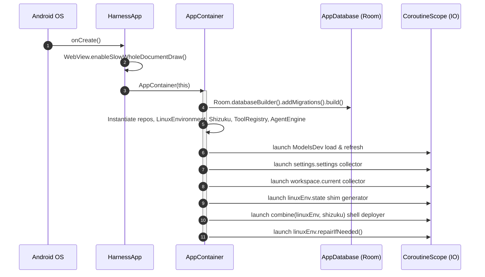

# Application Initialization and State

> Application subclass configuring global runtime dependencies and application-wide lifecycle state.

### Module Responsibilities

`HarnessApp` acts as application subclass and process lifecycle entry point. Configures global Android framework flags. Instantiates `AppContainer`.

`AppContainer` serves as central dependency injection root and lifecycle coordinator. Instantiates system singletons: Room database, repositories, agent execution engine, Linux environment, Shizuku IPC manager, tool registries. Manages cross-component communication channels and reactive initialization jobs.

---

### Call Chain and Lifecycle

1. Android OS invokes `HarnessApp.onCreate()`.
2. `WebView.enableSlowWholeDocumentDraw()` executes. Reason: ensures full-document snapshotting capability for web capture.
3. `HarnessApp` constructs `AppContainer`.
4. `AppContainer` initializes SQLite schema via Room with migrations `MIGRATION_4_5` through `MIGRATION_9_10`.
5. `AppContainer` links `linuxEnv.deployStateListener` to `shizuku.invalidateDeployState()`. Reason: invalidates cached binaries after package mutations.
6. Asynchronous supervisor coroutines launch on `Dispatchers.IO`:
   - Synchronously load `ModelsDev` cache; refresh from remote.
   - Collect `settings.settings`; synchronize disabled skills and migrate legacy search keys.
   - Collect `workspace.current`; resolve `.harness/skills` directory.
   - Collect `linuxEnv.state`; regenerate linker shims on `EnvState.Ready`.
   - Combine `linuxEnv.state`, `shizuku.state`, and `shizuku.serviceState`; trigger `linuxEnv.ensureShellDeploy(shizuku)` when environment ready and Shizuku granted.
   - Execute `linuxEnv.repairIfNeeded()`; restage shell deployment if repairs altered prefix.

---

### Key State

| Field | Type | Storage / Concurrency | Role |
| :--- | :--- | :--- | :--- |
| `container` | `AppContainer` | `lateinit var` on `HarnessApp` | Global composition container reference. |
| `pendingSessionId` | `MutableSharedFlow<String>` | `extraBufferCapacity = 1` | Deep-link channel passing run-result notifications to UI. |
| `pendingShare` | `MutableStateFlow<PendingShare?>` | State flow | Stashes inbound `ACTION_SEND` intent payloads. |
| `pendingSettingsScroll` | `MutableStateFlow<String?>` | State flow | Directs navigation to target settings anchor section. |
| `disabledSkills` | `AtomicReference<Set<String>>` | Memory / thread-safe atomic | Dynamic blacklist of deactivated skill names. |
| `webSearchProvider` | `AtomicReference<String>` | Memory / thread-safe atomic | Active search engine identifier (`"keyless"` or provider key). |
| `projectSkillsDir` | `File?` | `@Volatile` | Filesystem pointer to current workspace `.harness/skills`. |
| `searchKeyMigrated` | `AtomicBoolean` | Atomic CAS guard | Prevents duplicate migrations of legacy search API keys. |

---

### Core Files

- `app/src/main/java/com/androidharness/app/HarnessApp.kt`: Application subclass definition and `AppContainer` dependency wiring.
- `app/src/main/java/com/androidharness/app/MainActivity.kt`: Activity entry retrieving `(application as HarnessApp).container` to handle intents and render UI.
- `app/src/main/java/com/androidharness/app/AgentService.kt`: Service hosting runtime agent executions and posting notification callbacks.

---

### Boundary Conditions and Error Handling

- Pre-v4 databases invoke `fallbackToDestructiveMigration(true)`. Migrations from v4 through v10 execute sequentially preserving session and token cost histories.
- `linuxEnv.repairIfNeeded()` failure preserves `EnvState.Ready`. Network errors during prefix self-healing do not demote operational environment status.
- Legacy search key migration applies CAS via `searchKeyMigrated.compareAndSet(false, true)`. Reason: prevents clobbering keys on concurrent settings emissions.
- Package installations trigger `linuxEnv.deployStateListener`. Reason: forces shell-tier Shizuku process invalidation; prevents executing stale binary copies.

---

### Extension Points

- **Room Migrations**: Append new migrations to `Room.databaseBuilder` in `AppContainer` before calling `.build()`.
- **Tool Dispatch**: Register newly defined tools inside `ToolRegistry.default(...)` inside `AppContainer`.
- **Global Event Pipes**: Expose new shared flows or state flows on `AppContainer` for cross-activity/service lifecycle signaling.

---

Sources: [app/src/main/java/com/androidharness/app/HarnessApp.kt](app/src/main/java/com/androidharness/app/HarnessApp.kt#L1-L225), [app/src/main/java/com/androidharness/app/MainActivity.kt](app/src/main/java/com/androidharness/app/MainActivity.kt#L1-L80)

## Source files

- `app/src/main/java/com/androidharness/app/HarnessApp.kt`
