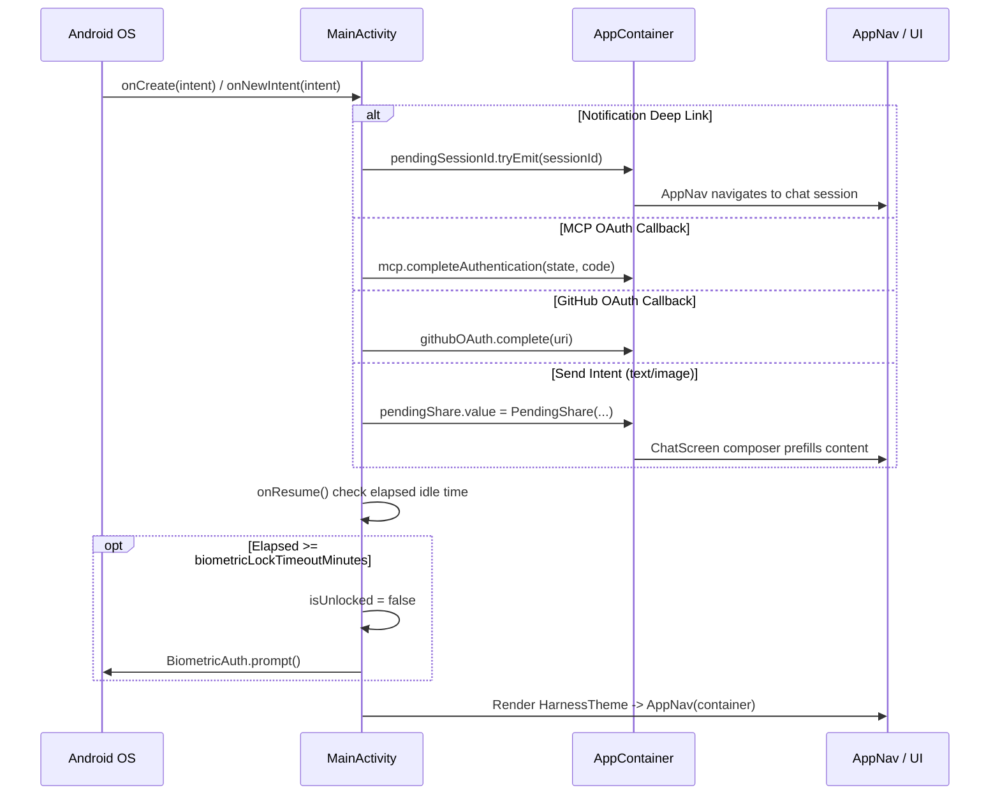

# Primary User Interface Entry

> Main activity managing the primary UI hosting container, user interactions, and entry lifecycle.

### Module Responsibilities

`MainActivity` acts as primary application entry point (`FragmentActivity`). Responsibilities:
- Host Jetpack Compose root (`AppNav`).
- Handle incoming Android Intents (deep linking, OAuth callbacks, shared content).
- Enforce screen security policies (`FLAG_SECURE`) via `ScreenshotPolicy`.
- Manage biometric lock lifecycle and inactivity timeout.
- Request runtime notification permissions (`POST_NOTIFICATIONS`).
- Host app-level modal dialogs (`UpdateDialog`).

---

### Call Chain and Intent Routing

**Key Diagram Nodes:**
- **`OS`**: Dispatches system entry intents, resume triggers, biometric callbacks.
- **`MainActivity`**: Intercepts intent payloads, gates display behind biometric lock, sets window flags.
- **`AppContainer`**: Shared state bus receiving session IDs, pending shares, and OAuth credentials.
- **`AppNav / UI`**: Root compose controller consuming pending states to steer view hierarchy.

---

### Key State

| State Variable | Type | Location | Purpose |
|---|---|---|---|
| `isUnlocked` | `Boolean` (Compose mutableState) | `MainActivity` | Tracks biometric authorization pass status. |
| `promptShownThisResume` | `Boolean` | `MainActivity` | Prevents redundant biometric prompts per resume cycle. |
| `lastPausedTimestamp` | `Long` | `MainActivity` | Records unix epoch ms at `onPause` for timeout calculation. |
| `pendingSessionId` | `MutableSharedFlow<String>` | `AppContainer` | Emits target session ID from notifications for deep link navigation. |
| `pendingShare` | `MutableState<PendingShare?>` | `AppContainer` | Holds mime-typed payloads from `ACTION_SEND` intents. |
| `credentialScreenVisible` | `StateFlow<Boolean>` | `ScreenshotPolicy` | Dynamic flag forcing `FLAG_SECURE` when sensitive tokens are displayed. |
| `step` | `StateFlow<UpdateManager.Step>` | `UpdateManager` | State driver for the global `UpdateDialog`. |

---

### Major Files

- `app/src/main/java/com/androidharness/app/MainActivity.kt`: Main activity implementation; manages window flags, intent filters, biometric security, update loop.
- `app/src/main/AndroidManifest.xml`: Configures single-task launch mode, permission declarations, intent filters for schemes `androidharness://mcp`, OAuth paths, `ACTION_SEND`.
- `app/src/main/java/com/androidharness/app/data/ScreenshotPolicy.kt`: Computes whether screen capture must be suppressed based on user settings and credential screen visibility.
- `app/src/main/java/com/androidharness/app/ui/common/BiometricAuth.kt`: Biometric prompt abstraction wrapping AndroidX `BiometricPrompt`.
- `app/src/main/java/com/androidharness/app/ui/AppNav.kt`: Main Jetpack Compose navigation graph invoked once unlocked.
- `app/src/main/java/com/androidharness/app/ui/update/UpdateDialog.kt`: Application update dialog overlay displayed across all screen contexts.

---

### Boundary Conditions

- **Biometric lockout recovery**: If `BiometricAuth.canAuthenticate()` returns false (no hardware or no credentials enrolled), app sets `isUnlocked = true` on biometric error. Prevents permanent user lockout.
- **Background inactivity**: `onResume` calculates elapsed time since `lastPausedTimestamp`. If `elapsed >= biometricLockTimeoutMinutes`, revokes `isUnlocked` and presents biometric prompt immediately.
- **Single-task re-entry**: `launchMode="singleTask"` prevents duplicate activity instances. Reroutes external intents to `onNewIntent(intent)` instead of recreating activity.
- **Runtime permission gate**: Prompts `Manifest.permission.POST_NOTIFICATIONS` on API level 33+ (Android 13) during `onCreate`. Service and background runs continue without notification display if denied.
- **Display capture security**: `WindowManager.LayoutParams.FLAG_SECURE` applied if user disallows screenshots or if `credentialScreenVisible` is true. Prevents leak in recents overview and screen recorders.

---

### Extension Points

- **Intent schemes**: Register new `<intent-filter>` blocks in `AndroidManifest.xml` under `MainActivity`. Dispatch them inside `MainActivity.handleSessionIntent()` or dedicated intent handlers.
- **Global overlays**: Inject system dialogs or sheet models above `AppNav` inside `MainActivity.setContent` alongside `UpdateDialog`.
- **Pre-lock actions**: Add initialization hooks within `onCreate` prior to biometric verification for background sync registration.

---

Sources: [app/src/main/java/com/androidharness/app/MainActivity.kt](app/src/main/java/com/androidharness/app/MainActivity.kt#L1-L286), [app/src/main/AndroidManifest.xml](app/src/main/AndroidManifest.xml#L54-L86)

## Source files

- `app/src/main/java/com/androidharness/app/MainActivity.kt`
