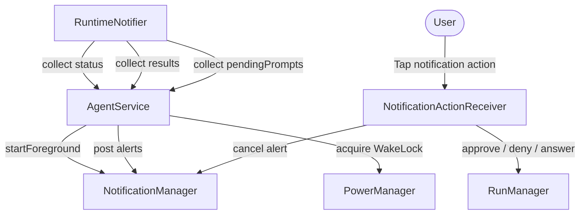

# Foreground Service & Execution Host

> Service lifecycle hosting agent runs in the background and handling Android notification actions.

# Foreground Service & Execution Host

Host long-running background agent executions. Prevent process termination. Expose interactive notification actions.

- `RuntimeNotifier`: Emits live status, completed run results, blocking prompt states.
- `AgentService`: Android `Service` keeping process alive via `startForeground` and `PARTIAL_WAKE_LOCK`. Renders system notifications.
- `NotificationActionReceiver`: Unexported `BroadcastReceiver`. Consumes notification buttons and direct text inputs. Dispatches resolutions directly into `RunManager`.

---

## Module Responsibilities

- **Process retention**: Keep harness process alive via `dataSync` foreground service during agent runs and interactive terminal sessions.
- **CPU execution guarantee**: Hold Android partial wake lock. Prevent CPU sleep while screen off.
- **Status broadcasting**: Mirror runtime status strings into low-importance persistent notification.
- **Interactive alerting**: Surface blocking prompts (tool approvals, user questions, environment setup) as high-importance notifications.
- **Action routing**: Receive broadcast notification intents. Forward responses directly into `RunManager`. Clear answered alerts.
- **Completion alerts**: Post dismissible notifications when runs finish in background.

---

## Call Chain

### Service Lifecycle & Notification Updates
1. Foreground startup invokes `AgentService.onCreate()`.
2. Service establishes notification channels via `createChannels()`.
3. Service calls `startForeground(NOTIFICATION_ID, buildNotification("Working…"))`.
4. Service launches coroutines on `SupervisorJob() + Dispatchers.Main`. Collects three flows:
   - `RuntimeNotifier.status`: Rerenders persistent foreground notification ID `9101`.
   - `RuntimeNotifier.results`: Fires result notification ID `9102` on completion.
   - `RuntimeNotifier.pendingPrompts`: Synchronizes active alerts via `refreshPromptAlerts()`. Cancels absent prompt session tags. Displays active prompts at ID `9103` tagged by `sessionId`.
5. `AgentService.onStartCommand()` calls `acquireWakeLock()`. Returns `START_NOT_STICKY`.
6. Service termination calls `AgentService.onDestroy()`. Cancels coroutine scope. Releases wake lock.

### Notification Action Dispatch
1. User clicks action button or submits free-text reply.
2. System delivers explicit broadcast intent to `NotificationActionReceiver`.
3. `NotificationActionReceiver.onReceive()` parses `EXTRA_SESSION_ID`.
4. Receiver cancels notification tag `sessionId` at ID `ALERT_NOTIFICATION_ID` immediately. Prevents duplicate interactions.
5. Receiver resolves `RunManager` via `(context.applicationContext as HarnessApp).container.runManager`.
6. Intent action determines handler:
   - `ACTION_APPROVE`: `runManager.approve(sessionId, rememberForSession = false)`.
   - `ACTION_APPROVE_ALWAYS`: `runManager.approve(sessionId, rememberForSession = true)`.
   - `ACTION_DENY`: `runManager.deny(sessionId)`.
   - `ACTION_ENV_INSTALL`: `runManager.approveEnvironmentInstall(sessionId)`.
   - `ACTION_ENV_SKIP`: `runManager.denyEnvironmentInstall(sessionId)`.
   - `ACTION_ANSWER`: Resolves string from `RemoteInput` or intent extra `EXTRA_ANSWER_TEXT`. Calls `runManager.answerQuestion(sessionId, answer)`.

---

## Key State & Models

### Runtime State (`RuntimeNotifier`)
- `_status`: `MutableStateFlow<String>` ("Working…"). Backs ongoing execution status string.
- `_results`: `MutableSharedFlow<RunResultNotification>(extraBufferCapacity = 8)`. Emits finished run summaries.
- `promptsBySession`: `MutableMap<String, List<PendingPrompt>>`. Guarded by `promptLock`.
- `_pendingPrompts`: `MutableStateFlow<List<PendingPrompt>>`. Published union of all session prompts.

### Data Models
- `PendingPrompt`:
  - `sessionId`: Session owner identifier.
  - `kind`: `Kind.APPROVAL`, `Kind.QUESTION`, `Kind.ENVIRONMENT`.
  - `sessionTitle`: Session title header context.
  - `headline`: Action summary line.
  - `detail`: Optional expanded diff or command details.
  - `options`: List of predefined choice strings.
- `RunResultNotification`:
  - `sessionId`: Run target session.
  - `title`: Run title.
  - `ok`: Success boolean flag.
  - `summary`: Outcome text summary.

### Notification Channels & Identifiers
| Channel / ID | Constant | Level | Purpose |
| :--- | :--- | :--- | :--- |
| `agent_runs` | `CHANNEL_ID` | `IMPORTANCE_LOW` | Live persistent progress. |
| `run_results` | `RESULTS_CHANNEL_ID` | `IMPORTANCE_DEFAULT` | Completed run result alerts. |
| `action_needed` | `ALERT_CHANNEL_ID` | `IMPORTANCE_HIGH` | Blocking approvals / user input requests. |
| `9101` | `NOTIFICATION_ID` | N/A | Foreground service ongoing status notification. |
| `9102` | `RESULT_NOTIFICATION_ID` | N/A | Completed run notification. |
| `9103` | `ALERT_NOTIFICATION_ID` | N/A | Action prompt notification (keyed by `sessionId` tag). |

---

## Primary Files

- `app/src/main/java/com/androidharness/app/AgentService.kt`: Contains `AgentService` implementation, `RuntimeNotifier` state hub, `PendingPrompt`, `RunResultNotification`.
- `app/src/main/java/com/androidharness/app/agent/NotificationActionReceiver.kt`: Unexported broadcast receiver mapping notification intents to `RunManager` mutations.
- `app/src/main/AndroidManifest.xml`: Declares foreground service with `dataSync` type, system permissions (`FOREGROUND_SERVICE`, `FOREGROUND_SERVICE_DATA_SYNC`, `WAKE_LOCK`, `POST_NOTIFICATIONS`), and receiver registration.

---

## Boundary Conditions

- **Wake Lock Expiration**: Wake lock holds timeout capped at 12 hours (`acquire(12L * 60 * 60 * 1000)`). Prevents indefinite battery drain on hung processes.
- **Request Code Collision**: Action `PendingIntent` instances calculate unique request codes via `31 * sessionId.hashCode() + slot`. Prevents Android intent clobbering across distinct sessions.
- **Mutable vs Immutable PendingIntents**: Fixed options and approvals set `FLAG_IMMUTABLE`. Quick-reply `RemoteInput` sets `FLAG_MUTABLE` to permit OS input injection.
- **Option Button Limit**: `MAX_OPTION_BUTTONS` caps discrete question buttons to 3. Subsequent choices require free-text `RemoteInput`.
- **Preemptive Dismissal**: `NotificationActionReceiver` cancels notification before invoking `RunManager`. Eliminates race conditions with double clicks or in-app completions.
- **Parallel Session Prompts**: `promptsBySession` synchronizes via `promptLock`. Session updates do not wipe other concurrent session alerts.

---

## Extension Points

- **Custom Prompt Kinds**: Extend `PendingPrompt.Kind` enum. Add rendering branch in `AgentService.buildActionNeeded()`. Add action constant and branch in `NotificationActionReceiver.onReceive()`.
- **Foreground Type Adjustment**: Modify `android:foregroundServiceType` in `AndroidManifest.xml` if execution scope shifts beyond data synchronization tasks.
- **Alert Channel Customization**: Modify `createChannels()` to customize vibration patterns, ringtones, or DND bypass attributes on `ALERT_CHANNEL_ID`.

---

Sources: [app/src/main/java/com/androidharness/app/AgentService.kt](app/src/main/java/com/androidharness/app/AgentService.kt#L1-L349), [app/src/main/java/com/androidharness/app/agent/NotificationActionReceiver.kt](app/src/main/java/com/androidharness/app/agent/NotificationActionReceiver.kt#L1-L59), [app/src/main/AndroidManifest.xml](app/src/main/AndroidManifest.xml#L1-L118)

## Source files

- `app/src/main/java/com/androidharness/app/AgentService.kt`
- `app/src/main/java/com/androidharness/app/agent/NotificationActionReceiver.kt`
