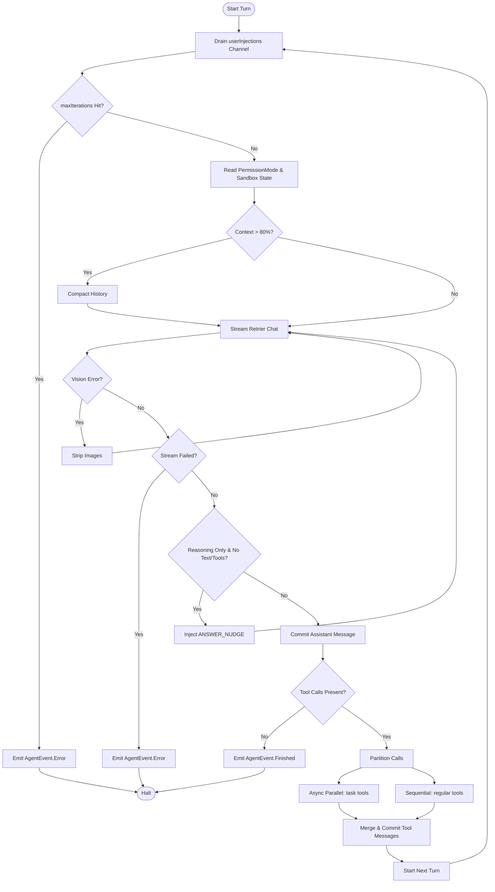

# Agent Execution Engine

> Central iterative prompt-and-tool loop orchestrating message exchange, tool evaluation, and step progression.

# Agent Execution Engine

Central iterative loop orchestrating LLM streaming, user message injection, context compaction, permission gating, and tool evaluation.

## Module Responsibilities

- **Iterative Turn Loop**: Runs prompt-response cycles until model stops, errors, or hits iteration limit.
- **Stream Ingestion**: Consumes LLM stream events (`StreamEvent.TextDelta`, `StreamEvent.ThinkingDelta`, `StreamEvent.ToolCallReady`).
- **Tool Dispatch**: Splits tool calls into parallel subagent tasks and sequential standard tools.
- **Permission Enforcement**: Evaluates per-turn `PermissionMode`. Prompts user or blocks non-read-only tools in `AgentMode.PLAN`.
- **Context Governance**: Estimates token usage, invokes automatic compaction at context threshold, strips images on vision errors.

## Architecture and Flow

- **Drain userInjections**: Incorporates mid-run steering messages into working chat history.
- **Read PermissionMode**: Dynamically re-evaluates mode per iteration. Unlocks `UnboundedFileFs` under `PermissionMode.FULL_ACCESS`.
- **StreamLLM**: Wraps `LlmProvider.streamChat` inside `StreamRetrier.run` for transient 429/5xx recovery.
- **Partition Calls**: Isolates read-only `task` subagent invocations for parallel coroutine execution; runs filesystem and state-modifying tools sequentially.
- **Merge & Commit**: Emits `AgentEvent.ToolMessageCommitted` ordered identically to original model call index.

## Invocation Chain

1. `RunManager` calls `AgentEngine.run(...)` returning `Flow<AgentEvent>`.
2. Engine collects events inside `channelFlow`.
3. Iteration starts: drains `userInjections` channel into `working` history.
4. `ContextHygiene.shrinkToolResults` trims prior large outputs.
5. `StreamRetrier.run` executes `LlmProvider.streamChat(...)`.
6. Stream populates text buffer, thinking buffer, and pending `ToolCallData` list.
7. Engine evaluates response completion. Empty answer triggers nudge branch. Valid response emits `AgentEvent.AssistantCommitted`.
8. `executeWithPermission` validates tool against active `PermissionMode` and `AgentMode`.
9. Ordinary tools run sequentially. Subagent calls run concurrently via `coroutineScope` and `async`.
10. Engine commits tool results to `working` history. Loop restarts.

## Key State and Data Structures

- **`PermissionMode`**:
  - `CONFIRM_ALL`: Prompts every tool call.
  - `CONFIRM_RISKY`: Prompts state-altering commands.
  - `FULL_AUTO`: Auto-approves whitelisted commands within sandbox.
  - `FULL_ACCESS`: Disables approval prompts, shell denylists, and path containment.
- **`AgentMode`**:
  - `ACT`: Full execution mode.
  - `PLAN`: Read-only execution mode. Rejects tools where `tool.isReadOnly == false`.
- **`working` (`MutableList<ChatMessage>`)**: In-memory message list for current run turn. Sanitized per step.
- **`ApprovalRequest` / `QuestionRequest` / `EnvironmentRequest`**: Deferred async requests blocking execution until user resolution.
- **`AgentEvent`**: Event stream emitted to UI. Encompasses token deltas, thinking steps, approvals, file edits, token usage, subagent steps.

## Boundary Conditions

- **Safety Cap**: `maxIterations > 0` aborts loop when counter reached. Prevents runaway infinite tool loops.
- **Context Compaction**: `estimateContext(working, systemPrompt).total > maxContextTokens * 0.8` triggers `compact(...)` if history size exceeds 6 messages.
- **Vision Degradation**: Non-vision model drops images upfront. Vision model rejecting images mid-stream triggers fallback: `ContextHygiene.stripImages` purges image payloads, retries request.
- **Silent Reasoning Guard**: Empty answer text with non-empty thinking triggers `ANSWER_NUDGE` injection up to `MAX_ANSWER_NUDGES`. Empty assistant messages not committed.
- **SAF Confinement**: `UnboundedFileFs` disabled when `workspace.isSaf` is true regardless of `FULL_ACCESS`.

## Extension Points

- **`extraTools`**: Injects run-scoped tool definitions (such as MCP client endpoints) into iteration registry via `registry.withExtra(...)`.
- **`providerFactory`**: Dynamically maps `ProviderConfig` to custom `LlmProvider` client implementations.
- **`resolveSubagentModel`**: Custom model resolver hook enabling subagent workers to switch model tier.
- **`userInjections`**: `Channel<String>` input pipe allowing host service or user interface to push prompts mid-run.

Sources: [app/src/main/java/com/androidharness/app/agent/AgentEngine.kt](app/src/main/java/com/androidharness/app/agent/AgentEngine.kt#L1-L527)

## Source files

- `app/src/main/java/com/androidharness/app/agent/AgentEngine.kt`
