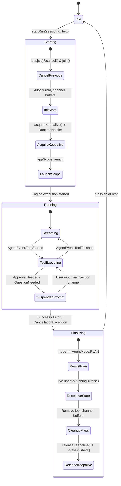

# Agent Run Lifecycle Management

> Session tracking, cancelation token propagation, and active run lifecycle state coordination.

### Module Responsibilities

`RunManager` controls agent execution lifecycles per session across process UI lifecycles.

- **Scope Decoupling**: Runs agent loops inside application-level `appScope` (`SupervisorJob` + `Dispatchers.Default`). UI destruction, screen rotation, backgrounding do not abort active runs.
- **Session Tracking**: Maintains active session IDs, per-session coroutine jobs, injection channels, turn identifiers in synchronized in-memory maps.
- **State Coordination**: Surfaces execution snapshots via `MutableStateFlow<LiveRunState>`. Exposes stream deltas, running tools, interactive prompt suspensions.
- **Stream Throttling**: Collects incoming streaming text/thinking tokens inside `DeltaBuffers`. Periodically flushes to UI at frame-friendly intervals.
- **Cancellation & Keepalive**: Cancels previous running jobs on new input. Integrates with `RuntimeNotifier` foreground service and wake lock via `acquireKeepalive()` / `releaseKeepalive()`.
- **Message Persistence**: Interacts directly with `SessionRepository`. Commits assistant responses, user prompts, file edit records, tool messages to local DB.

---

### Key Files & Dependencies

- `app/src/main/java/com/androidharness/app/agent/RunManager.kt`: Orchestrates run states, coroutine jobs, cancellation tokens, event routing.
- `app/src/main/java/com/androidharness/app/agent/AgentEngine.kt`: Execution engine driving iterative LLM prompting, tool evaluation, event emissions.
- `app/src/main/java/com/androidharness/app/data/SessionRepository.kt`: Persistent storage layer for session histories, message rows, file diff metrics.
- `app/src/main/java/com/androidharness/app/RuntimeNotifier.kt`: Foreground service bridge. Publishes persistent notification status, interactive actions.
- `app/src/main/java/com/androidharness/app/agent/TodoStore.kt`: Tracks runtime task progress and plan state per session.

---

### Execution & Lifecycle Flow



#### Key Node Mechanics
- **CancelPrevious**: Resolves concurrency races on identical `sessionId`. Cancels prior active job, joins completion before allocating next turn.
- **InitState**: Injects fresh user `ChatMessage`, resets `TodoStore` scope, primes `liveMessageId` to maintain stable UI message recycling.
- **Streaming / ToolExecuting**: `AgentEvent` stream dispatched to `handleEvent()`. `DeltaBuffers` aggregates chunks to suppress excessive Compose recompositions.
- **SuspendedPrompt**: Catches `ApprovalNeeded`, `QuestionNeeded`, `EnvironmentNeeded`. Halts auto-execution, forwards request to `RuntimeNotifier` for background notification interaction.
- **Finalizing**: Cleans up synchronized collections, cancels UI linger timers, releases OS wake locks.

---

### Core State & Data Structures

#### `LiveRunState`
Primary UI-observed state model published via `StateFlow`:
- `running: Boolean`: True while `AgentEngine` loop executes.
- `turnId: String?`: UUID representing current conversational step.
- `liveMessageId: String?`: Pre-allocated message ID reused during streaming commit to prevent view flicker.
- `lastCommittedId: String?`: Tracks last assistant message written to database.
- `runningCalls: List<ToolCallData>`: Tools currently executing or awaiting response.
- `pendingApproval / pendingQuestion / pendingEnvironment`: Interactive suspension descriptors awaiting user intervention.
- `thinkingStartedAt / thinkingEndedAt`: Timestamps tracking model reasoning duration.

#### Internal State Collections
All access synchronized via internal `lock: Any`:
- `jobs: MutableMap<String, Job>`: Active coroutine execution handles.
- `injections: MutableMap<String, Channel<String>>`: User message/prompt reply injection queues.
- `turnIds: MutableMap<String, String>`: Active turn IDs per session.
- `deltaBuffers: MutableMap<String, DeltaBuffers>`: In-memory string buffers for text and reasoning deltas.
- `keepaliveCount: AtomicInteger`: Reference count for active runs holding foreground execution status.

---

### Invocation Chains

#### 1. Run Initialization
```
RunManager.startRun()
  ├── jobs[sid]?.cancel() -> jobs[sid]?.join()
  ├── todoStore.beginRun(sid)
  ├── sessions.addMessage(USER)
  ├── acquireKeepalive() -> RuntimeNotifier.update("Working…")
  └── appScope.launch
        ├── launch { flushDeltas(sid) }
        ├── launch { RuntimeNotifier.setSessionPrompts(sid, ...) }
        └── engine.run(...)
```

#### 2. Event Dispatching
```
AgentEngine event emission
  └── RunManager.handleEvent()
        ├── AgentEvent.Text / Thinking -> DeltaBuffers.append()
        ├── AgentEvent.AssistantCommitted -> flushDeltas() -> sessions.addMessage(ASSISTANT)
        ├── AgentEvent.ToolStarted -> live.update(runningCalls += call)
        ├── AgentEvent.ApprovalNeeded / QuestionNeeded -> live.update(pending...)
        ├── AgentEvent.FileEdited -> repoMap.invalidate() -> sessions.recordFileEdit()
        └── AgentEvent.ToolFinished -> live.update(runningCalls -= callId)
```

#### 3. Run Teardown
```
Engine completion / appScope block exit
  ├── sessions.setPendingPlan() (AgentMode.PLAN)
  ├── live.update(running = false, ...)
  ├── runningSessionIds.update { it - sid }
  ├── jobs.remove(sid), injections.remove(sid), deltaBuffers.remove(sid)
  ├── notifyFinished(sid, error)
  └── releaseKeepalive()
```

---

### Boundary Conditions & Concurrency Controls

- **UI Frame Rate Protection**: High-frequency LLM server-sent events appended to `DeltaBuffers`. Dedicated coroutine flushes buffer every `STREAM_FLUSH_MS` to maintain ~15 UI updates/sec.
- **Coroutines Synchronization**: Single lock object guards access to `states`, `jobs`, `injections`, `deltaBuffers`.
- **In-Place UI Handoff**: `startRun()` and first token arrival generate stable `liveMessageId`. `AssistantCommitted` commits row under identical ID. Chat UI smoothly morphs live bubble into DB-persisted bubble without delete/insert flicker.
- **Process Backgrounding**: Keepalive increments register foreground tasks with Android OS. Notifications expose user input actions for suspended prompts without bringing activity to foreground.
- **Cancellation Propagation**: Invoking `Job.cancel()` stops engine iteration, terminates streaming loops via `CancellationException`, triggers `finally` block cleaning up state maps and keepalives.

---

### Extension Points

- **Tool Call Visualization**: Extend `describeToolCall()` to provide custom human-readable status text for newly implemented tool definitions.
- **Prompt Interruption Hooks**: Add typed requests matching `ApprovalRequest` / `QuestionRequest` inside `handleEvent()` to extend interactive pauses during tool dispatch.
- **External Notifications**: Hook into `notifyFinished()` to route completion alerts to external messaging providers or system trays.

---

Sources: [app/src/main/java/com/androidharness/app/agent/RunManager.kt](app/src/main/java/com/androidharness/app/agent/RunManager.kt#L1-L500)

## Source files

- `app/src/main/java/com/androidharness/app/agent/RunManager.kt`
