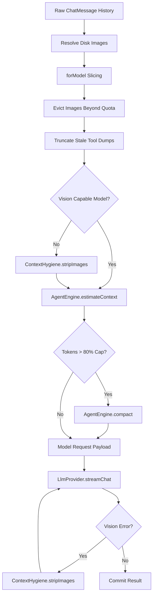

# Context Pruning and Sanitization

> Conversation history truncation, hygiene enforcement, and prompt payload size management.

## Module Responsibilities

Context Pruning and Sanitization manages prompt payload size, enforces multimodal constraints, and isolates model context from database history.

- **Working copy isolation**: Sanitizes in-memory conversation copies. Preserves complete, unpruned message history in persistent storage for user interface rendering.
- **Stale tool output truncation**: Truncates older tool outputs exceeding character budgets. Preserves recent tool outputs intact for operational context.
- **Multimodal payload eviction**: Caps total active image payloads across conversation history. Strips image binary data older than allowed quota.
- **Vision capability degradation**: Strips base64 image data and injects textual replacement notices when models lack vision support or reject visual inputs.
- **Transcript folding and compaction**: Slices model history to active compaction boundaries. Summarizes folded historical turns into synthetic system messages.

---

## Architecture and Processing Flow

### Flow Node Explanations

- **`forModel Slicing`**: Locates last `AgentEngine.COMPACTION_PREFIX` occurrence. Discards messages preceding index.
- **`Evict Images Beyond Quota`**: Traverses messages reverse-chronologically. Retains up to `MAX_CONTEXT_IMAGES`. Clears `imageData` from older turns.
- **`Truncate Stale Tool Dumps`**: Identifies all `Role.TOOL` messages. Protects last `RECENT_FULL_TOOLS`. Truncates remaining messages exceeding `STALE_TOOL_CHARS`.
- **`ContextHygiene.stripImages`**: Clears all `imageData` lists. Appends placeholder notice with original filenames into message text.
- **`AgentEngine.compact`**: Triggered when token estimate exceeds 80% of `maxContextTokens` and history length exceeds 6 messages. Replaces folded history with summary markers.
- **`FallbackStrip`**: Catches transient LLM API vision rejections during execution. Strips images from working context, then retries request stream immediately.

---

## Key Files and Core Responsibilities

| File Path | Core Responsibility |
|---|---|
| `app/src/main/java/com/androidharness/app/agent/ContextHygiene.kt` | Static pruning algorithms, tool character truncator, image quota limiter, text placeholder generation. |
| `app/src/main/java/com/androidharness/app/agent/AgentEngine.kt` | Context estimation dispatch, compaction invocation thresholding, vision error detection, runtime working copy updates. |

---

## Key Parameters and State Constants

- `RECENT_FULL_TOOLS` (`6`): Number of most recent `Role.TOOL` outputs preserved verbatim without length checks.
- `STALE_TOOL_CHARS` (`4_000`): Maximum character length allowed for tool outputs outside recent full preservation set.
- `MAX_CONTEXT_IMAGES` (`2`): Conversation-wide cap on retained base64 image payloads passed to LLM APIs.
- `COMPACTION_NOTICE_PREFIX` (`"[Context compacted:"`): Prefix identifier for user-visible system compaction notifications.
- `AgentEngine.COMPACTION_PREFIX`: System message header designating folded historical summary blocks.
- Token Threshold (`0.8`): Execution loop compacts context when `estimate.total > (maxContextTokens * 0.8)` and working history contains over 6 messages.

---

## Boundary Conditions

- **Head and tail text preservation**: `ContextHygiene.truncate` preserves split slices from start and end of strings. Calculates slice size via `((maxChars - marker.length) / 2).coerceAtLeast(64)`. Center replaced with character truncation notice.
- **Partial image slice allocation**: Single turns containing multiple images receive partial quota allocation if remaining conversation budget is smaller than message image array size.
- **Absence of compaction summaries**: `forModel` defaults to full history if `indexOfLast` finds no `AgentEngine.COMPACTION_PREFIX` marker.
- **Text-only fallback injection**: `stripImages` checks `m.text.isNotBlank()`. Joins placeholder using newline delimiter if text exists, otherwise sets placeholder as lone text content.
- **Reasoning turn rejection**: `AgentEngine` drops turns producing reasoning without text or tool calls. Prevents sending empty assistant payloads to upstream providers.

---

## Extension Points

- **`shrinkToolResults` parameters**: Call sites can override default `recentFull`, `maxChars`, or `maxImages` limits for domain-specific tool outputs.
- **`stripImages` notice formatting**: Accepts custom `note` string parameters to tailor omitted image advisories to specific model system prompts.
- **External context compaction strategies**: Pluggable `compact` routine inside `AgentEngine` supports alternate summarization prompts or hierarchical rolling condensation backends.

---

Sources: [app/src/main/java/com/androidharness/app/agent/ContextHygiene.kt](app/src/main/java/com/androidharness/app/agent/ContextHygiene.kt#L1-L114), [app/src/main/java/com/androidharness/app/agent/AgentEngine.kt](app/src/main/java/com/androidharness/app/agent/AgentEngine.kt#L230-L395)

## Source files

- `app/src/main/java/com/androidharness/app/agent/ContextHygiene.kt`
