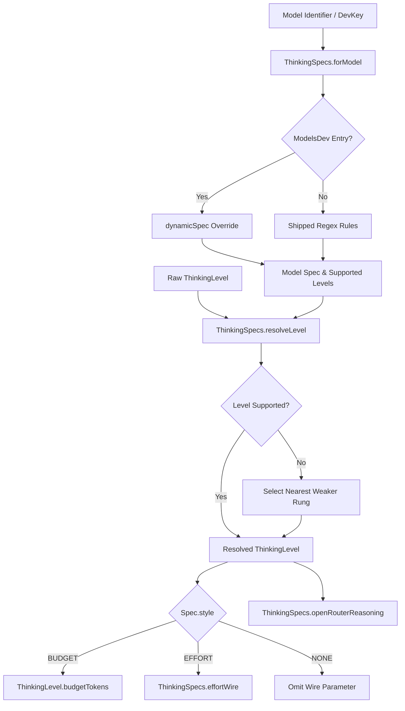

# Reasoning and Thinking Budgets

> Configuration and specification of model reasoning depth, thinking constraints, and budget tokens.

## Module Responsibilities

`ThinkingLevel` and `ThinkingSpecs` define canonical reasoning depth configurations for language models. 

Responsibilities:
- Provide unified reasoning ladder (`ThinkingLevel`) across UI, settings, and network clients.
- Decouple user preference persistence from provider capabilities; settings store raw requested rungs without destructive clamping across model switches.
- Inspect model capabilities using dynamic metadata (`ModelsDev`) and fallback regex family tables.
- Execute non-escalating degradation policy (`resolveLevel`): maps unsupported requests to nearest weaker supported rungs.
- Translate resolved rungs to wire payloads: token budgets (Anthropic, Gemini), effort strings (OpenAI), or gateway objects (OpenRouter).

---

## Primary Files

- `app/src/main/java/com/androidharness/app/agent/ThinkingLevel.kt`: Defines unified 8-rung ladder, token budget equations, and base OpenAI effort string mapping.
- `app/src/main/java/com/androidharness/app/agent/ThinkingSpecs.kt`: Implements model capability specifications (`Spec`), dynamic catalog lookups, nearest-weaker resolution logic, and provider-specific wire formatting.

---

## Resolution and Clamping Workflow

### Flow Nodes
- `UI`: Raw global ladder tier stored directly in `SettingsRepository`. Never mutated on model change.
- `SpecLookup`: Resolves consumption style and allowed rungs. Dynamic catalog metadata takes precedence over static regex patterns.
- `ResolveCall`: Enforces monotonic non-escalation. Selects identical level if supported; otherwise selects highest supported level below requested rung. Falls back to lowest active tier if no weaker rung exists.
- `WireStyle`: Formats wire request based on resolved protocol (`BUDGET`, `EFFORT`, `NONE`).

---

## Key States and Enums

### `ThinkingLevel`
Canonical global effort ladder. Ordered by `rank` (`ordinal` low to high):
1. `OFF` (rank 0)
2. `MINIMAL` (rank 1)
3. `LOW` (rank 2)
4. `MEDIUM` (rank 3)
5. `HIGH` (rank 4)
6. `XHIGH` (rank 5)
7. `MAX` (rank 6)
8. `ULTRA` (rank 7)

### `ThinkingSpecs.Style`
Consumption mechanism on wire:
- `NONE`: Inherent reasoning models (DeepSeek, Qwen3). Omit dial parameter.
- `EFFORT`: Categorical string parameters (`reasoning_effort`).
- `BUDGET`: Explicit token count allocations (`budget_tokens`, `thinkingBudget`).

### `ThinkingSpecs.Spec`
Model configuration descriptor:
- `style`: Target `Style`.
- `levels`: Ascending list of supported `ThinkingLevel` items. Always includes `OFF`.

---

## Provider Translation Matrix

| Provider / Model Pattern | Wire Style | Supported Rungs | Wire Translation |
|---|---|---|---|
| `(^\|/)gpt-5`, `(^\|/)o[3-9]([-.]\|$)` | `EFFORT` | `OFF`, `MINIMAL`, `LOW`, `MEDIUM`, `HIGH`, `XHIGH` | `effortWire` string (`"minimal"`, `"low"`, `"medium"`, `"high"`, `"xhigh"`) |
| `(^\|/)grok-[34]` | `EFFORT` | `OFF`, `LOW`, `HIGH` | `effortWire` string (`"low"`, `"high"`) |
| `claude` | `BUDGET` | ALL rungs | `budgetTokens(maxOutput)`: 512, 1024, 4096, 16384, 24576, 32768 |
| `gemini-[23]` | `BUDGET` | ALL rungs | `budgetTokens(maxOutput)`: 512, 1024, 4096, 16384, 24576, 32768 |
| `deepseek`, `qwen3`, `glm-[45]`, `kimi` | `NONE` | `OFF`, `LOW`, `MEDIUM`, `HIGH` | Omitted from payload (thinks inherently) |
| OpenRouter Gateway | Dynamic | Determined by endpoint | `RouterReasoning`: effort string or bare `enabled = true` |

---

## Boundary Conditions

- Output token starvation: `ThinkingLevel.budgetTokens` coerces allocated tokens to `(maxOutputTokens - 4_096).coerceAtLeast(0)`. Guarantees 4,096 tokens reserved for model output generation.
- Non-reasoning models: Models reporting `reasoning == false` yield `levels = [OFF]`. `resolveLevel` clamps every input level to `OFF`.
- Cost safety: `resolveLevel` searches `enabled.lastOrNull { it < level }`. Never selects stronger rung than requested. Prevents silent cost escalation.
- Zero degradation prevention: Active request (`!= OFF`) degraded against model with reasoning capabilities never falls back to `OFF`. Uses `?: enabled.first()` to maintain reasoning state.
- Wire omissions: `rawRequested == ThinkingLevel.OFF` causes `effortWire` and `openRouterReasoning` to return `null`.

---

## Extension Points

- New model family rules: Append `Regex to Spec` pairs in `ThinkingSpecs.rules`. Ordered list; earlier entries take priority before `defaultSpec`.
- Dynamic model vocabulary: Register entries in `ModelsDev` with custom `effortValues` or `budgetTokens = true`. Bypasses static regex pattern matching.
- Gateway mapping: Customize `openRouterEffort` or `openRouterReasoning` to translate internal tiers to emerging provider-specific routing protocols.

---

Sources: [app/src/main/java/com/androidharness/app/agent/ThinkingLevel.kt](app/src/main/java/com/androidharness/app/agent/ThinkingLevel.kt#L1-L54), [app/src/main/java/com/androidharness/app/agent/ThinkingSpecs.kt](app/src/main/java/com/androidharness/app/agent/ThinkingSpecs.kt#L1-L260)

## Source files

- `app/src/main/java/com/androidharness/app/agent/ThinkingSpecs.kt`
- `app/src/main/java/com/androidharness/app/agent/ThinkingLevel.kt`
