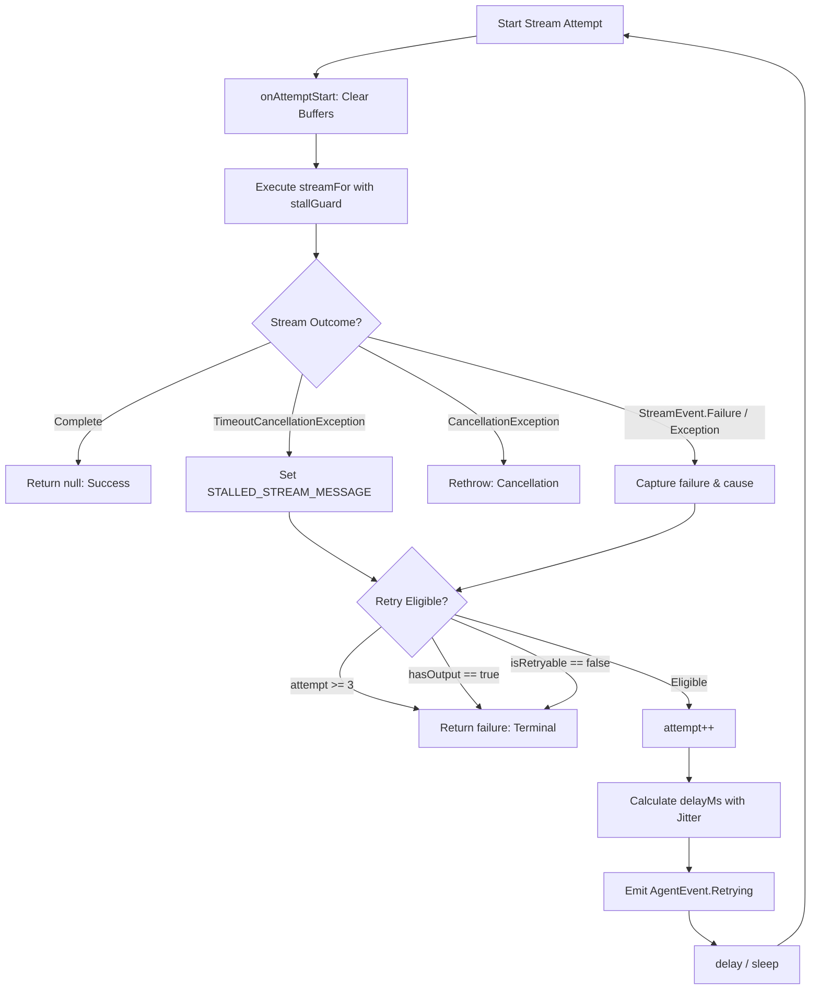

# Stream Streaming & Fault Recovery

> Streaming response handler with automated retry policies for transient streaming LLM failures.

### Module Responsibilities

* `StreamRetrier`: Shared streaming wrapper. Executes LLM flows, guards against hung SSE sockets, retries transient failures, halts retries on dirty buffers.
* `RetryPolicy`: Failure classifier and backoff calculator. Differentiates transient and permanent HTTP/network errors, injects backoff jitter.

---

### Primary Files

* `app/src/main/java/com/androidharness/app/agent/StreamRetrier.kt`: Stream retry loop runner, `stallGuard` extension function, stall timeout constant.
* `app/src/main/java/com/androidharness/app/agent/RetryPolicy.kt`: Retry limit constants, status code rules, message regex matchers, exponential jittered backoff calculation.

---

### Call Chain

1. Caller (`AgentEngine` main turn, subagent turn, or compaction) calls `StreamRetrier.run(...)`.
2. Caller supplies lambdas:
   * `streamFor`: Constructs fresh raw `Flow<StreamEvent>`.
   * `onAttemptStart`: Clears output buffers before each attempt.
   * `hasOutput`: Reports whether caller emitted visible UI tokens or tool deltas.
   * `handleEvent`: Consumes non-failure `StreamEvent` values.
3. `StreamRetrier` decorates flow with `stallGuard(stallTimeoutMs)`.
4. Upstream collector processes `StreamEvent`:
   * `StreamEvent.Failure` sets in-stream failure message.
   * Other events route to `handleEvent`.
5. Failures intercept:
   * `TimeoutCancellationException`: Gateway silent. Sets `STALLED_STREAM_MESSAGE`.
   * `CancellationException`: Caller canceled run. Rethrows immediately.
   * `Exception`: Captures `cause` and exception message.
6. Evaluator executes `RetryPolicy.isRetryable(cause, failure)`:
   * Checks max attempts (`MAX_RETRIES = 3`).
   * Verifies `!hasOutput()`.
7. Retry valid: Emits `AgentEvent.Retrying`, waits `RetryPolicy.delayMs(attempt)`, loops to next attempt.
8. Retry invalid: Returns terminal failure message string. Success returns `null`.

---

### Retry Decision Flow

#### Diagram Nodes

* `stallGuard`: Coroutine flow timeout. Replaces infinite SSE socket wait with 90s deadline.
* `CancellationException`: Preserves structural coroutine teardown. Skips retry processing.
* `Retry Eligible`: Requires `attempt < 3`, empty partial buffers (`!hasOutput()`), and transient classification match.
* `delayMs with Jitter`: Exponential delay preventing provider thundering herds.

---

### Key State

* `attempt`: Int. Zero-indexed iteration counter.
* `hasOutput`: Boolean lambda. Guards output idempotency. Once caller buffers deltas, suppresses retries to prevent duplicate UI text.
* `failure`: String? error payload captured from `StreamEvent.Failure`, `TimeoutCancellationException`, or generic `Exception`.
* `cause`: Throwable? root cause extracted from caught exceptions for unwrapping.

---

### Boundary Conditions

* **Partial stream emissions:** `hasOutput()` returns `true`. Aborts retry loop immediately. Prevents duplicate model response generation on UI.
* **Hung connection:** Server leaves socket open without sending bytes. `stallGuard(90_000)` fires `TimeoutCancellationException`. Catches before `CancellationException` handler. Converts to `STALLED_STREAM_MESSAGE`. Retries.
* **Explicit cancellation:** User interrupts generation. Throws `CancellationException`. Rethrown immediately. Bypasses error classification and retry delays.
* **Class inheritance precedence:** `ApiException` subclasses `IOException`. `RetryPolicy.isRetryable` inspects `ApiException` first. Prevents HTTP 400 (bad request) from retrying under generic `IOException` rules.
* **Transient HTTP codes:** Only `408`, `429`, and `500..599` trigger retry.
* **Transient regex matches:** Matches string patterns (`overloaded`, `rate limit`, `timeout`, `timed out`, `temporarily`, `try again`, `connection reset`, `connection refused`, `ECONNRESET`, `socket closed`).
* **Retry limit:** `MAX_RETRIES = 3`. Attempt 4 returns failure unconditionally.
* **Backoff bounds:** Shift exponent coerced in `0..4`. Base delays: 1s, 2s, 4s. Jitter: `±30%`.

---

### Extension Points

* `sleep`: Injected suspend function parameter `(Long) -> Unit` in `StreamRetrier.run`. Defaults to `kotlinx.coroutines.delay`. Allows deterministic virtual-time unit testing.
* `stallTimeoutMs`: Injected millisecond parameter in `StreamRetrier.run`. Overrides 90s default stall threshold for slow reasoning streams.
* `retryReason`: Formatting closure passed by caller. Customizes diagnostic text inside `AgentEvent.Retrying`.
* `hasOutput`: Contextual output validator. Call sites isolate custom message buffers (for instance, main chat deltas vs subagent task summaries).

---

Sources: [app/src/main/java/com/androidharness/app/agent/StreamRetrier.kt](app/src/main/java/com/androidharness/app/agent/StreamRetrier.kt#L1-L102), [app/src/main/java/com/androidharness/app/agent/RetryPolicy.kt](app/src/main/java/com/androidharness/app/agent/RetryPolicy.kt#L1-L49)

## Source files

- `app/src/main/java/com/androidharness/app/agent/StreamRetrier.kt`
- `app/src/main/java/com/androidharness/app/agent/RetryPolicy.kt`
