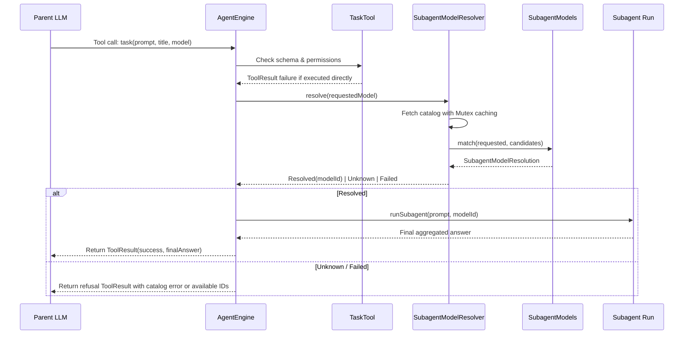

# Subagent Delegation and Model Resolution

> Routing sub-tasks to dedicated subagent runs and resolving target model tiers.

### Module Responsibilities

- **Context Isolation**: `TaskTool` declares read-only subagent tasks. Isolates deep research contexts. Prevents main conversation context bloat.
- **Engine Interception**: Direct execution of `TaskTool.execute` blocked. Engine intercepts calls at runtime. Dispatches isolated runs via `AgentEngine.runSubagent`.
- **Model Resolution**: `SubagentModelResolver` resolves optional model overrides against provider catalog. Memoizes catalog responses across concurrent tasks.
- **Fuzzy Catalog Matching**: `SubagentModels` matches requested IDs using exact, case-insensitive, and unqualified vendor suffix rules.

---

### Main Files

- `app/src/main/java/com/androidharness/app/tools/SubagentTools.kt`: Declares `TaskTool`. Exposes schema parameters (`prompt`, `title`, `model`). Sets `isReadOnly = true`. Blocks direct execution.
- `app/src/main/java/com/androidharness/app/agent/SubagentModelResolver.kt`: Defines `SubagentModelResolution` outcomes, `SubagentModels` matching logic, and thread-safe `SubagentModelResolver` memoization cache.

---

### Call Chain

#### Key Nodes
- **`Parent LLM`**: Emits concurrent `task` invocations in single generation turn.
- **`AgentEngine`**: Intercepts `task` invocations before direct tool execution. Controls subagent lifecycle.
- **`SubagentModelResolver`**: Coordinates thread-safe catalog fetch. Caches candidate lists across parallel subagent requests.
- **`SubagentModels`**: Evaluates matching heuristics against candidate list.
- **`Subagent Run`**: Isolated execution loop. Restricts file writes, tool interactions, and recursive task delegation.

---

### Key States

#### `SubagentModelResolution`
- `Resolved(modelId: String)`: Exact catalog identifier resolved. Engine spawns subagent using this target tier.
- `Unknown(available: List<String>)`: Target model not found in catalog. Engine crafts refusal prompt containing candidate list.
- `Failed(message: String)`: Network or provider catalog fetch failure. Informs LLM of catalog unavailability.

---

### Model Matching Precedence

`SubagentModels.match` evaluates candidates in sequential priority:
1. **Exact Match**: `it == wanted`. Target identical.
2. **Case-Insensitive Match**: `it.equals(wanted, ignoreCase = true)`. Normalizes casing to catalog specification. Preserves upstream token usage accounting.
3. **Vendor Suffix Match**: Evaluated if `wanted` contains no `/`. Matches `it.endsWith("/$wanted")` (e.g. `claude-3-5-sonnet` matching `anthropic/claude-3-5-sonnet`). Accepted only when single unambiguous match found.
4. **Fallback**: Returns `SubagentModelResolution.Unknown(candidates)`.

---

### Boundary Conditions

- **Direct Invocations**: Calling `TaskTool.execute()` directly yields `ToolResult(false, "task is handled by the engine and cannot be executed directly.")`. Engine execution mandatory.
- **Recursion Prevention**: `TaskTool` description explicitly forbids nested subagent spawning. Prevents unbounded delegation chains.
- **Permission Bypasses**: `isReadOnly = true` set on `TaskTool`. Requires no user approval checks before execution.
- **Concurrency & Caching**: Catalog fetch wrapped in `Mutex`. Concurrent subagent delegations trigger single catalog network round-trip.
- **Catalog Failure Recovery**: Catalog fetch errors return `SubagentModelResolution.Failed`. Cache remains `null`. Subsequent runs retry fetch.
- **Coroutine Cancellation**: `CancellationException` caught and re-thrown immediately in `SubagentModelResolver.resolve`. Preserves cancellation scope hierarchies.

---

### Extension Points

- **Catalog Providers**: Inject custom suspend supplier `fetch: suspend () -> List<String>` into `SubagentModelResolver` constructor. Supports dynamic providers (e.g., OpenRouter, OpenAI, Local LLMs).
- **Matching Rules**: Modify `SubagentModels.match` to add version aliases or provider-specific wildcards.

---

Sources:
- [app/src/main/java/com/androidharness/app/agent/SubagentModelResolver.kt](app/src/main/java/com/androidharness/app/agent/SubagentModelResolver.kt#L1-L68)
- [app/src/main/java/com/androidharness/app/tools/SubagentTools.kt](app/src/main/java/com/androidharness/app/tools/SubagentTools.kt#L1-L46)

## Source files

- `app/src/main/java/com/androidharness/app/agent/SubagentModelResolver.kt`
- `app/src/main/java/com/androidharness/app/tools/SubagentTools.kt`
