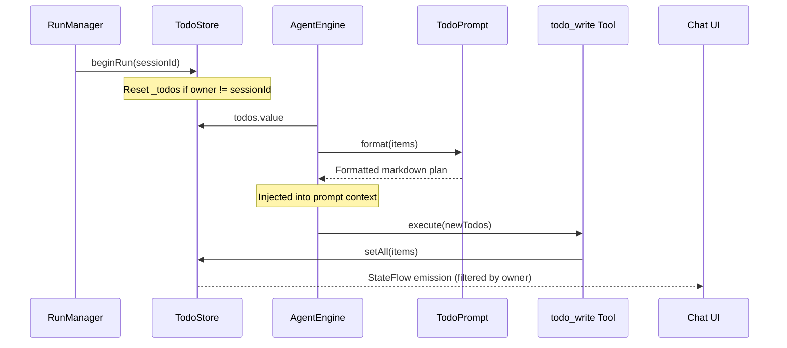

# Task and Todo Plan Persistence

> Storage and dynamic prompt injection of structured agent plans and execution milestones.

# Task and Todo Plan Persistence

In-memory reactive plan tracking and prompt formatting subsystem. Manages structured agent milestone plans and dynamically injects task lists into LLM prompts.

## Core Responsibilities

- **State Management**: Holds live task items within reactive `StateFlow` streams.
- **Session Isolation**: Binds task lifecycle to active `sessionId`. Discards cross-session residual plans.
- **Prompt Rendering**: Formats structured task models into LLM-readable system prompt blocks.
- **Tool Integration**: Accepts full replacements of plan items via `todo_write` tool dispatch.

## Key Files

- `app/src/main/java/com/androidharness/app/agent/TodoStore.kt`: State container holding reactive task lists and session ownership.
- `app/src/main/java/com/androidharness/app/agent/TodoPrompt.kt`: Formatter serializing task items for system prompt context.
- `app/src/main/java/com/androidharness/app/HarnessApp.kt`: Dependency injection root instantiating and distributing singleton `TodoStore`.

## Data Structures & State

```
TodoItem
├── content: String
└── status: TodoItem.Status
    ├── PENDING
    ├── IN_PROGRESS
    └── COMPLETED
```

### `TodoStore` State

- `_todos: MutableStateFlow<List<TodoItem>>`: Current active tasks. Default `emptyList()`.
- `_owner: MutableStateFlow<String?>`: Current owning `sessionId`. Default `null`.

## Lifecycle & Call Chain



### Flow Stages

1. **Session Claim**: `RunManager` calls `TodoStore.beginRun(sessionId)`. Session ID differs from `_owner.value`: clears `_todos`, updates `_owner`. Prevents cross-session bleed.
2. **Context Injection**: `AgentEngine` polls `TodoStore.todos`. Calls `TodoPrompt.format(items)`. Appends formatted block to LLM system instructions.
3. **Plan Update**: Agent invokes `todo_write`. Tool invokes `TodoStore.setAll(items)`. Replaces task list atomically.
4. **UI Observation**: UI collects `TodoStore.todos` and `TodoStore.owner`. Renders list only when active session matches owner.

## Prompt Formatting Logic

`TodoPrompt.format` renders tasks:

- Empty list: Returns `""`.
- Non-empty list: Outputs header `Current task list (keep this updated via todo_write):` followed by markdown items:
  - `- [pending] <content>`
  - `- [in_progress] <content>`
  - `- [completed] <content>`

Status enum serialized to lowercase via `item.status.name.lowercase()`.

## Boundary Conditions

- **Session Mismatch**: New session claims store. Previous session plan dropped immediately.
- **Process Restart**: Memory-only store. Tasks vanish across process death.
- **Atomic Replacement**: No item-level patch API. Agents must send full array on each update.
- **Empty State**: No prompt overhead when todo list empty.

## Extension Points

- **Room Persistence**: Map `TodoItem` to Room entity in `AppDatabase`. Persist plans per session across app restarts.
- **Granular Mutations**: Add incremental patch methods (`appendTodo`, `updateStatus`) to avoid re-transmitting entire task lists via LLM tool arguments.
- **Hierarchical Tasks**: Extend `TodoItem` with parent identifiers or dependency graphs for subagent tracking.

Sources: [app/src/main/java/com/androidharness/app/agent/TodoStore.kt](app/src/main/java/com/androidharness/app/agent/TodoStore.kt#L1-L44), [app/src/main/java/com/androidharness/app/agent/TodoPrompt.kt](app/src/main/java/com/androidharness/app/agent/TodoPrompt.kt#L1-L16), [app/src/main/java/com/androidharness/app/HarnessApp.kt](app/src/main/java/com/androidharness/app/HarnessApp.kt#L72-L146)

## Source files

- `app/src/main/java/com/androidharness/app/agent/TodoStore.kt`
- `app/src/main/java/com/androidharness/app/agent/TodoPrompt.kt`
