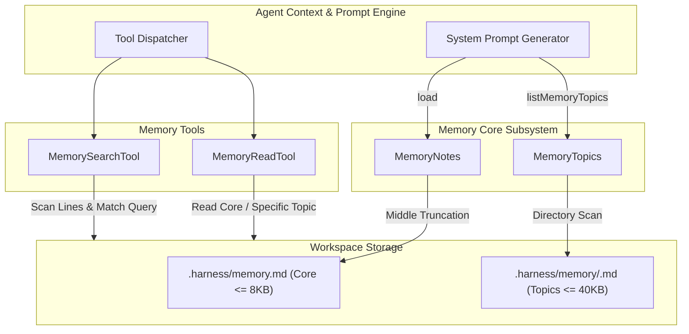

# Agent Long-Term Memory & Topic Notes

> Persistence and retrieval of contextual notes, topic summaries, and cross-session knowledge.

# Agent Long-Term Memory & Topic Notes

Dual-tier workspace persistence preserves agent context across runs without context window bloat. Tier 1 provides auto-loaded core memory with strict size limits. Tier 2 provides on-demand topic files indexed by identifier.



- `System Prompt Generator`: injects core memory content and topic names into prompt.
- `MemoryNotes`: regulates core memory size via balanced truncation and tail retention.
- `MemoryTopics`: defines path resolution, sanitization rules, and safety constraints for topic partitions.
- `MemoryReadTool`: retrieves unpruned memory partitions or index summaries.
- `MemorySearchTool`: executes case-insensitive scan over all memory files to locate target lines.

---

### Module Responsibilities

- **Core memory management (`MemoryNotes.kt`)**: Implements workspace-level scratchpad at `.harness/memory.md`. Enforces hard size cap. Prevents notes expanding into runaway system prompts.
- **Topic partitioning (`MemoryTopics.kt`)**: Isolates deep domain knowledge under `.harness/memory/<topic>.md`. Exposes topics by name only inside system prompt. LLM retrieves topic contents on demand.
- **Agent retrieval tools (`MemoryTools.kt`)**:
  - `memory_read`: Retrieves full core memory, topic index, or individual topic files.
  - `memory_search`: Line-by-line keyword scanner locating relevant memory files without loading entire files into model context.
  - `listMemoryTopics`: Inspects `.harness/memory`, extracts topic stems, sorts alphabetically.

---

### Key Workflows & Call Chains

#### 1. Core Memory Load & Truncation
```
AgentEngine -> MemoryNotes.load(rawText, MAX_CHARS=8000)
```
- Content $\le$ 8,000 characters: returns text intact.
- Content > 8,000 characters: cuts middle section. Retains equal halves of head and tail with middle truncation marker:
  $$\text{keep} = \max\left(64, \frac{\text{MAX\_CHARS} - \text{marker.length}}{2}\right)$$

#### 2. Core Memory Update
```
Tool / Agent -> MemoryNotes.write(existing, content, mode, MAX_CHARS=8000)
```
- `mode == "replace"`: overwrites buffer.
- `mode == "append"`: appends `\n\n` followed by trimmed content.
- Buffer overflow: `next.takeLast(maxChars)`. Keeps newest tail entries.

#### 3. Topic Discovery & Reading
```
LLM -> MemoryReadTool.execute(topic?)
```
- No argument: reads `.harness/memory.md` and appends formatted listing from `listMemoryTopics()`.
- Topic supplied: resolves path via `MemoryTopics.topicPath(topic)`. Reads `.harness/memory/<sanitized-topic>.md`. Missing file returns error message listing existing topics.

#### 4. Cross-Memory Substring Search
```
LLM -> MemorySearchTool.execute(query)
```
- Aggregates `.harness/memory.md` and all `.harness/memory/*.md`.
- Scans files line-by-line with case-insensitive check.
- Formats matches as `<path>:<line_number>: <content>`. Matches cap at 8,000 characters before appending `[truncated]`.

---

### Critical State Constraints

| Identifier | Value | Scope | Enforcement |
|---|---|---|---|
| `MemoryNotes.MAX_CHARS` | `8,000` | `.harness/memory.md` | `MemoryNotes.load()` splits middle; `MemoryNotes.write()` slices tail. |
| `MemoryTopics.MAX_TOPIC_CHARS` | `40,000` | `.harness/memory/<topic>.md` | Maximum size boundary for topic files. |
| `MemoryTopics.DIR` | `".harness/memory"` | Workspace path | Root directory for topic markdown documents. |
| Search Result Truncation | `8,000` chars | `MemorySearchTool` | Slices output string when match list reaches cap. |
| Topic Stem Length | Max `48` chars | Topic identifier | Truncated during regex sanitization. |

---

### Boundary Conditions & Security Sanitization

```
Input Topic String -> trim() -> lowercase() -> regex replace [^a-z0-9_-]+ with "-" -> trim('-') -> take(48)
```

- **Path traversal prevention**: Path sanitization strips directory separators and dots. `strictTopicPath(topic)` requires input to match sanitized output exactly before executing write operations. Inputs containing `../../` or slashes fail validation.
- **Tolerant reads vs. strict writes**:
  - `MemoryTopics.topicPath`: lenient. Converts arbitrary user input into canonical format for reads.
  - `MemoryTopics.strictTopicPath`: strict. Rejects non-canonical inputs immediately without renaming.
- **Directory absence**: `listMemoryTopics` catches exceptions during resolution and returns empty list when directory does not exist.

---

### Extension Points

- **Semantic Memory & Embeddings**: Replace substring matching inside `MemorySearchTool` with vector search against embedded topic chunks.
- **Automated Topic Archiving**: Migrate overflow records from `MemoryNotes.write` into date-stamped or topic-segmented files under `.harness/memory/` instead of tail-pruning.
- **Structured Frontmatter**: Add YAML frontmatter parsing in `MemoryTopics` for metadata indexing (e.g., timestamps, dependencies, tool affinities).

---

Sources:
- [app/src/main/java/com/androidharness/app/agent/MemoryNotes.kt](app/src/main/java/com/androidharness/app/agent/MemoryNotes.kt#L1-L39)
- [app/src/main/java/com/androidharness/app/agent/MemoryTopics.kt](app/src/main/java/com/androidharness/app/agent/MemoryTopics.kt#L1-L40)
- [app/src/main/java/com/androidharness/app/tools/MemoryTools.kt](app/src/main/java/com/androidharness/app/tools/MemoryTools.kt#L1-L131)

## Source files

- `app/src/main/java/com/androidharness/app/agent/MemoryNotes.kt`
- `app/src/main/java/com/androidharness/app/agent/MemoryTopics.kt`
- `app/src/main/java/com/androidharness/app/tools/MemoryTools.kt`
