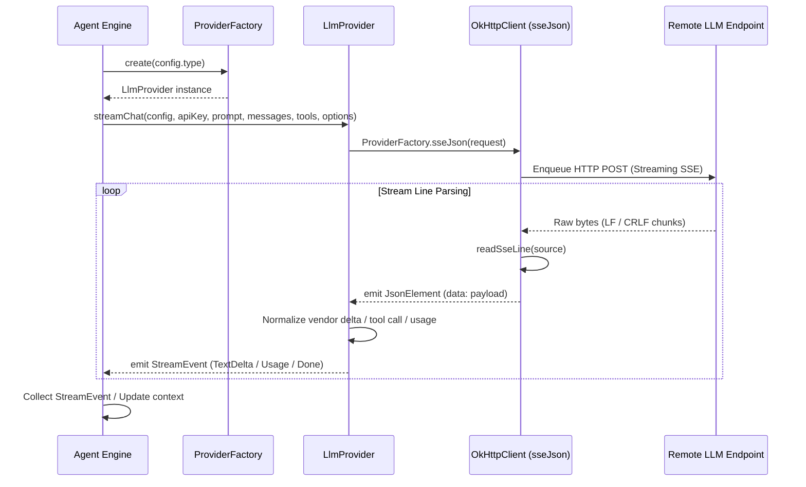

# LLM Core Interface & Client Contracts

> Abstract client contracts defining streaming generation, token usage extraction, and message models.

### Module Responsibilities

Module provides vendor-neutral client contracts for LLM communication. Normalizes wire protocols across multiple vendors into unified streaming flow. Exposes standard chat representations, streaming events, SSE line parsing, cache-routing configurations, token usage accounting.

---

### Primary Files

- `app/src/main/java/com/androidharness/app/llm/Llm.kt`: Core provider interfaces (`LlmProvider`), factory (`ProviderFactory`), SSE reader (`readSseLine`), streaming events (`StreamEvent`), provider configurations (`ProviderConfig`, `ProviderType`, `RequestOptions`, `ToolSchema`).
- `app/src/main/java/com/androidharness/app/core/Models.kt`: Provider-neutral domain models (`ChatMessage`, `Role`, `ToolCallData`, `ImageRef`, `ImageData`).

---

### Core Abstractions & Data Contracts

#### Interface & Factory
- `LlmProvider`: Single streaming entry point. Accepts configuration, credentials, system prompt, message history, tool specifications, request options. Returns reactive stream:
  ```kotlin
  fun streamChat(
      config: ProviderConfig,
      apiKey: String,
      systemPrompt: String,
      messages: List<ChatMessage>,
      tools: List<ToolSchema>,
      options: RequestOptions,
  ): Flow<StreamEvent>
  ```
- `ProviderFactory`: Shared singleton OkHttpClient instance. Read timeout `0 ms` for long-lived streams. Connect timeout `30s`, write timeout `60s`. Instantiates providers by `ProviderType`. Hosts low-level `sseJson` reactive bridge.

#### Providers & Endpoints
- `ProviderType`: Enumerates wire protocols:
  - `OPENAI_COMPAT`: Path `/chat/completions`.
  - `OPENAI_RESPONSES`: Path `/v1/responses`.
  - `ANTHROPIC`: Path `/v1/messages`.
  - `GEMINI`: Path `:streamGenerateContent`.
- `ProviderConfig`: Serialization record binding provider `id`, display `name`, protocol `type`, `baseUrl`, and default `model`.

#### Stream Events (`StreamEvent`)
Sealed interface emitted by `streamChat`:
- `TextDelta(val text: String)`: Incremental assistant content.
- `ThinkingDelta(val text: String)`: Incremental model reasoning tokens.
- `ToolCallReady(val call: ToolCallData)`: Fully assembled tool invocation.
- `ToolCallBatch(val calls: List<ToolCallData>)`: Multi-tool parallel calls.
- `Batch(val events: List<StreamEvent>)`: Composite grouped events.
- `Usage(val inputTokens: Int, val outputTokens: Int, val cachedInputTokens: Int = 0, val cacheWriteTokens: Int = 0)`: Unified token consumption. Total prompt tokens equals `inputTokens` (`uncached + cache reads + cache writes`). Cache hit rate equals `cachedInputTokens / inputTokens`.
- `Failure(val message: String)`: Stream-level error event.
- `Done(val finishReason: String? = null)`: Terminal event. Contains vendor finish reason (`stop`, `length`, `tool_calls`, `end_turn`, `MAX_TOKENS`).

#### Message Contracts
- `ChatMessage`: Core neutral exchange representation. Fields: `role` (`SYSTEM`, `USER`, `ASSISTANT`, `TOOL`), `text`, `toolCalls`, `toolCallId`, `toolName`, `isError`, `thinking`, `thinkingMs`, `images`, `imageData`, `turnId`.
- `ToolCallData`: Identified tool invocation containing `id`, `name`, `argumentsJson`.
- `ToolSchema`: Tool declaration with `name`, `description`, `parametersJson` (`JsonObject`).
- `RequestOptions`: Runtime parameters including `maxOutputTokens`, `thinking` (`ThinkingLevel`), and `cacheKey` (session ID used for prompt cache shard affinity across OpenAI and Anthropic).

---

### Call Chain & Architecture



#### Key Pipeline Stages
1. Engine obtains provider instance from `ProviderFactory.create`.
2. Engine triggers `LlmProvider.streamChat`.
3. Provider transforms `ChatMessage` and `ToolSchema` to vendor JSON payload. Includes `cacheKey` in vendor headers/metadata.
4. Provider calls `ProviderFactory.sseJson(request)`.
5. `callbackFlow` enqueues OkHttp `Call`. Cancels HTTP request upon collector coroutine cancellation (`awaitClose`).
6. `readSseLine` buffers incoming bytes, extracts clean lines, ignores keep-alives, terminates on `[DONE]`.
7. Provider parses emitted `JsonElement` payloads into typed `StreamEvent` variants.

---

### Boundary Conditions & Wire Normalization

- **Interior Carriage Return Preservation**: Standard line readers (`readUtf8Line`, `BufferedReader.readLine`) strip lone `\r`. Tool calls containing CRLF files corrupt without literal CR bytes. `ProviderFactory.readSseLine` checks explicit `\n` index. Drops only immediate trailing `\r`. Preserves interior CR bytes intact.
- **Null Safety in Gateway Envelopes**: Proxies and gateways emit explicit null fields (`"usage": null`, `"delta": null`). Normal `.jsonObject` conversions throw exceptions. Helper extensions `jsonObjectOrAbsent()` and `jsonArrayOrAbsent()` cast safely via `as?`, treating null values as absent.
- **Connection Lifetimes**: OkHttp configured with `readTimeout(0, TimeUnit.MILLISECONDS)`. Prevents socket timeout during long thinking phases or high-latency tokens.
- **HTTP Error Extraction**: Non-successful responses truncate error payload at 2000 characters: `response.body?.string()?.take(2000)`. Wrapped in `ApiException(code, message)` and passed to Flow closure.

---

### Extension Points

- **New LLM Provider**:
  1. Add identifier to `ProviderType` with wire `defaultBaseUrl` and `endpointPath`.
  2. Implement `LlmProvider` interface.
  3. Register mapping in `ProviderFactory.create`.
- **Custom Wire Parser**:
  1. Consume `ProviderFactory.sseJson(request)` for standard SSE JSON streams.
  2. Map incoming vendor `JsonElement` frames to `StreamEvent` sealed subtypes inside custom provider class.

---

Sources: [app/src/main/java/com/androidharness/app/llm/Llm.kt](app/src/main/java/com/androidharness/app/llm/Llm.kt#L1-L214), [app/src/main/java/com/androidharness/app/core/Models.kt](app/src/main/java/com/androidharness/app/core/Models.kt#L1-L50)

## Source files

- `app/src/main/java/com/androidharness/app/llm/Llm.kt`
