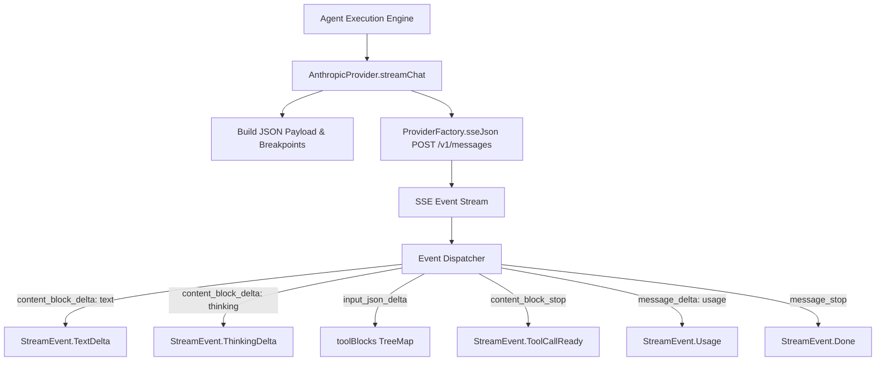

# Anthropic Claude Integration

> Implementation of Claude streaming completions, tool call serialization, and header negotiation.

# Anthropic Claude Integration

Implementation of Anthropic Claude `/v1/messages` protocol. Handles streaming responses, prompt cache breakpoints, tool call chunk assembly, thinking budgets, message schema mapping.

## Module Responsibilities

- **Request formation**: Serializes conversation history, tools, system instructions, thinking parameters into Anthropic wire format.
- **Header negotiation**: Inject `x-api-key` and `anthropic-version: 2023-06-01`.
- **Cache optimization**: Assign four ephemeral prompt cache breakpoints across static and dynamic payload sections.
- **Stream decoding**: Parse Server-Sent Events (SSE). Reconstruct streaming tool arguments, thinking deltas, text deltas, usage metrics.
- **Turn aggregation**: Merge consecutive tool executions into single `user` role payloads required by Claude API.

## Architecture and Invocation Chain

### Key Nodes

- **`AnthropicProvider.streamChat`**: Entry point. Computes token bounds, attaches headers, begins OkHttp SSE flow.
- **`Build JSON Payload & Breakpoints`**: Configures thinking budgets, sorts tools, applies ephemeral cache markers to system prompt, tool schemas, user messages.
- **`Event Dispatcher`**: Transforms incoming raw SSE events (`message_start`, `content_block_delta`, `message_delta`, etc.) into strongly typed `StreamEvent` objects.
- **`toolBlocks TreeMap`**: Indexes in-flight tool call JSON fragments by content block index. Emits `ToolCallReady` on completion.

## Key State & Stream Handling

State maintained across individual request stream lifecycles:

- `toolBlocks`: `TreeMap<Int, Triple<String, String, StringBuilder>>`. Tracks `(id, name, accumulatedArguments)` per content block index. Buffers chunks until `content_block_stop`.
- `inputTokens`, `cachedTokens`, `cacheWriteTokens`: Total prompt token calculations. Extracted on `message_start`.
- `stopReason`: Stored from `message_delta.stop_reason`. Emitted inside final `StreamEvent.Done`.

### Event Parsing Matrix

| Anthropic SSE Event | Extracted Data | Emitted `StreamEvent` |
|---|---|---|
| `message_start` | `usage.input_tokens`, `usage.cache_read_input_tokens`, `usage.cache_creation_input_tokens` | Normalizes total input tokens. Emits none. |
| `content_block_start` | `content_block.type == "tool_use"`, `id`, `name`, `index` | Registers entry in `toolBlocks`. Emits none. |
| `content_block_delta` | `delta.type == "text_delta"` | `StreamEvent.TextDelta` |
| `content_block_delta` | `delta.type == "thinking_delta"` | `StreamEvent.ThinkingDelta` |
| `content_block_delta` | `delta.type == "input_json_delta"` | Appends to `toolBlocks[index]`. Emits none. |
| `content_block_stop` | `toolBlocks.remove(index)` | `StreamEvent.ToolCallReady` |
| `message_delta` | `delta.stop_reason`, `usage.output_tokens` | `StreamEvent.Usage` |
| `message_stop` | Terminal marker | `StreamEvent.Done(stopReason)` |
| `error` | `error.message` | `StreamEvent.Failure` |

## Header Negotiation & Request Construction

Target URL: `${config.baseUrl.trimEnd('/')}/v1/messages`.

HTTP Headers:
- `x-api-key`: Model credentials.
- `anthropic-version`: Pinned to `2023-06-01`.
- `Content-Type`: `application/json; charset=utf-8`.

Payload Rules:
- **Thinking budget**: Computed via `options.thinking.budgetTokens`. Clamped to `ModelsDev.entry("anthropic", config.model)?.budgetMax`. If budget active, set `thinking.type = "enabled"` and `thinking.budget_tokens = budget`.
- **Max tokens**: Anthropic requires output token capacity above thinking tokens. Enforced by `maxOf(options.maxOutputTokens, budget + 8_192)`.
- **Cache routing**: If `options.cacheKey` provided, injects `metadata.user_id = cacheKey.take(64)` for backend cache shard locality.

## Prompt Caching Strategy

Anthropic enforces a maximum of 4 `cache_control: {"type": "ephemeral"}` breakpoints. Engine allocates them across prompt layers:

1. **System Prompt**: Static system text marked ephemeral.
2. **Tool Definitions**: Tools sorted alphabetically by name. Last tool definition marked ephemeral.
3. **Rolling Last Message**: `messages.lastIndex` marked ephemeral. Consecutive requests read previous conversation history from cache.
4. **Stable First User Message**: `indexOfFirst { role == "user" }` marked ephemeral. Provides partial cache hit fallback when rolling cache expires (~5 min idle).

Anchor rule: `withCacheBreakpoint` skips `thinking` and `redacted_thinking` blocks. Attaches breakpoint strictly to standard blocks (`text`, `tool_use`, `tool_result`, `image`).

## Message and Tool Serialization

Transforms engine `ChatMessage` into Anthropic content blocks:

- **`Role.USER`**: Plain text converted to string content. Multimodal images formatted as `type: "image"`, `source: {"type": "base64", "media_type": mime, "data": base64}`.
- **`Role.ASSISTANT`**: Maps model responses to `type: "text"` and tool requests to `type: "tool_use"` with parsed `input` JSON.
- **`Role.TOOL`**: Adjacent tool results bundled into single `role: "user"` message. Each tool response represented as `type: "tool_result"` block with `tool_use_id`, execution content, optional `is_error: true`.
- **`Role.SYSTEM`**: Interleaved system entries converted to `role: "user"`.

## Boundary Conditions

- **Uncached Token Accounting**: Anthropic `input_tokens` excludes cache hits and creations. `AnthropicProvider` recalculates:
  $$\text{inputTokens} = \text{uncached} + \text{cachedTokens} + \text{cacheWriteTokens}$$
  Maintains unified pricing calculations across providers.
- **Missing Tool Call IDs**: If block omits tool id, generates fallback `toolu_${System.nanoTime()}`.
- **Empty Tool Arguments**: Blank parameter streams default to `{}`.
- **Null Safety in SSE**: Custom `jsonObjectOrAbsent()` extensions prevent deserialization crashes when proxies output explicit `null` fields.

## Extension Points

- **`ModelsDev` Catalog**: Modify max thinking budget caps without updating core serialization logic.
- **`ProviderConfig.baseUrl`**: Route requests to internal Anthropic-compatible proxies or staging mock endpoints.

Sources: [app/src/main/java/com/androidharness/app/llm/AnthropicProvider.kt](app/src/main/java/com/androidharness/app/llm/AnthropicProvider.kt#L1-L374), [app/src/main/java/com/androidharness/app/llm/Llm.kt](app/src/main/java/com/androidharness/app/llm/Llm.kt#L23-L150)

## Source files

- `app/src/main/java/com/androidharness/app/llm/AnthropicProvider.kt`
