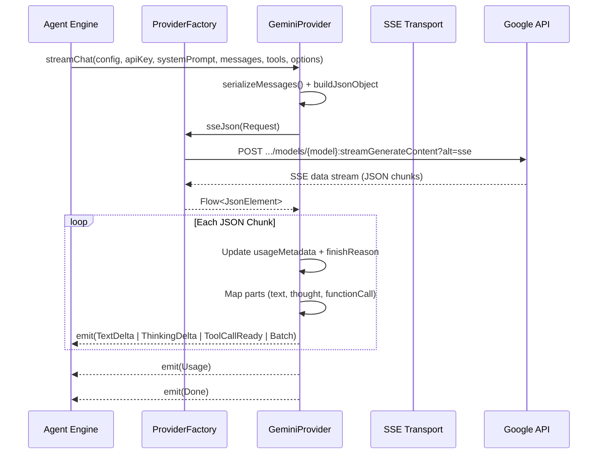

# Google Gemini Integration

> Adapter for Gemini generateContent streams and multi-modal tool calling protocols.

# Google Gemini Integration

Adapter for Google Gemini `streamGenerateContent` REST protocol over Server-Sent Events (SSE).

## Module Responsibilities

- Serializes domain conversation history, multimodal inputs, and function declarations into Google REST payload schema.
- Sends streaming POST requests to endpoint `:streamGenerateContent?alt=sse` using `x-goog-api-key` authentication.
- Parses chunked SSE JSON streams using OkHttp and Okio.
- Translates Gemini `candidates`, `parts`, `thought`, and `functionCall` items into unified `StreamEvent` emissions.
- Aggregates cumulative token usage metrics across chunks, emitting single summary event at stream termination.

## Invocation Chain

### Node Operations
- **`serializeMessages()`**: Translates harness message history into Gemini content turns. Folds multiple consecutive tool responses into single user container turn.
- **`buildJsonObject`**: Compiles `systemInstruction`, `contents`, `tools.functionDeclarations`, and `generationConfig`.
- **`sseJson(Request)`**: OkHttp callback flow. Reads raw stream line by line. Emits parsed `JsonObject` elements.
- **Chunk Parser**: Extracts `usageMetadata`, `finishReason`, text parts, thoughts, and function calls.
- **Finalizer**: Emits single `StreamEvent.Usage` with latest cumulative values, followed by `StreamEvent.Done(finishReason)`.

## Key State & Data Transformations

### State Variables
- `callCounter`: Tracks number of tool calls within stream. Constructs synthetic identifiers: `gemini_${name}_$callCounter`.
- `inputTokens`, `outputTokens`, `cachedTokens`: Tracks cumulative tokens from `usageMetadata`. Gemini reports totals per chunk. Overwrites previous values, emits once at stream completion to prevent counter inflation.
- `finishReason`: Preserves candidate termination reason (`candidate.finishReason`) before parsing parts array.

### Role Mapping

| Internal `Role` | Gemini `role` | Payload Representation |
| :--- | :--- | :--- |
| `Role.USER` | `"user"` | `parts: [{ inlineData: ... }, { text: ... }]` |
| `Role.ASSISTANT`| `"model"`| `parts: [{ text: ... }, { functionCall: { name, args } }]` |
| `Role.TOOL` | `"user"` | `parts: [{ functionResponse: { name, response: { output } } }, { inlineData: ... }]` |
| `Role.SYSTEM` | `"user"` | `parts: [{ text: ... }]` |

*Note: Global system prompt serializes to top-level `systemInstruction` object rather than `contents`.*

### Event Transformations
- `part["thought"] == true`: Emits `StreamEvent.ThinkingDelta(text)`.
- `part["text"]`: Emits `StreamEvent.TextDelta(text)`.
- `part["functionCall"]`: Emits `StreamEvent.ToolCallReady(ToolCallData(id, name, args))`.
- Empty parts: Ignored.
- Single part: Emitted as direct `StreamEvent`.
- Multiple parts: Wrapped in `StreamEvent.Batch(events)`.

## Boundary Conditions & Edge Cases

- **Consecutive Tool Results**: Gemini API forbids consecutive role turns with separate `TOOL` entries. While-loop inspects subsequent messages, packing all adjacent `Role.TOOL` records into single `user` message with multiple `functionResponse` elements.
- **Thought Configuration**: When `options.thinking` is `MAX` or `ULTRA`, `thinkingBudget` set to `-1` (dynamic model allocation). For explicit levels, budget tokens calculated against `maxOutputTokens` and clamped against `ModelsDev.entry("google", model).budgetMax`.
- **CRLF Preservation**: Standard `readLine()` strips standalone interior carriage returns (`\r`), corrupting generated patches or files. Underlying `ProviderFactory.readSseLine()` strips only immediate trailing `\r` before `\n`, preserving embedded line endings.
- **Null Safety in JSON**: Uses `jsonObjectOrAbsent()` and `jsonArrayOrAbsent()` extension utilities. Converts explicit JSON `null` values to absent entries, avoiding serializer crashes when gateways emit `"delta": null`.
- **Synthetic IDs**: Gemini API lacks native unique identifiers for tool invocations within `functionCall`. Class constructs synthetic id prefixed with `gemini_` to satisfy harness dispatch requirements.

## Major Files

- `app/src/main/java/com/androidharness/app/llm/GeminiProvider.kt`: Main adapter implementation for Gemini SSE and multimodal serialization.
- `app/src/main/java/com/androidharness/app/llm/Llm.kt`: Base contracts, `LlmProvider` interface, `StreamEvent` sealed hierarchy, and SSE line reader.

## Extension Points

- **`generationConfig` Tuning**: Inject parameters (`temperature`, `topP`, `stopSequences`) within `streamChat` body builder (`GeminiProvider.kt#L64-L81`).
- **Tool Declaration Formatting**: Modify `functionDeclarations` serialization loop to alter parameter constraints or schema structures (`GeminiProvider.kt#L52-L61`).
- **Inline Multimodal Types**: Extend `inlineData` serialization in `serializeMessages` to support additional non-image MIME types supported by Gemini API.

Sources: [app/src/main/java/com/androidharness/app/llm/GeminiProvider.kt](app/src/main/java/com/androidharness/app/llm/GeminiProvider.kt#L1-L254), [app/src/main/java/com/androidharness/app/llm/Llm.kt](app/src/main/java/com/androidharness/app/llm/Llm.kt#L23-L213)

## Source files

- `app/src/main/java/com/androidharness/app/llm/GeminiProvider.kt`
