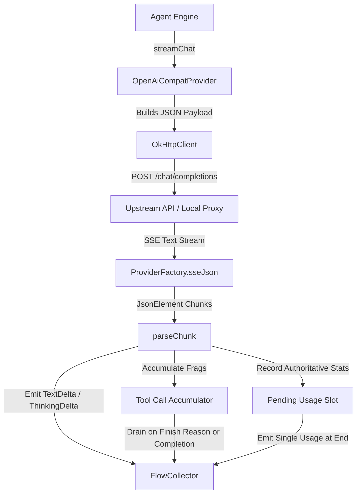

# OpenAI Compatible Provider

> Generic client communicating with OpenAI-compatible chat completion endpoints and local proxies.

### Module Responsibilities

`OpenAiCompatProvider` connects AndroidHarness to OpenAI-standard `/chat/completions` HTTP endpoints. Bridges local proxies (Ollama, LM Studio, llama.cpp) and remote multi-model gateways (OpenAI, OpenRouter, Groq, DeepSeek, Together).

Primary responsibilities:
- Wire serialization. Builds `/chat/completions` JSON payloads with model-specific thinking, caching, and token constraints.
- Multi-target feature toggling. Probes hostname to isolate strict local servers from unsupported options.
- Non-short-circuiting SSE chunk parsing. Decodes interleaved `content`, `reasoning_content`, `tool_calls`, and `usage`.
- Parallel tool call reassembly. Indexes streaming function chunks by call ID to prevent gateway index collisions.

---

### Main Files

- `app/src/main/java/com/androidharness/app/llm/OpenAiCompatProvider.kt`: Implements `LlmProvider` for OpenAI compatible APIs.
- `app/src/main/java/com/androidharness/app/llm/Llm.kt`: Defines provider interfaces, contracts, config data classes, and stream events.

---

### Call Chain

1. Caller invokes `streamChat(config, apiKey, systemPrompt, messages, tools, options)`.
2. Provider evaluates `config.baseUrl` and `config.model`. Sets `max_completion_tokens` or `max_tokens`.
3. Provider evaluates host destination. Injects `prompt_cache_key`, `stream_options.include_usage`, and `reasoning` / `reasoning_effort` payloads.
4. Provider serializes messages and tool definitions. Issues POST request via `OkHttpClient`.
5. `ProviderFactory.sseJson(request)` collects JSON SSE frames.
6. `parseChunk()` extracts text, reasoning deltas, errors, usage tokens, and function fragments.
7. Function calls assemble into `acc` map.
8. Flow drains remaining tool calls and authoritative `pendingUsage`. Emits `StreamEvent.Done`.

---

### Key States and Structures

- `acc: LinkedHashMap<String, Triple<StringBuilder, StringBuilder, StringBuilder>>`: Accumulates tool call ID, function name, and argument buffer fragments across chunks. Keyed by tool call ID.
- `indexToId: HashMap<Int, String>`: Maps SSE stream payload indices to call IDs. Resolves index reuse where gateways emit parallel calls under index 0.
- `pendingUsage: StreamEvent.Usage?`: Retains most recent usage snapshot. Prevents multiple token charge emissions when gateways send usage on every chunk.
- `NEW_TOKEN_PARAM_MODELS: Regex`: Matches `^(o\d|gpt-5)`. Swaps `max_tokens` for `max_completion_tokens`.

---

### Boundary Conditions

- Local proxy isolation: `isLocalHost(baseUrl)` inspects IP patterns (`127.*`, `10.*`, `192.168.*`, `172.16-31.*`) and bare hostnames (`localhost`, `0.0.0.0`). Prevents HTTP 400 errors by withholding `stream_options.include_usage`, `user`, and `reasoning_effort` from Ollama, llama.cpp, and LM Studio.
- Gateway usage fragmentation: Parsers check multiple payload keys (`cached_tokens`, `cache_read_input_tokens`, `prompt_cache_hit_tokens`, `cache_creation_input_tokens`) to extract input, output, cache-read, and cache-write counters across providers.
- Finish reason omission: Stream terminal handler runs `drainAccumulated(acc)` when stream terminates cleanly after `[DONE]` without prior `finish_reason`. Prevents dropping trailing tool invocations.
- Reasoning wire variants: Dispatches `reasoning_content` (DeepSeek, OpenRouter) and `reasoning` property strings into unified `StreamEvent.ThinkingDelta`.

---

### Extension Points

- `ThinkingSpecs`: Map provider-specific reasoning flags or effort vocabularies before wire payload formatting.
- `supportsUsageAccounting()` / `supportsCacheKey()`: Add provider hostname matchers to adjust upstream parameter tolerance.
- `parseChunk()` usage selectors: Register vendor-specific usage keys when supporting non-standard cache accounting headers.

---

Sources: [app/src/main/java/com/androidharness/app/llm/OpenAiCompatProvider.kt](app/src/main/java/com/androidharness/app/llm/OpenAiCompatProvider.kt#L1-L432), [app/src/main/java/com/androidharness/app/llm/Llm.kt](app/src/main/java/com/androidharness/app/llm/Llm.kt#L23-L105)

## Source files

- `app/src/main/java/com/androidharness/app/llm/OpenAiCompatProvider.kt`
