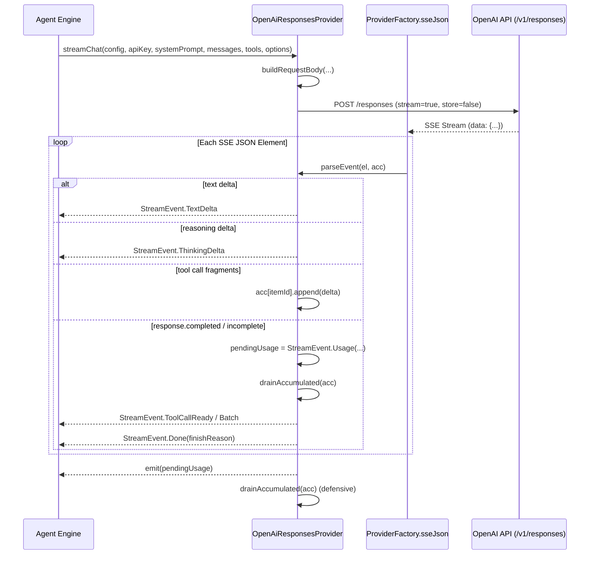

# OpenAI Realtime & Responses Provider

> Specialized OpenAI provider utilizing Responses and structured output protocols.

# OpenAI Realtime & Responses Provider

OpenAI Responses API integration. Communicates via `POST /v1/responses`. Handles reasoning effort specifications, structured message serialization, SSE item streams, and function-call accumulation.

## Module Responsibilities

- **Protocol Encapsulation**: Dispatches requests to `/responses` instead of legacy `/chat/completions`.
- **Reasoning Integration**: Serializes thinking levels to `reasoning.effort` and `summary: "auto"`. Emits reasoning stream deltas.
- **Message Flattening**: Converts chat history to flat response input items (`function_call`, `function_call_output`, `input_text`, `input_image`).
- **Tool Call Assembly**: Streams JSON argument deltas per item identifier into accumulating buffers. Materializes `StreamEvent.ToolCallReady` or `StreamEvent.ToolCallBatch`.
- **Cache Sharding**: Configures `prompt_cache_key` and routing metadata `user: pc_<key>`.

## Call Chain & Execution Flow



### Flow Node Details
- `buildRequestBody`: Transforms `ChatMessage` collection, tool schemas, and `RequestOptions` into stateless OpenAI Responses payload (`store: false`).
- `ProviderFactory.sseJson`: Manages long-lived OkHttpClient call. Extracts raw SSE `data:` payloads while preserving raw carriage returns (`\r`).
- `parseEvent`: Matches Responses event `type` field. Appends function call deltas, creates deltas for text and reasoning, captures token usage.
- `drainAccumulated`: Flushes function calls buffered in the item accumulator map into single or batched tool call events.
- `pendingUsage`: Stored locally until SSE flow completes. Prevents premature multi-accounting in streaming pipelines.

## Key State & Accumulator Mechanics

Tool call streaming in `/v1/responses` uses item-based correlation rather than array indices:

```
acc: LinkedHashMap<String, Triple<String, String, StringBuilder>>
// Map Key: item.id (Responses API item identifier)
// Triple.first:  call_id (Function call ID, falls back to item.id)
// Triple.second: name (Tool name)
// Triple.third:  arguments (Buffered JSON fragment chunks)
```

State transitions per event:
1. `response.output_item.added`: Item `type == "function_call"`. Inserts new `Triple(callId, name, StringBuilder())` keyed by item `id`.
2. `response.function_call_arguments.delta`: Appends `delta` string to `Triple.third`.
3. `response.output_item.done`: Inspects `Triple.third`. Appends full `arguments` string if deltas were absent.
4. `response.completed` / `response.incomplete`: Triggers `drainAccumulated(acc)`. Emits `ToolCallReady` (single) or `ToolCallBatch` (multiple). Clears accumulator.

## Primary Files & Signatures

| File | Entity | Purpose |
| --- | --- | --- |
| `app/src/main/java/com/androidharness/app/llm/OpenAiResponsesProvider.kt` | `OpenAiResponsesProvider` | Core Responses provider implementing `LlmProvider`. Request builder and event parser. |
| `app/src/main/java/com/androidharness/app/llm/OpenAiResponsesProvider.kt` | `buildRequestBody` | Request JSON serializer (`model`, `store: false`, `reasoning`, `input`, `tools`). |
| `app/src/main/java/com/androidharness/app/llm/OpenAiResponsesProvider.kt` | `serializeMessage` | Maps `Role.USER`, `Role.ASSISTANT`, `Role.TOOL`, `Role.SYSTEM` to Responses input structures. |
| `app/src/main/java/com/androidharness/app/llm/OpenAiResponsesProvider.kt` | `parseEvent` | Processes SSE JSON elements into `StreamEvent` subtypes. |
| `app/src/main/java/com/androidharness/app/llm/OpenAiResponsesProvider.kt` | `drainAccumulated` | Converts accumulated argument builders into `ToolCallData` instances. |
| `app/src/main/java/com/androidharness/app/llm/Llm.kt` | `ProviderType.OPENAI_RESPONSES` | Enum binding mapping provider to `https://api.openai.com/v1` and `/v1/responses`. |
| `app/src/main/java/com/androidharness/app/llm/Llm.kt` | `ProviderFactory.sseJson` | SSE network transport converting OkHttp response streams to `Flow<JsonElement>`. |
| `app/src/main/java/com/androidharness/app/llm/Llm.kt` | `ProviderFactory.readSseLine` | Line decoder preserving non-terminal `\r` inside JSON literals. |

## Boundary Conditions & Defensive Handling

- **Non-Delta Tool Arguments**: Some upstream endpoints omit `response.function_call_arguments.delta` events and deliver the complete argument body on `response.output_item.done`. Checked in `response.output_item.done`; fallback reads `item["arguments"]` if buffer empty.
- **Unfinished Streams**: SSE streams can terminate without `output_item.done` or `response.completed`. Evaluated on flow completion; invokes fallback `drainAccumulated(acc)` to prevent dropped tool calls.
- **Null Safety in Json Parsing**: Remote endpoints return explicit `null` fields (`"usage": null`, `"delta": null`). `jsonObjectOrAbsent()` casts nullable `JsonElement` to `JsonObject?` safely, preventing type cast crashes.
- **CRLF Preservation**: Standard stream readers convert raw `\r` into line breaks, damaging JSON payloads with carriage returns. `ProviderFactory.readSseLine` only trims trailing `\r` preceding `\n`; internal carriage returns inside tool argument strings are preserved.
- **Cache Key Truncation**: Prompt cache keys restricted in length. `options.cacheKey` is truncated to 64 characters (`cleanKey.take(64)`) and passed to `prompt_cache_key` and `user: "pc_$cleanKey"`.
- **Single Usage Emission**: `pendingUsage` is held and emitted once at flow termination. Prevents duplicate usage counting across intermediate chunk completions.

## Extension Points

- **Reasoning Effort Mapping**: Add target model mappings in `com.androidharness.app.agent.ThinkingSpecs.effortWire`. Modifies value passed to `reasoning.effort`.
- **System Instructions**: Adjust `instructions` key in `buildRequestBody`. System prompt decoupled from message history array.
- **Strict Structured Outputs**: Modify `tools` serializer in `buildRequestBody`. Switch `strict: false` to `true` when schema requires strict JSON schema compliance.
- **Multimodal Message Content**: Add extra payload builders into `serializeMessage`. Currently supports `input_text` and base64 `input_image` payloads.

## Sources

Sources: [app/src/main/java/com/androidharness/app/llm/OpenAiResponsesProvider.kt](app/src/main/java/com/androidharness/app/llm/OpenAiResponsesProvider.kt#L1-L305), [app/src/main/java/com/androidharness/app/llm/Llm.kt](app/src/main/java/com/androidharness/app/llm/Llm.kt#L23-L214)

## Source files

- `app/src/main/java/com/androidharness/app/llm/OpenAiResponsesProvider.kt`
