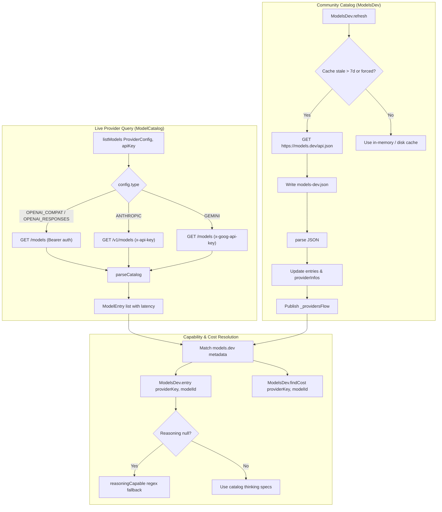

# Model Catalog & Developer Metadata

> Registry of supported LLMs, context window limits, vendor identifiers, and feature capabilities.

# Model Catalog & Developer Metadata

Registry of supported LLMs, context window limits, vendor identifiers, and feature capabilities.

## Module Responsibilities

- **Live Provider Introspection**: Queries remote vendor endpoints (`/models`, `/v1/models`). Validates API credentials, network reachability, catalog payload schemas.
- **Community Metadata Ingestion**: Fetches and caches models.dev feed (`https://models.dev/api.json`). Supplies fine-grained thinking vocabularies, context limits, token pricing.
- **Capability Heuristics**: Resolves reasoning flags and vision compatibility via regex rules when provider schemas omit capability parameters.
- **Pricing & Parameter Resolution**: Maps model identifiers across varied vendor naming formats to derive cost metrics and token bounds.

---

## Primary Files

| File | Primary Role |
| :--- | :--- |
| `ModelCatalog.kt` | Live provider model listing, endpoint dispatch, payload parsing, capability regex evaluators (`reasoningCapable`, `visionCapable`). |
| `ModelsDev.kt` | Offline/cached community catalog manager, weekly refresh scheduler, thinking option extractor (`effort`, `budget_tokens`, `toggle`), pricing resolver (`findCost`). |

---

## Key State & Data Structures

### `ModelCatalog.kt`

- `ModelEntry`: Representation of an available model. Holds `id` (String), tri-state `reasoning` (Boolean?), and `contextTokens` (Long?).
- `ModelCatalog.Result`: Sealed interface. Produces `Models(models, latencyMs)` on success or `Failed(message)` on HTTP/socket failure.

### `ModelsDev.kt`

- `entries`: In-memory `Map<String, Map<String, Entry>>` mapping provider keys to model entries.
- `providerInfos`: In-memory `List<ProviderInfo>` cataloging known providers.
- `_providersFlow`: `MutableStateFlow<List<ProviderInfo>>` broadcasting provider directory changes to UI.
- `loaded`: Guard flag preventing redundant disk cache reads.
- `CACHE_FILE`: Local file `"models-dev.json"` stored in `context.filesDir`. Stale duration: 7 days (`STALE_MS = 604800000L`).
- `Entry`: Per-model capability metadata:
  - `reasoning`: Tri-state boolean.
  - `effortValues`: Enumerated reasoning effort terms (`low`, `high`, `max`).
  - `budgetTokens`: Explicit token budget indicator.
  - `budgetMax`: Max budget ceiling.
  - `toggle`: Binary thinking enable toggle.
  - `contextTokens`: Token ceiling (`limit.context`).
  - `cost`: Token cost rates (`ModelCost(input, output, cacheRead, cacheWrite)`).

---

## Resolution & Discovery Flow



### Flow Walkthrough

1. `ModelCatalog.listModels` executes background HTTP GET on Dispatchers.IO. It routes authentication headers per provider type (`Bearer`, `x-api-key`, `x-goog-api-key`).
2. `parseCatalog` deserializes vendor payloads:
   - OpenAI/Anthropic: Iterates `data` objects. Checks `supported_parameters` or `reasoning` keys for thinking features. Reads `context_length`, `max_tokens`, or `context_window`.
   - Gemini: Iterates `models` objects. Strips `models/` prefix. Sets reasoning capability via `reasoningCapable` regex heuristic.
3. `ModelsDev.load` pulls cached `models-dev.json` from disk on app launch. `ModelsDev.refresh` executes weekly remote refreshes or on-demand forced updates.
4. Parsing parses `reasoning_options` arrays into discrete types: `effort`, `budget_tokens`, and `toggle`.
5. Calls to `ModelsDev.entry` or `ModelsDev.findCost` query exact IDs, strip provider prefixes (`substringAfterLast('/')`), and apply normalized character matching.

---

## Capability Heuristics & Boundary Handling

### Reasoning Capability Heuristic (`reasoningCapable`)
Evaluates model ID string when endpoint omits capability descriptors. Returns true on regex match:
```kotlin
(^|/)(o[1345]([-.]|$)|gpt-5)|deepseek-(r1|reasoner)|deepseek-v[4-9]|claude|gemini-[23]\.[0-9]|qwen3|glm-[45]|minimax-m2|nemotron|hy3|kimi-latest|k2
```

### Vision Capability Heuristic (`visionCapable`)
Detects multimodal acceptance:
- **Explicit Allowed Substrings**: `-vl`, `vision`, `omni`, `4o`, `gemini`, `claude`, `gpt-4-turbo`.
- **Explicit Blocked Regex**: Rejects known text-only families:
  ```kotlin
  (^|/)(deepseek-(chat|coder|r1|reasoner|v[0-9])|qwen.*coder|o1-mini|codellama|mistral-(tiny|small|embed)|llama-.*-(?!.*vision))
  ```

### Boundary Conditions & Edge Cases

- **Provider Key Resolution**: `providerKeyFor` checks known host domains (e.g. `api.openai.com` to `openai`). If unlisted, strips base URL scheme/path and matches against `ProviderInfo.api` hostnames across 180+ catalog entries.
- **Provider Filtering**: `speakableProviders` omits hardcoded curated vendor hosts (`openrouter.ai`, `api.anthropic.com`, etc.) and vendors with unsupported client protocol runtimes (`protocolFor(npm) == null`).
- **Identifier Discrepancies**: User configurations might add or drop organization prefixes (`anthropic/claude-sonnet-4-5` vs `claude-sonnet-4-5`). `ModelsDev.entry` searches exact keys, falls back to `substringAfterLast('/')`, then tests suffix ends.
- **Pricing Fallback**: `findCost` evaluates provider direct matches, scans all providers for exact model IDs, attempts suffix matching, then falls back to normalized alphanumeric substring scans (`norm.replace("-", "").replace(".", "")...`). Defaults cache read to `input * 0.25` and cache write to `input` when absent in catalog.
- **Network / Parse Failures**: HTTP errors return `Result.Failed` in `ModelCatalog.listModels`. Failed network updates in `ModelsDev.refresh` leave previous disk cache or hardcoded application specifications active.

---

## Extension Points

- **New Vendor Protocol Mapping**: Map npm package IDs in `ModelsDev.protocolFor` to associate newly supported SDK providers with `ProviderType`.
- **Endpoint Catalog Additions**: Add URL patterns and authentication headers in `ModelCatalog.listModels` and `ModelCatalog.parseCatalog` when adding distinct provider families.
- **Reasoning Regex Updates**: Update regex in `ModelCatalog.kt#reasoningCapable` when unlisted model families introduce thinking behaviors without remote parameter flags.
- **Vision Model Flags**: Modify `ModelCatalog.kt#visionCapable` inclusions and exclusions when new visual or text-only models ship.
- **Reasoning Vocabulary Types**: Add extraction rules in `ModelsDev.kt#parse` inside the `reasoning_options` parser when community feeds define new reasoning parameters.

---

Sources: [app/src/main/java/com/androidharness/app/llm/ModelCatalog.kt](app/src/main/java/com/androidharness/app/llm/ModelCatalog.kt#L1-L134), [app/src/main/java/com/androidharness/app/llm/ModelsDev.kt](app/src/main/java/com/androidharness/app/llm/ModelsDev.kt#L1-L333)

## Source files

- `app/src/main/java/com/androidharness/app/llm/ModelCatalog.kt`
- `app/src/main/java/com/androidharness/app/llm/ModelsDev.kt`
