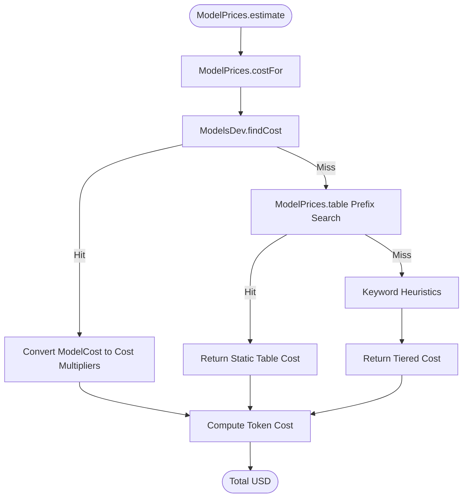

# Token Pricing & Cost Tracking

> Pricing tables and calculation logic for input, output, and cache token cost tracking.

# Token Pricing & Cost Tracking

Tracks LLM token financial expenditures. Computes dollar costs across prompt input, output generation, cache reads, and cache writes.

## Module Responsibilities

- **Dynamic Catalog Pricing:** Ingests weekly community pricing feed (`models.dev/api.json`). Caches locally.
- **Hierarchical Cost Resolution:** Resolves prices via dynamic catalog, static prefix table, then heuristic fallback.
- **Token Estimation Calculation:** Aggregates uncached prompt tokens, cached input tokens, cache write tokens, and output tokens into USD.
- **Provider Normalization:** Maps provider endpoints and model name variants across heterogeneous pricing schemes.

## Key Files

- `app/src/main/java/com/androidharness/app/llm/ModelPrices.kt`: Defines `Cost` model, hardcoded pricing table, heuristic tiers, and arithmetic calculation function `estimate()`.
- `app/src/main/java/com/androidharness/app/llm/ModelsDev.kt`: Fetches, caches, parses `https://models.dev/api.json`. Resolves provider keys and model costs across exact, suffix, and normalized identifiers.

## Resolution & Calculation Flow

- `ModelPrices.costFor`: Entry point for price resolution. Queries catalog, fallback table, heuristic ladder.
- `ModelsDev.findCost`: Scans in-memory catalog cache via 4-tier match strategy (provider exact, global exact, suffix match, normalized string containment).
- `ConvertLive`: Normalizes absolute catalog cache rates into relative multipliers (`cacheRead / input`, `cacheWrite / input`).
- `CheckStatic`: Normalizes model string delimiters (`:`, `/` to `-`) and searches prefix pairs in `ModelPrices.table`.
- `CheckHeuristics`: Categorizes unknown models by substring tokens (`free`, `flash`, `opus`, `pro`, fallback defaults).
- `CalcFormula`: Computes non-cached prompt tokens, scales each bucket by rate per 1,000,000 tokens, sums output.

## Call Chain

1. **Invocation:** UI or execution engine calls `ModelPrices.estimate(model, totalInputTokens, outputTokens, cachedTokens, cacheWriteTokens, providerKey)`.
2. **Cost Extraction:** `estimate()` calls `ModelPrices.costFor(model, providerKey)`.
3. **Live Catalog Lookup:** `costFor()` queries `ModelsDev.findCost(providerKey, model)`:
   - Match exact `modelId` under specified `providerKey`.
   - Match exact `modelId` across all cached providers.
   - Suffix match (strips vendor prefix before `/`).
   - Substring match against normalized alphanumeric string.
4. **Static Table Lookup:** On catalog miss, `costFor()` scans `ModelPrices.table`. Delimiters `:` and `/` replaced with `-`. Prefix match evaluated bidirectional.
5. **Heuristic Tier Fallback:** On table miss, regex/substring match classifies model into tier:
   - `free`: $0.00 / $0.00
   - `flash` / `mini` / `nano` / `8b`: $0.15 input / $0.60 output
   - `opus` / `large` / `max` / `405b`: $5.00 input / $25.00 output
   - `pro` / `sonnet` / `r1` / `70b`: $1.50 input / $6.00 output
   - Default: $0.50 input / $2.00 output
6. **Token Arithmetic:**
   $$\text{uncached} = \max(0, \text{totalInputTokens} - \text{cachedTokens} - \text{cacheWriteTokens})$$
   $$\text{cost} = \frac{\text{uncached} \times \text{input}}{10^6} + \frac{\text{cachedTokens} \times \text{input} \times \text{cacheRead}}{10^6} + \frac{\text{cacheWriteTokens} \times \text{input} \times \text{cacheWrite}}{10^6} + \frac{\text{outputTokens} \times \text{output}}{10^6}$$

## Key State

| State Holder | Variable | Scope | Type | Purpose |
|---|---|---|---|---|
| `ModelsDev` | `entries` | In-memory `@Volatile` | `Map<String, Map<String, Entry>>` | Cached provider/model pricing metadata. |
| `ModelsDev` | `providerInfos` | In-memory `@Volatile` | `List<ProviderInfo>` | Parsed provider registry. |
| `ModelsDev` | `loaded` | In-memory `@Volatile` | `Boolean` | Prevents redundant disk reads of `models-dev.json`. |
| Disk Storage | `models-dev.json` | Internal app storage | JSON File | Persisted weekly catalog cache. |
| `ModelPrices` | `table` | Static constant | `List<Pair<String, Cost>>` | Fallback price definitions per 1M tokens. |

## Boundary Conditions

- **Negative Uncached Counts:** Provider token accounting may report `cachedTokens + cacheWriteTokens > totalInputTokens`. `(totalInputTokens - cachedTokens - cacheWriteTokens).coerceAtLeast(0)` prevents negative billing.
- **Zero Input Price Multipliers:** Catalog models with `input = 0.0` avoid zero division: fallback defaults set `cacheRead = 0.25`, `cacheWrite = 1.0`.
- **Stale Remote Data:** `ModelsDev.refresh()` checks file age against `STALE_MS` (7 days). If network fails or HTTP status non-200, existing disk cache remains active.
- **Vendor Prefix Inconsistencies:** Models passed as `anthropic/claude-3-5-sonnet` match catalog entries keyed as `claude-3-5-sonnet` via `substringAfterLast('/')`.

## Extension Points

- **Static Price Additions:** Append new model pairs to `table` in `ModelPrices.kt` for immediate offline pricing updates.
- **Custom Provider Endpoint Mappings:** Add host matching rules to `ModelsDev.providerKeyFor()` to map self-hosted gateways or proxies to upstream provider catalogs.
- **Heuristic Refinements:** Adjust price tier thresholds or add pattern checks inside `ModelPrices.costFor()`.

Sources: [app/src/main/java/com/androidharness/app/llm/ModelPrices.kt](app/src/main/java/com/androidharness/app/llm/ModelPrices.kt#L1-L104), [app/src/main/java/com/androidharness/app/llm/ModelsDev.kt](app/src/main/java/com/androidharness/app/llm/ModelsDev.kt#L36-L320)

## Source files

- `app/src/main/java/com/androidharness/app/llm/ModelPrices.kt`
