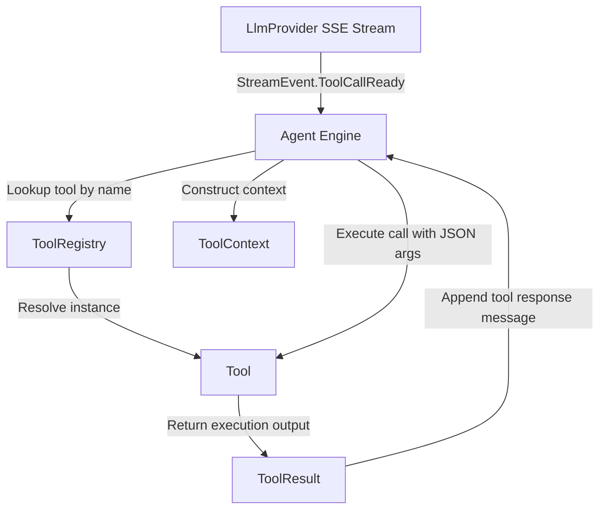

# Tool Definition & Dispatch System

> Base tool contracts, argument validation, serialization interfaces, and invocation handlers.

### Module Responsibilities

Tool Definition & Dispatch System provides execution contracts, JSON schema construction, context injection, and dynamic tool discovery. Converts LLM tool calls into sandboxed system actions.

- **Tool specification**: Declares name, JSON Schema, read-only status, execution logic.
- **Context boundary**: Injects filesystem abstraction (`WorkspaceFs`) and permission overrides (`sandboxOff`).
- **Schema projection**: Transforms internal tool contracts into provider-agnostic `ToolSchema` payloads.
- **Dynamic extension**: Merges run-scoped tools (MCP adapters) over static base registries.

---

### Primary Files

- `app/src/main/java/com/androidharness/app/tools/Tool.kt`: Defines `Tool`, `ToolContext`, `ToolResult`, `ToolRegistry`, and `Schema` DSL.
- `app/src/main/java/com/androidharness/app/llm/Llm.kt`: Defines `ToolSchema` and tool stream events (`ToolCallReady`, `ToolCallBatch`).

---

### Core Abstractions and Contracts

#### `Tool` (`Tool.kt#L33-L40`)
Execution contract.
- `name: String`: Unique lookup key.
- `description: String`: Guidance text for model dispatch.
- `parametersSchema: JsonObject`: Validated JSON Schema representation of input parameters.
- `isReadOnly: Boolean`: Indicates non-mutating operations. Filters tools when agent context restricts mutations.
- `execute(args: JsonObject, ctx: ToolContext): ToolResult`: Suspending execution handler.

#### `ToolContext` (`Tool.kt#L11-L19`)
Execution environment wrapper.
- `workspace: WorkspaceFs`: Target filesystem interface.
- `sandboxOff: Boolean`: Bypasses tool-internal denylists and sandbox checks. Set by engine; tools read only.

#### `ToolResult` (`Tool.kt#L21-L29`)
Output payload.
- `ok: Boolean`: Tool success state.
- `output: String`: Stdout, text content, or error trace returned to agent conversation context.
- `image: ImageRef?`: Vision-capable payload for inline multimodal model responses.

#### `ToolRegistry` (`Tool.kt#L42-L141`)
Registry container.
- `byName: Map<String, Tool>`: Immutable map indexing registered tools.
- `withExtra(extra: List<Tool>)`: Clones registry with ephemeral tools appended.
- `schemas(readOnlyOnly: Boolean)`: Generates sorted list of `ToolSchema` instances for LLM ingestion.
- `default(...)`: Factory injecting OS services, shell tier routers, and platform controllers into standard tools.

#### `Schema` (`Tool.kt#L144-L178`)
JSON Schema generator DSL.
- `string`, `integer`, `boolean`, `array`: Helper methods generating JSON Schema field objects.
- `obj(properties, required)`: Builds composite object schema with property definitions and mandatory field lists.

---

### Invocation Pipeline

- **LlmProvider SSE Stream**: Emits `ToolCallReady` containing tool identifier and arguments JSON.
- **Agent Engine**: Coordinates argument validation, state injection, and error recovery.
- **ToolRegistry**: Resolves registered `Tool` instance matching requested name.
- **ToolContext**: Holds target `WorkspaceFs` mount and `sandboxOff` permissions.
- **Tool**: Suspends execution, performs operation, produces `ToolResult`.

---

### Boundary Conditions and Edge Cases

- **Missing tool resolution**: `ToolRegistry.get()` yields `null`. Engine reports missing tool error directly into conversation flow.
- **Malformed arguments**: Missing JSON attributes throw within `Tool.execute()`. Errors bubble up as exceptions or `ToolFailure`.
- **Empty run-scoped extensions**: `ToolRegistry.withExtra(emptyList())` returns `this` instance directly. Prevents redundant allocations (`Tool.kt#L48-L50`).
- **Sandbox bypass integrity**: Tools inspect `ToolContext.sandboxOff`. Tools never toggle this flag autonomously (`Tool.kt#L13-L18`).
- **Null safety in provider streams**: Gateway null payloads (`"usage": null`, `"delta": null`) handled via `jsonObjectOrAbsent()` and `jsonArrayOrAbsent()` (`Llm.kt#L107-L114`).

---

### Extension Points

1. **Custom Platform Tools**: Implement `Tool` interface. Register inside `ToolRegistry.default()` factory.
2. **Dynamic / Run-Scoped Tools**: Invoke `ToolRegistry.withExtra(listOf(customTool))` to inject runtime tools without mutating base registry.
3. **Structured Argument DSL**: Utilize `Schema.obj()` and primitives to enforce validation contracts for model providers.

---

Sources: [app/src/main/java/com/androidharness/app/tools/Tool.kt](app/src/main/java/com/androidharness/app/tools/Tool.kt#L1-L179), [app/src/main/java/com/androidharness/app/llm/Llm.kt](app/src/main/java/com/androidharness/app/llm/Llm.kt#L49-L115)

## Source files

- `app/src/main/java/com/androidharness/app/tools/Tool.kt`
