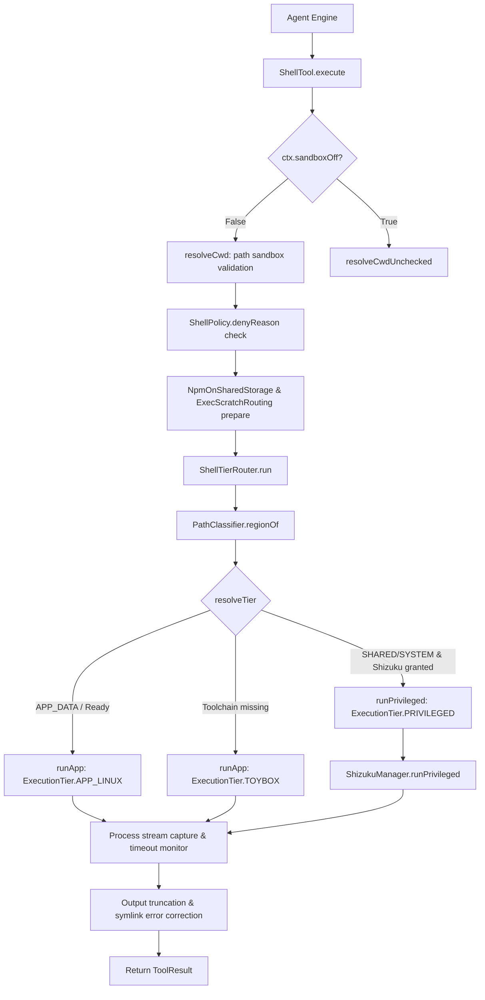

# Shell Command Execution and Sandboxing

> Command-line process execution, standard stream capture, and command timeout management.

### Module Responsibilities

`ShellTool` executes command-line processes inside Android device environments. Validates arguments. Constrains working directory. Preprocesses commands for Android filesystem compatibility.

`ShellTierRouter` evaluates path target and privilege context. Dispatches command to highest available runtime tier (`PRIVILEGED`, `APP_LINUX`, `TOYBOX`). Manages stream capture and process timeouts.

---

### Call Chain

#### Node Roles
- `resolveCwd`: Verifies working directory stays within canonical workspace root.
- `NpmOnSharedStorage & ExecScratchRouting`: Injects `--no-bin-links` and redirects archive extractions away from non-executable FAT/FUSE storage.
- `PathClassifier`: Categorizes destination (`APP_DATA`, `SHARED_STORAGE`, `SYSTEM`) to dictate tier access.
- `ShellTierRouter`: Spawns Shizuku process wrapper or local app process.

---

### Critical States & Execution Tiers

| State / Tier | Execution Mechanism | Privileges | Path Scope |
|---|---|---|---|
| `ExecutionTier.PRIVILEGED` | Shizuku server process (`/system/bin/sh` or deployed Linux toolchain bash). | `shell` / `root` UID. | System paths, `/sdcard`, non-app data. |
| `ExecutionTier.APP_LINUX` | App-level sub-process running deployed Termux toolchain binaries. | App UID. | App data directory; shared storage if `MANAGE_EXTERNAL_STORAGE` held. |
| `ExecutionTier.TOYBOX` | Android default `/system/bin/sh` fallback. | App UID. | Minimal system utilities; unprivileged paths only. |

#### Internal Process Flags
- `timedOut`: Set true if process runtime exceeds requested timeout. Kills execution; preserves existing output.
- `hasSymlinkError`: Detected when `ln -s` commands fail on storage lacking symlink support. Cleans zero-byte artifact files left by failed calls.

---

### Primary Files

- `app/src/main/java/com/androidharness/app/tools/ShellTool.kt`: Tool entrypoint. Resolves `cwd`, calls command rewrites, truncates output streams, formats result strings.
- `app/src/main/java/com/androidharness/app/data/env/ShellTierRouter.kt`: Path classification, execution tier resolution, privilege escalation fallback, command execution dispatch.

---

### Boundary Conditions

- **Timeout Clamping**: Parameter `timeout_seconds` clamped between `1` and `600` seconds (default: `120`).
- **Buffer Truncation**: Stdout and stderr capped independently at `100_000` characters (`MAX_OUTPUT_CHARS`). Exceeding output appended with `\n[truncated]`.
- **CWD Confinement**: Blocked with `ToolFailure` if canonical `cwd` falls outside canonical `workspace.shellRoot` when `sandboxOff == false`.
- **SAF Workspaces**: Direct execution rejected if workspace lacks valid underlying Linux root path (`workspace.shellRoot == null`).
- **Privileged Drop**: `runPrivileged` drops to `runApp(..., APP_LINUX)` if Shizuku remote process dies mid-call.

---

### Extension Points

- **Command Preprocessing**: Pipeline chaining inside `ShellTool.execute` before router invocation (e.g., custom path rewrites similar to `NpmOnSharedStorage` or `ExecScratchRouting`).
- **Tier Routing Logic**: `ShellTierRouter.resolveTier` allows hooking custom isolation containers or chroot environments.

---

Sources: [app/src/main/java/com/androidharness/app/tools/ShellTool.kt](app/src/main/java/com/androidharness/app/tools/ShellTool.kt#L1-L147), [app/src/main/java/com/androidharness/app/data/env/ShellTierRouter.kt](app/src/main/java/com/androidharness/app/data/env/ShellTierRouter.kt#L1-L164)

## Source files

- `app/src/main/java/com/androidharness/app/tools/ShellTool.kt`
