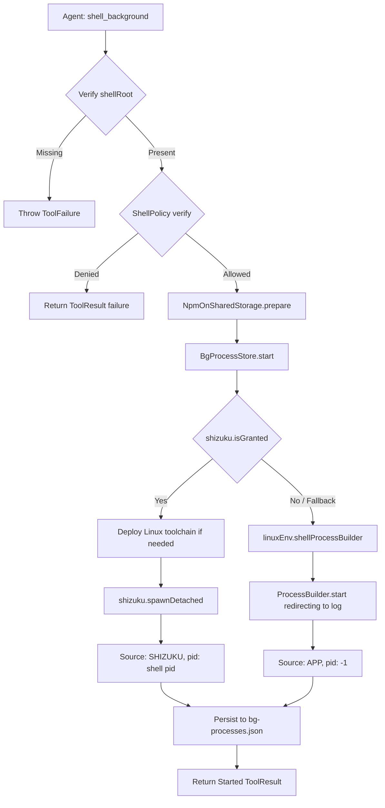

# Background Shell Process Management

> Multiplexed background process runner tracking long-running asynchronous shell sessions.

# Background Shell Process Management

Multiplexed background execution engine. Spawns, tracks, monitors, terminates detached shell sessions.

## Module Responsibilities

- **Dual-Tier Spawning**: Route execution to Shizuku shell daemon or Android app-level child process.
- **Session Durability**: Preserve Shizuku process survivability across host app death; retain state across app reboots via serialized JSON store.
- **Log Demultiplexing**: Direct process stdout/stderr into workspace-scoped `.log` files with unique boot tokens.
- **Lifecycle Auditing**: Probe live status on demand, filter heartbeat noise from log tails, cull dead entries.
- **Process Reaping**: Enforce multi-phase teardown targeting process IDs, parent process groups, and dangling file-descriptor holders.

## Key Files

- `app/src/main/java/com/androidharness/app/tools/BgShell.kt`: Agent tools interface (`shell_background`, `bg_list`, `bg_kill`). Enforces workspace root requirements, sandbox policy verification, npm shared storage arguments.
- `app/src/main/java/com/androidharness/app/data/BgProcessStore.kt`: Process state store, serialization engine, Shizuku/App runner split, log tail formatter, procfs killer.

## Key State and Models

### `BgProcessEntry`
Serialized record in `bg-processes.json`.

```kotlin
@Serializable
data class BgProcessEntry(
    val id: Int,
    val command: String,
    val cwd: String,
    val logPath: String,
    val pid: Int = -1,
    val source: String = "APP",
    val startedAt: Long = 0L,
)
```

- `id`: Monotonic local process identifier.
- `pid`: Shell PID when launched via Shizuku; `-1` for app-tier processes.
- `source`: Execution tier (`"SHIZUKU"` or `"APP"`).
- `logPath`: Relative workspace path to standard stream output file.

### In-Memory State (`BgProcessStore`)
- `entries`: `ConcurrentHashMap<Int, BgProcessEntry>` holding active and deserialized session records.
- `appProcesses`: `ConcurrentHashMap<Int, Process>` tracking live JVM app children.
- `bootToken`: Base-36 timestamp generated at store initialization. Guarantees unique log file names across restarts.
- `bootAt`: Store epoch timestamp. Distinguishes current-session processes from previous-session survivors in `bg_list`.

## Execution Lifecycle



### Flow Node Explanations
- **Verify shellRoot**: Command requires physical disk path. Rejects SAF virtual trees without shell backing.
- **ShellPolicy verify**: Evaluates command against execution security policy unless `sandboxOff` active.
- **NpmOnSharedStorage.prepare**: Rewrites npm commands targeting shared storage with `--no-bin-links`.
- **shizuku.spawnDetached**: Spawns detached daemon in Shizuku server context. Survives app termination.
- **linuxEnv.shellProcessBuilder**: Spawns local POSIX process child under app UID. Requires active foreground service.
- **Persist to bg-processes.json**: Writes sorted entries via temporary `.tmp` atomic file swap under mutex.

## Process Termination Flow

`BgKillTool` delegates to `BgProcessStore.kill(id)`:

1. Locate `BgProcessEntry` by `id`.
2. Resolve target `logFile`.
3. Branch on `e.source`:
   - `"SHIZUKU"`: Call `shizuku.killProcess(e.pid)`.
   - `"APP"`: Extract native PID via reflection on `java.lang.Process`. Signal negative PID via `Os.kill(-pid, SIGKILL)`. Invoke `/system/bin/pkill -9 -P <pid>`. Signal direct PID via `Os.kill(pid, SIGKILL)`. Call `Process.destroyForcibly()`.
4. Sweep procfs: `killPidsWithFd(logFile)` inspects `/proc/*/fd` links. Sends `SIGKILL` to lingering processes holding open descriptors to target log.
5. Evict from `entries` and `appProcesses`. Atomically rewrite `bg-processes.json`.

## Boundary Conditions

- **Storage Lacks Symlinks**: `NpmOnSharedStorage.prepare` detects FAT/vfat/exfat mounts. Appends `--no-bin-links` to prevent symlink failures.
- **Log Collisions**: Process IDs restart at 1 on clean installs or registry prune. `logName = "$id-$bootToken.log"` isolates logs per instance.
- **Dead Session Cleanup**: `BgListTool` triggers `list()`. Checks `shizuku.isProcessAlive` or JVM `Process.isAlive`. Dead processes removed from memory and serialized store immediately.
- **Old Session Pruning**: Store init loads `bg-processes.json`. Discards entries older than 24 hours (`System.currentTimeMillis() - 86400000L`).
- **Heartbeat Noise Suppression**: `store.tail` strips lines containing case-insensitive token `"heartbeat"`. Bounds output to requested character ceiling.

## Extension Points

- **Transport Plugs**: Replace `shizuku.spawnDetached` with alternative daemon interfaces (root runners, remote ADB daemons).
- **Log Pipeline**: Replace flat text file appending (`Redirect.appendTo(logFile)`) with rolling log writers or ring-buffered memory mapped files.
- **Interactive Stdin**: Introduce FIFO pipe routing into `BgProcessEntry` to support input transmission for long-running servers.

Sources:
- [app/src/main/java/com/androidharness/app/tools/BgShell.kt](app/src/main/java/com/androidharness/app/tools/BgShell.kt#L1-L122)
- [app/src/main/java/com/androidharness/app/data/BgProcessStore.kt](app/src/main/java/com/androidharness/app/data/BgProcessStore.kt#L1-L259)

## Source files

- `app/src/main/java/com/androidharness/app/tools/BgShell.kt`
