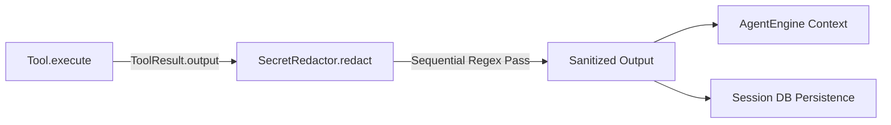

# Secret Masking & Sanitization

> Redaction filters for removing API tokens, passwords, and sensitive keys from tool outputs.

### Responsibilities

`SecretRedactor` filters credentials, API tokens, cryptographic keys, and userinfo authentication strings from tool execution output. Redaction occurs before tool output enters LLM context windows or persists to session databases.

---

### Primary Files

- `app/src/main/java/com/androidharness/app/tools/SecretRedactor.kt`: Singleton regex scrubber and pattern definitions.
- `app/src/main/java/com/androidharness/app/tools/Tool.kt`: Defines `ToolResult`, emitting raw `output` string payloads to be sanitized.

---

### Call Chain

- **Tool Execution**: Tool returns raw standard output, standard error, or API response in `ToolResult.output`.
- **Sanitization Interception**: `SecretRedactor.redact(text)` processes string against sequential pattern array.
- **Context Injection**: Redacted output enters prompt builder for subsequent model iterations.
- **Storage Persistence**: Scrubbed string commits to chat history records.

---

### Pattern Match Registry

`SecretRedactor.PATTERNS` evaluates 11 predefined `Regex` filters sequentially, replacing matches with `[redacted]`:

| Pattern Target | Signature / Regex | Match Criteria |
|---|---|---|
| PEM Private Keys | `-----BEGIN [A-Z ]*PRIVATE KEY-----[\s\S]*?-----END [A-Z ]*PRIVATE KEY-----` | Full multiline PEM blocks |
| LLM API Keys | `\bsk-[A-Za-z0-9]{10,}` | OpenAI/Anthropic secret key prefixes |
| AWS Access Keys | `\bAKIA[0-9A-Z]{16}` | Standard AWS key identifiers |
| Google API Keys | `\bAIza[0-9A-Za-z\-_]{20,}` | Standard GCP/Firebase API keys |
| JWT Tokens | `\beyJ[A-Za-z0-9_-]+\.[A-Za-z0-9_-]+\.[A-Za-z0-9_-]+` | Triple-part Base64 URL web tokens |
| HTTP Bearer Tokens | `(?i)\bBearer\s+\S+` | Case-insensitive authorization headers |
| Password Fields | `(?i)\bpassword\s*[:=]\s*\S+` | Direct key-value assignments |
| GitHub Classic / Fine | `\bgh[posr]_[A-Za-z0-9]{16,}`, `github_pat_[A-Za-z0-9_]{20,}` | PAT, OAuth, refresh tokens, clone URLs |
| HTTPS URL Credentials | `(?<=https://)[^/\s@]+:[^/\s@]{6,}(?=@)` | Lookbehind/lookahead redacting `user:pass` only |
| Credential Key-Values | `(?i)\b(access_?token\|auth_?token\|session_?token\|api_?key\|secret_?key)\s*[=:]\s*["']?[A-Za-z0-9+/_\-]{20,}` | Generic config/auth token strings |

---

### Boundary Conditions

- **URL Preserving Scrubber**: URL credential pattern uses lookbehind `(?<=https://)` and lookahead `(?=@)`. Replaces `username:password` credentials; preserves protocol, domain, and path structure.
- **Length Floor Bounds**: Token rules enforce minimum character lengths (`{10,}`, `{16}`, `{20,}`). Short words or random command flags avoid false-positive masking.
- **Case Flags**: `(?i)` flag enables matching insensitive formats (`Bearer`, `password`, `api_key`).
- **Sequential Mutability**: Replaces string iteratively over loop. High pattern count yields linear scaling `O(N * M)` where `N` is text length and `M` is pattern count.

---

### Extension Points

- **Custom Redaction Rules**: Append domain-specific tokens or internal identity tokens directly to `SecretRedactor.PATTERNS`.
- **Dynamic Secret Injection**: Register run-scoped user tokens (e.g., active OAuth credentials) dynamically to scrub ad-hoc session secrets.

---

Sources: [app/src/main/java/com/androidharness/app/tools/SecretRedactor.kt](app/src/main/java/com/androidharness/app/tools/SecretRedactor.kt#L1-L33), [app/src/main/java/com/androidharness/app/tools/Tool.kt](app/src/main/java/com/androidharness/app/tools/Tool.kt#L21-L40)

## Source files

- `app/src/main/java/com/androidharness/app/tools/SecretRedactor.kt`
