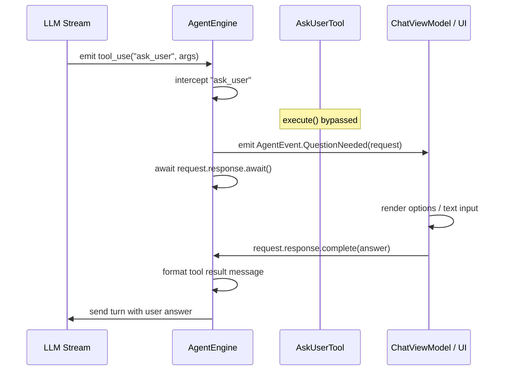

# Interactive User Prompts

> Tools soliciting user confirmation and interactive inputs during run execution.

# Interactive User Prompts

Interactive user prompts suspend engine execution to solicit decisions, answers, or permissions from users during tool call evaluation.

## Module Responsibilities

- Expose schema contracts for clarification questions (`AskUserTool`).
- Intercept interactive tool invocations before execution.
- Suspend engine coroutine using deferred completion handles.
- Dispatch structured interactive events to UI layer.
- Resume agent step execution upon UI input submission.

## Core Contracts & Key State

```
AskUserTool (Tool)
├── name: "ask_user"
├── isReadOnly: true
└── parameters: question (required), options, multi_select

AgentEngine Interception Primitives
├── QuestionRequest      -> callId, question, options, multiSelect, CompletableDeferred<String>
├── ApprovalRequest      -> call, toolDescription, diffPreview, grantKey, CompletableDeferred<Boolean>
├── EnvironmentRequest   -> call, command, hints, repair, missingTool, CompletableDeferred<Boolean>
└── PermissionMode       -> CONFIRM_ALL, CONFIRM_RISKY, FULL_AUTO, FULL_ACCESS
```

- `AskUserTool`: Declaration tool. Invocation placeholder. Never executes directly.
- `QuestionRequest`: Holds question payload. `response` receives text or serialized choice.
- `ApprovalRequest`: Holds tool confirmation payload. `response` receives approval boolean.
- `EnvironmentRequest`: Holds terminal dependency requests. `response` receives installation approval.
- `AgentEvent.QuestionNeeded`: Carries `QuestionRequest` across channel flow.
- `AgentEvent.ApprovalNeeded`: Carries `ApprovalRequest` across channel flow.
- `AgentEvent.EnvironmentNeeded`: Carries `EnvironmentRequest` across channel flow.

## Call Chain & Execution Flow



- LLM outputs `ask_user` call. `AgentEngine` inspects name. Engine intercepts before `Tool.execute()`.
- Engine instantiates `QuestionRequest`. Encapsulates `CompletableDeferred<String>`.
- Engine emits `AgentEvent.QuestionNeeded`.
- UI observes event. Renders action cards, single-select chips, or checkboxes.
- User submits. UI calls `response.complete(answer)`.
- `request.response.await()` unblocks engine loop. Tool message injects into history.

## Boundary Conditions & Fallbacks

- Direct `AskUserTool.execute()`: throws error. Engine intercept bypasses execution; direct execution returns `ToolResult(false, ...)`.
- Empty options array: fallback to free-form text input card.
- Single-select mode: 2–4 options render as chips.
- `multi_select = true`: up to 8 options render as checkboxes.
- Cancellation: run abortion cancels pending `CompletableDeferred`. Awaiting coroutine throws `CancellationException`.
- Risky action interception: gated by `PermissionMode`. `CONFIRM_ALL` and `CONFIRM_RISKY` halt execution via `ApprovalRequest`; `FULL_AUTO` and `FULL_ACCESS` bypass gate.

## Extension Points

- New prompt modes: declare parameters in `AskUserTool.parametersSchema`.
- Additional interactive events: subclass `AgentEvent`. Pair with `CompletableDeferred` carrier class.
- Custom decision policies: extend `PermissionMode` enum to conditionally emit `ApprovalRequest`.

## Sources

- [InteractiveTools.kt](app/src/main/java/com/androidharness/app/tools/InteractiveTools.kt#L1-L36)
- [AgentEngine.kt](app/src/main/java/com/androidharness/app/agent/AgentEngine.kt#L35-L77)
- [AgentEngine.kt](app/src/main/java/com/androidharness/app/agent/AgentEngine.kt#L114-L124)

Sources: [app/src/main/java/com/androidharness/app/tools/InteractiveTools.kt](app/src/main/java/com/androidharness/app/tools/InteractiveTools.kt#L1)

## Source files

- `app/src/main/java/com/androidharness/app/tools/InteractiveTools.kt`
