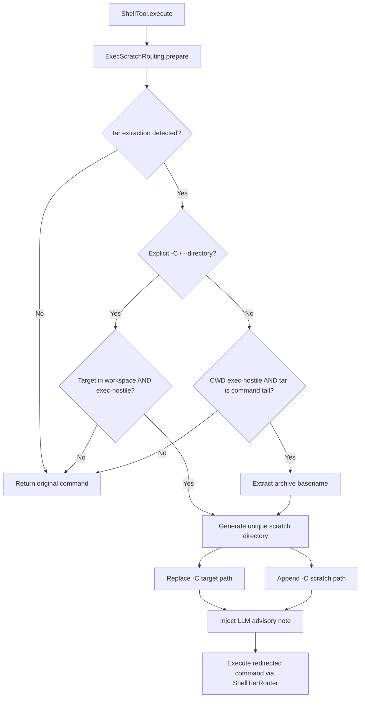

# Execution Scratch Routing

> Routing and isolation of temporary execution files within scratch directories.

# Execution Scratch Routing

Transparent tarball extraction rewriting routing archive unpack operations from execution-hostile Android shared storage into POSIX-compliant scratch directories.

## Module Responsibilities

- **Exec-Hostile Detection**: Android shared storage (`/storage/emulated/0`, `/sdcard`, FUSE mounts) strips POSIX execution permissions (`chmod +x` ineffective) and forbids symlink creation. Corrupts toolchains (JDK, Gradle, Node runtimes).
- **Command Inspection**: Scans incoming shell commands for GNU/Busybox `tar` extraction invocations.
- **Path Retargeting**: Rewrites destination flags (`-C`, `--directory`) or appends destination flag to redirect extracted trees into isolated exec-capable scratch storage (`$HARNESS_SCRATCH`).
- **LLM Context Injection**: Appends advisory note to `ToolResult` instructing agent where binaries extracted.

## Call Chain

```
ShellTool.execute()
  └─ NpmOnSharedStorage.prepare()
  └─ ExecScratchRouting.prepare(command, cwd)
       ├─ TAR_EXTRACT_RE.containsMatchIn(command)
       ├─ preferredScratch()
       ├─ resolveAgainst() / isWorkspacePath() / isExecHostile()
       ├─ uniqueScratchDir()
       └─ Returns Pair<rewrittenCommand, noteText>
  └─ ShellTierRouter.run(rewrittenCommand, ...)
```



### Key Flow Nodes
- **`tar extraction detected?`**: Regex `TAR_EXTRACT_RE` checks `tar` binary with extraction mode flags (`x`, `xf`, `-xzf`).
- **`Explicit -C / --directory?`**: `CHANGE_DIR_RE` captures target directory from double quotes, single quotes, or bare tokens.
- **`Target in workspace AND exec-hostile?`**: Verifies path canonicalizes under workspace root and matches hostile roots (`/storage/emulated/0`, `/sdcard`).
- **`CWD exec-hostile AND tar is command tail?`**: If no `-C` passed, validates working directory is hostile and `tar` constitutes terminal segment of pipeline chain (`&&`, `;`, `|`).
- **`Generate unique scratch directory`**: Sanitizes directory name. Increments numerical suffix (`name-2`, `name-3`) on collisions.

## Key States & Routing Logic

### Hostile Target Detection
`isExecHostile(path)` checks absolute prefix:
- Matches `/storage/emulated/0` or `/storage/emulated/0/*`
- Matches `/sdcard` or `/sdcard/*`

Non-matching paths (app internal data directories, private sandbox storage) pass unmodified.

### Destination Rewriting Modes
1. **Explicit Directory Argument**:
   - Matches: `-C <dir>`, `--directory=<dir>`, `--directory <dir>`
   - Replaces matched range with `${flag} "${newName}"`.
2. **Implicit Current Working Directory**:
   - Matches end of pipeline: `tail = command.substringAfterLast("&&").substringAfterLast(";").substringAfterLast("|")`
   - Archive base extracted via recognized extensions: `.tar.gz`, `.tgz`, `.tar.bz2`, `.tbz2`, `.tar.xz`, `.txz`, `.tar.zst`, `.tar`.
   - Appends `-C "${newName}"` to command.

### Scratch Root Selection
`preferredScratch()` resolves first existing directory from `ShellPolicy.SCRATCH_ROOTS`. Falls back to `ShellPolicy.SCRATCH_TMP`.

## Primary Files

- `app/src/main/java/com/androidharness/app/tools/ExecScratchRouting.kt`: Core singleton router, regex parsers, path sanitizers, rewriting engine.
- `app/src/main/java/com/androidharness/app/tools/ShellTool.kt`: Shell execution tool caller intercepting raw command via `prepare()`.
- `app/src/main/java/com/androidharness/app/tools/ShellPolicy.kt`: Sandbox policy definitions holding `SCRATCH_ROOTS` and `SCRATCH_TMP`.

## Edge & Boundary Conditions

- **Multi-command Chaining**: Implicit extraction (`no -C`) only rewrites when `tar` operates as trailing expression in `&&`, `;`, or `|` chain. Avoids appending arguments to intermediate commands.
- **Path Resolution Failures**: `resolveAgainst()` wraps canonical resolution in exception handler. Returns `null` on invalid paths, aborting rewriting.
- **Name Collisions**: `uniqueScratchDir()` checks `File(candidate).exists()`. Loops incrementing integer suffix until unused path found.
- **Sanitization Fallback**: Directory name filters non-alphanumeric/non-`._-` characters. Empty results fallback to `"toolchain"`.
- **Symlink Post-Processing**: Paired with `ShellTool` symlink cleanup logic detecting zero-byte stale files left by failed symlink creations on FUSE.

## Extension Points

- **Additional Archive Types**: Extend `EXTENSIONS` list and `TAR_EXTRACT_RE` parser to handle `unzip`, `7z`, or `unrar` targeting shared storage.
- **New Hostile Filesystem Mounts**: Expand `isExecHostile()` check if secondary external SD cards or non-standard FUSE mountpoints attached.
- **Scratch Provisioning Rules**: Add custom cleanup hooks or tier-specific scratch directory definitions inside `ShellPolicy.SCRATCH_ROOTS`.

Sources: [app/src/main/java/com/androidharness/app/tools/ExecScratchRouting.kt](app/src/main/java/com/androidharness/app/tools/ExecScratchRouting.kt#L1-L113), [app/src/main/java/com/androidharness/app/tools/ShellTool.kt](app/src/main/java/com/androidharness/app/tools/ShellTool.kt#L65-L72)

## Source files

- `app/src/main/java/com/androidharness/app/tools/ExecScratchRouting.kt`
