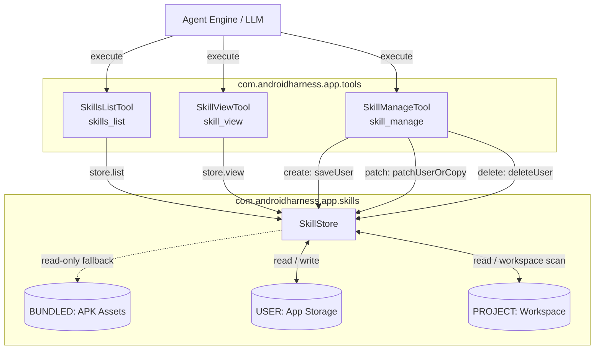

# Skill Extension Tools

> Dynamic execution tools wrapping external custom skill definitions and user-installed routines.

### Module Responsibilities

`Skill Extension Tools` exposes agent tool interfaces for reading, discovering, authoring, and mutating reusable procedural workflows (skills). Bridges LLM agent runtime to `SkillStore`. Resolves definitions across bundled APK assets, user storage, and workspace repositories.

### Primary Files

- `app/src/main/java/com/androidharness/app/tools/SkillTools.kt`: Implements `Tool` contracts (`SkillViewTool`, `SkillsListTool`, `SkillManageTool`). Generates boilerplate skill templates (`skillTemplate`).
- `app/src/main/java/com/androidharness/app/skills/Skill.kt`: Defines skill models (`SkillMeta`, `SkillView`, `ParsedSkill`), sources (`SkillSource`), and validation constraints (`NAME_REGEX`, character limits).

---

### Call Chain and Workflow Architecture

#### Key Nodes

- `SkillsListTool`: Scans store. Filters by category. Returns catalog index with enabled flags and source tags.
- `SkillViewTool`: Fetches markdown instructions or supporting assets (`references/`, `templates/`, `scripts/`, `assets/`). Injects linked file directory into output.
- `SkillManageTool`: Dispatches mutations. Enforces copy-on-write when patching bundled assets.
- `SkillStore`: Central persistence and discovery coordinator across APK, user profile, and active workspace.

---

### Tool Specifications

| Tool Name | Read-Only | Arguments | Responsibility |
|---|---|---|---|
| `skills_list` | `true` | `category` (optional) | Enumerate available skills, categories, source tiers, and enabled state. |
| `skill_view` | `true` | `name` (required), `file_path` (optional) | Load target `SKILL.md` body or referenced sub-asset. |
| `skill_manage` | `false` | `action` (create \| patch \| delete), `name`, `content`, `old_string`, `new_string` | Add user workflows, perform exact string replacements, or purge user skills. |

---

### Key State and Constraints

- **Skill Sources**:
  - `SkillSource.BUNDLED`: Read-only. Shipped inside APK. Immutable directly.
  - `SkillSource.USER`: Mutable. Stored in application user directory.
  - `SkillSource.PROJECT`: Scanned directly from current workspace root.
- **Copy-On-Write Behavior**:
  - `SkillManageTool` `patch` target matches bundled skill. `SkillStore.patchUserOrCopy` clones content into `USER` storage. Modifies copy. Leaves bundled APK asset intact.
- **Validation Constraints (`ParsedSkill`)**:
  - Name syntax: `^[a-z0-9][a-z0-9-]{0,63}$`.
  - Max name length: 64 characters.
  - Max catalog description length: 80 characters (truncated with `...` if exceeded).
  - Max user skill size: 20,000 characters.

---

### Boundary Conditions and Failure Handling

- **Missing Parameters**: `args["name"]` or `args["action"]` null. Tool throws `ToolFailure("Missing required argument: ...")`. Execution aborts.
- **Not Found**: `store.view(name, filePath)` returns failure. Returns `ToolResult(false, err.message)`.
- **String Replacement Mismatch**: `patch` action receives `old_string` lacking unique match. Result returns `ToolResult(false, "Patch failed.")`.
- **Bundled Skill Deletion**: `delete` action executed on `BUNDLED` skill. `store.deleteUser(name)` returns `false`. Returns `ToolResult(false, "No user skill named '...' to delete (bundled skills cannot be deleted).")`.

---

### Extension Points

- **Frontmatter Fields**: Extend `ParsedSkill` parser and metadata schema for custom tags or preconditions.
- **Skill Templates**: Customize default workflow structure in `skillTemplate()` to inject domain-specific validation headers.
- **Linked Asset Handlers**: Add sub-directory resolvers in `SkillViewTool` supporting arbitrary binary or dynamic asset execution routines.

---

Sources: [app/src/main/java/com/androidharness/app/tools/SkillTools.kt](app/src/main/java/com/androidharness/app/tools/SkillTools.kt#L1-L178), [app/src/main/java/com/androidharness/app/skills/Skill.kt](app/src/main/java/com/androidharness/app/skills/Skill.kt#L1-L43)

## Source files

- `app/src/main/java/com/androidharness/app/tools/SkillTools.kt`
