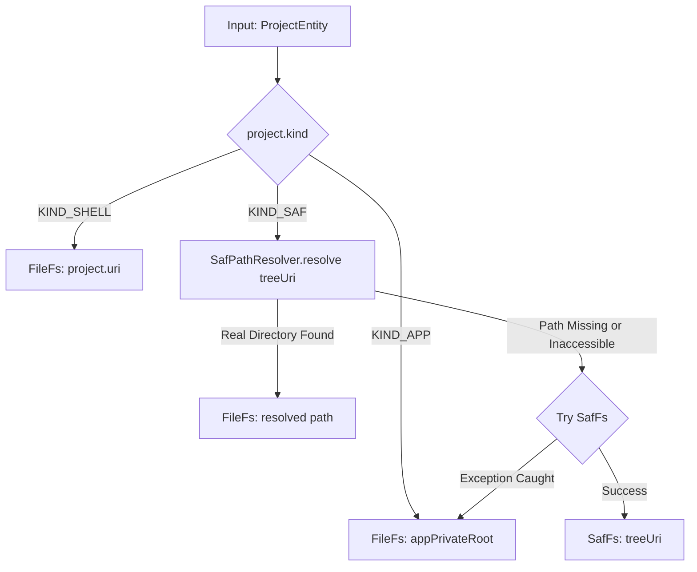

# Workspace Manager

> Orchestrator for active workspace directories, project root detection, and workspace configuration.

## Responsibilities

`WorkspaceManager` orchestrates agent workspace directories, project persistence, and filesystem abstraction bindings:
- Maintains workspace metadata in Room database through `HarnessDao`.
- Exposes reactive project state via Kotlin `Flow` pipelines (`currentProject`, `current`).
- Resolves Android Storage Access Framework (SAF) URIs into direct filesystem paths via `SafPathResolver`.
- Automatically provisions immutable app-private root fallback (`appPrivateRoot`).
- Manages Android persistable URI permissions on SAF folders during import and deletion.
- Prevents workspace duplication across disparate picker mechanisms through unified path deduping.

---

## Call Chain and Workflows

### Project Selection and Filesystem Resolution
1. UI or caller invokes `setActiveProject(id)`.
2. `dao.touchProject(id, timestamp)` updates database recency.
3. `dao.projectsFlow()` emits updated project list.
4. `currentProject` maps list to head entry. Empty database triggers `ensureDefaultProject()` fallback to `KIND_APP`.
5. `current` stream invokes `fsFor(project)`:
   - `KIND_SHELL`: Returns `FileFs` targeting raw filesystem path.
   - `KIND_SAF`: Executes `SafPathResolver.resolve()`. If direct path exists and represents directory, returns `FileFs`. Else instantiates `SafFs`. Catches failure by falling back to `FileFs(appPrivateRoot)`.
   - `KIND_APP`: Returns `FileFs(appPrivateRoot)`.

### Folder Ingestion Pipeline
1. UI provides tree URI via `addPickedFolder(treeUri)`.
2. Pure function `findDuplicate()` evaluates candidate against `projects` flow. Match triggers `reactivate(existing)`.
3. `SafPathResolver.resolve(treeUri)` checks for shared storage path.
4. Real directory found: invokes `addShellProject(path)`, upgrading workspace to shell-capable `KIND_SHELL`.
5. Real directory not found: delegates to `addSafProject(treeUri)`. Takes persistable URI grants via `ContentResolver.takePersistableUriPermission`. Persists `KIND_SAF` project record.

---

## Workspace Resolution Flow

### Node Descriptions
- `Input: ProjectEntity`: Active project descriptor pulled from Room DB.
- `project.kind`: Type selector discriminator (`KIND_APP`, `KIND_SHELL`, `KIND_SAF`).
- `FileFs: appPrivateRoot`: Local private filesystem rooted at `<filesDir>/workspace`. Permanent safe fallback.
- `FileFs: project.uri`: Direct filesystem root requiring standard storage or elevated Shizuku permissions.
- `SafPathResolver.resolve treeUri`: Content URI parser inspecting Android shared storage mappings.
- `Try SafFs`: Android DocumentFile SAF wrapper. Emits I/O streams across content provider boundary without shell process access.

---

## Key States

- `KIND_APP`: App-private sandbox folder. Shell operations enabled. Permanent; deletion disallowed.
- `KIND_SHELL`: Raw POSIX filesystem directory on device storage. Shell operations enabled. Requires `MANAGE_EXTERNAL_STORAGE` or Shizuku access.
- `KIND_SAF`: Android Storage Access Framework content tree URI. Read/write file tools supported. Shell execution unsupported unless mapped to physical path.
- `PathAssessment`: Path verification record containing directory existence flag and categorized storage `region`.
- `WorkspaceDescription`: View metadata model exposing user-facing labels, descriptions, and shell support flags.

---

## Main Files

- `WorkspaceManager.kt`: Workspace orchestrator, URI permission tracker, path deduplicator, and project DAO dispatcher.
- `WorkspaceFs.kt`: Virtual file system abstraction interfaces (`WorkspaceFs`, `FsNode`) and POSIX directory implementation (`FileFs`, `FileFsNode`).
- `SafPathResolver.kt`: Static URI parsing utility translating Android SAF tree URIs into shared storage POSIX paths.
- `WorkspaceIgnore.kt`: Workspace traversal exclusion filter applied during recursive tree walks.

---

## Edge Cases

- App Workspace Immutability: `deleteProject()` checks `project.kind == KIND_APP` and exits immediately. Default workspace cannot be destroyed.
- Dual-Entry Ingestion Collision: Adding identical folder via SAF picker and direct path yields identical deduplication key `SHELL:<path>` in `dedupeKey()`. Duplicates reactivate original database record without duplicate row insertion.
- SAF Permission Leaks: `deleteProject()` queries `persistedUriPermissions` matching target URI and invokes `releasePersistableUriPermission`. Prevents retained OS permission leaks.
- Storage Mount Failures: If SAF root becomes inaccessible or `SafFs` constructor throws, `fsFor()` catches exception via `runCatching` and returns `FileFs(appPrivateRoot)`.
- Directory Traversal Prevention: `FileFs.resolve()` computes `canonicalFile.toPath()`, normalizes path, and validates `resolved.startsWith(rootPath)`. Path escaping throws `ToolFailure`.

---

## Extension Points

- `WorkspaceFs` Implementations: Additional virtual storage systems (such as in-memory, network, or cloud-backed filesystems) implement `WorkspaceFs` and register inside `WorkspaceManager.fsFor()`.
- URI Resolution Rules: Pure lambda parameter `resolveSaf` in `findDuplicate()` and `dedupeKey()` accepts custom resolution policies without Android framework mocks.
- Region Classification: Path evaluation hooks into `PathClassifier.regionOf()` to classify Android system, private, or SD card zones for `ShellTierRouter` security tiers.

---

Sources: [app/src/main/java/com/androidharness/app/workspace/WorkspaceManager.kt](app/src/main/java/com/androidharness/app/workspace/WorkspaceManager.kt#L1-L280), [app/src/main/java/com/androidharness/app/workspace/WorkspaceFs.kt](app/src/main/java/com/androidharness/app/workspace/WorkspaceFs.kt#L1-L100)

## Source files

- `app/src/main/java/com/androidharness/app/workspace/WorkspaceManager.kt`
