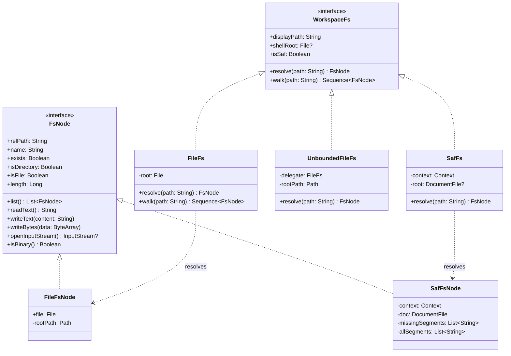

# Workspace Virtual File System

> Abstraction over storage backends providing unified read, write, and listing primitives.

### Responsibilities

Unified filesystem abstraction over local POSIX storage and Android Storage Access Framework (SAF). Decouples agent tools from underlying storage mechanics.

- **Storage Neutrality**: Exposes identical `FsNode` read/write/list primitives for app-private storage (`FileFs`), rootless/full-access storage (`UnboundedFileFs`), and user-selected SAF document trees (`SafFs`).
- **Path Confinement**: Enforces workspace boundary containment for sandboxed file access; prevents directory traversal (`../`).
- **Lazy Tree Realization**: Defers missing directory/file instantiation in SAF trees until write operations occur.
- **Binary Detection**: Sniffs content byte streams to distinguish text from binary payloads.

---

### Architecture & Class Hierarchy



#### Node Explanations
- `WorkspaceFs`: Top-level contract. Exposes path resolver, recursive walker, display path, and optional shell execution root (`shellRoot`).
- `FsNode`: Uniform node handle for filesystem entries. Encapsulates metadata queries, directory listing, recursive deletion, and atomic byte stream mutations.
- `FileFs` / `FileFsNode`: Backed by `java.io.File`. Directly addresses app-private or direct POSIX disk paths.
- `UnboundedFileFs`: Bypasses root containment checks. Permits navigation outside root directory for elevated execution contexts.
- `SafFs` / `SafFsNode`: Backed by `androidx.documentfile.provider.DocumentFile` and Android `ContentResolver`. Translates tree URIs without direct path access.

---

### Call Chain & Core Workflows

#### 1. Path Resolution
```
Agent Tool 
  └── WorkspaceFs.resolve(path)
        ├── FileFs: Path.normalize() ──> rootPath.startsWith() check ──> FileFsNode
        ├── UnboundedFileFs: openResolve(path) (permits absolute / "..") ──> FileFsNode
        └── SafFs: split('/') ──> reject ".." ──> walk DocumentFile tree ──> SafFsNode(missingSegments)
```

#### 2. SAF Delayed Write Pipeline
```
SafFsNode.writeText() / writeBytes()
  └── SafFsNode.resolveWriteTarget()
        ├── Existing DocumentFile -> reuse
        └── Missing target -> iterate missingSegments:
              ├── dir.createDirectory(segment)
              └── dir.createFile(mimeFor(fileName), fileName)
  └── ContentResolver.openOutputStream(target.uri, "wt")
        └── write bytes ──> flush() ──> FileOutputStream.fd.sync()
```

#### 3. Traversal (`walk`) Pipeline
```
WorkspaceFs.walk(path)
  ├── Resolve root node
  ├── FileFs / UnboundedFileFs:
  │     File.walkTopDown()
  │       ├── onEnter: check !WorkspaceIgnore.shouldSkipEnter()
  │       └── filter: check !WorkspaceIgnore.shouldSkip()
  └── SafFs:
        ArrayDeque breadth-first iteration
          ├── check shouldSkipEnter() before queueing directory children
          └── check shouldSkip() before yielding file node
```

---

### Key Implementations & State Handling

| Implementation | Root Representation | Shell Root | Escape Policy | Traversal Method |
| :--- | :--- | :--- | :--- | :--- |
| `FileFs` | `java.io.File` | `root` (`File`) | Throws `ToolFailure` if canonical path escapes root | `File.walkTopDown()` |
| `UnboundedFileFs` | `java.io.File` | `delegate.shellRoot` | Allowed; absolute paths permitted | `File.walkTopDown()` |
| `SafFs` | `androidx.documentfile.provider.DocumentFile` | `null` | Throws `ToolFailure` if segments contain `..` | `ArrayDeque` BFS loop |

#### Key Component States
- **`SafFsNode.missingSegments`**: Non-empty list indicates target path segments non-existent. `exists`, `isFile`, `isDirectory` evaluate `false`. Write trigger creates missing document branches on-demand.
- **`FileFsNode.relPath`**: Evaluates canonical path against `rootPath`. Renders `.` if root, absolute path if un-relativizable (`..` or separate mount point), relative string otherwise.

---

### Boundary Conditions & Guard Logic

- **Path Containment Violation**:
  - `FileFs`: Throws `ToolFailure("Path is outside the workspace and was blocked: $path")` when canonical target does not start with `rootPath`.
  - `SafFs`: Throws identical `ToolFailure` if any path segment matches `".."`.
- **Target Collision on Write**:
  - Throws `ToolFailure("Cannot write file '$relPath': is a directory")` if write target is directory or underlying write triggers `EISDIR`.
- **Stale SAF Permissions**:
  - `SafFs.requireRoot()` validates `DocumentFile.canWrite()`. Throws `ToolFailure("The picked workspace folder is no longer accessible...")` if revoked by OS or user.
- **Binary Content Detection (`isBinaryStream`)**:
  - Reads first 1024 bytes. Returns `true` if:
    1. Contains NUL byte (`0x00`).
    2. Control character count (`byte < 32` excluding `\t`, `\n`, `\r`) exceeds 10% of read bytes.
    3. UTF-8 decoder flags `CharacterCodingException` on payload bytes (trailing multi-byte continuation bits trimmed prior to decode).
- **Data Persistence Guarantee**:
  - `writeBytes` on both `FileFsNode` and `SafFsNode` flushes stream and invokes `FileOutputStream.fd.sync()` to ensure durability against application death.

---

### Extension Points

- **`WorkspaceFs` Contract**: Subclass to introduce alternative storage models (e.g., in-memory mock storage, remote SSH/SFTP backends, Android ContentProvider sandboxes).
- **MIME Type Mapping**: Extend `SafFsNode.mimeFor(fileName)` to map additional file extensions when producing SAF file entities.
- **Normalization Strategy**: Adjust `normalizeRelPath(path)` when workspace indexing needs custom tracking keys across differing path formats.

---

Sources: [app/src/main/java/com/androidharness/app/workspace/WorkspaceFs.kt](app/src/main/java/com/androidharness/app/workspace/WorkspaceFs.kt#L1-L492)

## Source files

- `app/src/main/java/com/androidharness/app/workspace/WorkspaceFs.kt`
