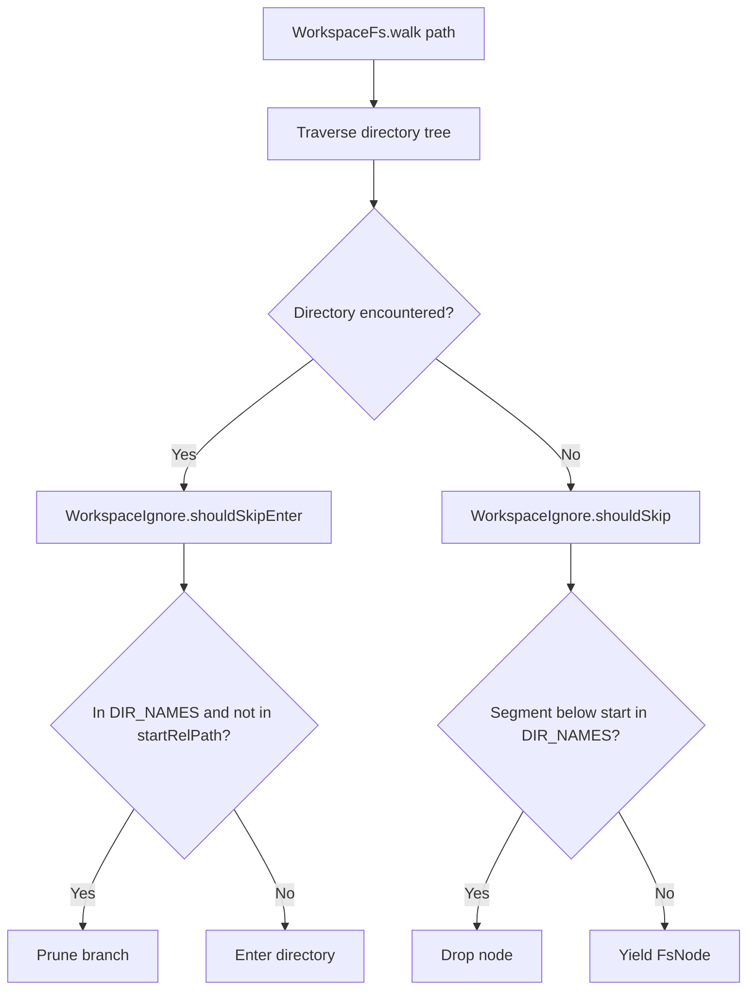

# Workspace Ignore Filters

> Pattern matching and exclusion logic filtering ignored files and hidden directories.

### Responsibilities

`WorkspaceIgnore` prunes deep recursive filesystem crawls (`walk()`) across build artifacts, dependencies, and cache directories. Module preserves agent awareness by keeping shallow directory listings (`list()`) unfiltered.

### Call Chain and Invocations

- `FileFs.walk` / `UnboundedFileFs.walk`: Kotlin `File.walkTopDown()` queries `shouldSkipEnter()` on `onEnter`. Filters yielded nodes via `shouldSkip()`.
- `SafFs.walk`: Manual `ArrayDeque` BFS queries `shouldSkipEnter()` before child queueing. Filters emitted items via `shouldSkip()`.

### Key State and Filter Rules

`WorkspaceIgnore` maintains single immutable state object:

- `DIR_NAMES`: `Set<String>` constant. Contains 21 hardcoded tokens:
  - Version control: `.git`, `.svn`, `.hg`
  - Package dependencies: `node_modules`, `bower_components`, `venv`, `.venv`
  - Build outputs: `build`, `dist`, `out`, `target`
  - IDE / Tooling caches: `.gradle`, `.idea`, `.mypy_cache`, `.pytest_cache`, `__pycache__`, `.next`, `.nuxt`, `.turbo`, `.cache`, `coverage`, `.dart_tool`, `.terraform`

### Filter Methods

- `isIgnoredDir(name)`: Direct lookup in `DIR_NAMES`.
- `shouldSkipEnter(startRelPath, dirName)`: Returns `true` if `dirName` in `DIR_NAMES` and absent from `parts(startRelPath)`.
- `shouldSkip(relPath, startRelPath)`: Normalizes paths to segments via `parts()`. Drops initial segments matching `startRelPath`. Returns `true` if any downstream segment matches `DIR_NAMES`.
- `parts(path)`: Replaces `\` with `/`. Splits on `/`. Filters out empty strings and `.` tokens.

### Boundary Conditions

- Explicit sub-crawl override: Invoking `walk("node_modules/foo")` bypasses directory exclusion. `shouldSkipEnter` detects token in `parts(startRelPath)` and permits descent.
- Path normalization: Handles mixed separators (`/`, `\`), redundant slashes, and current directory references (`.`).
- Surface listing preservation: `FsNode.list()` bypasses filter completely. LLM inspects top-level directory contents without crawling subtrees.
- Escape boundary: Paths outside workspace root rejected upstream by `WorkspaceFs.resolve()` before ignore checks execute.

### Extension Points

- Dynamic ignore configuration: Replace static `DIR_NAMES` set with workspace-configured exclusion list or `.gitignore` parser.
- Glob pattern matching: Extend segment exact match in `shouldSkip` to glob syntax (`*.min.js`, `*.log`).

Sources: [app/src/main/java/com/androidharness/app/workspace/WorkspaceIgnore.kt](app/src/main/java/com/androidharness/app/workspace/WorkspaceIgnore.kt#L1-L49), [app/src/main/java/com/androidharness/app/workspace/WorkspaceFs.kt](app/src/main/java/com/androidharness/app/workspace/WorkspaceFs.kt#L88-L99), [app/src/main/java/com/androidharness/app/workspace/WorkspaceFs.kt](app/src/main/java/com/androidharness/app/workspace/WorkspaceFs.kt#L236-L246), [app/src/main/java/com/androidharness/app/workspace/WorkspaceFs.kt](app/src/main/java/com/androidharness/app/workspace/WorkspaceFs.kt#L285-L304)

## Source files

- `app/src/main/java/com/androidharness/app/workspace/WorkspaceIgnore.kt`
