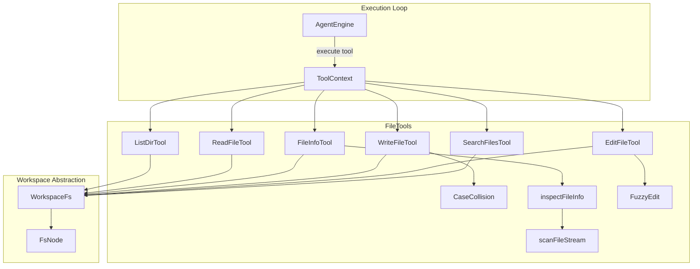

# Workspace File Tools

> Agent-exposed filesystem operations for searching, reading, writing, and listing files.

### Module Responsibilities

`FileTools.kt` provides filesystem manipulation tools to the agent runtime. Implements `Tool` interface. Operations execute under `Dispatchers.IO`. Restricts path access through `WorkspaceFs` virtual abstraction.

Primary functions:
- Directory traversal and listing.
- Chunked text file reading with line numbering and UTF-8 BOM removal.
- File metadata inspection with special handling for virtual files (`/proc`, `/sys`).
- File creation and replacement with POSIX trailing newline enforcement.
- Single-string fuzzy file editing with whitespace tolerance.
- Glob-based file path search.
- Case collision detection for Android shared and SAF storage mounts.

---

### Architecture & Invocation Flow

**Key Nodes**:
- `ToolContext`: Injects active `WorkspaceFs` instance and run parameters.
- `CaseCollision`: Evaluates mount types. Warns when path casing causes file collisions.
- `scanFileStream`: Bounded file streamer. Handles procfs zero-stat virtual sizing.
- `FuzzyEdit`: String replacement engine. Matches targets despite line shifts or whitespace divergence.
- `WorkspaceFs` / `FsNode`: Virtual filesystem layer. Maps relative paths to physical files or SAF URIs.

---

### Primary Tools & Components

| Class / Object | Tool Name | Read-Only | Core Behavior |
| :--- | :--- | :--- | :--- |
| `ListDirTool` | `list_dir` | Yes | Lists directory nodes. Appends `/` to directories. Sorts directories first, then alphabetical. Limits output to 500 entries. |
| `ReadFileTool` | `read_file` | Yes | Returns text with 1-based tab-delimited line numbers. Rejects binary files. Enforces offset/limit for files over 2 MB. Strips UTF-8 BOM. Output capped at 100,000 characters. |
| `FileInfoTool` | `file_info` | Yes | Reports file size, line count, binary status, trailing newline presence. Streams up to 1 MB for zero-stat procfs nodes. |
| `WriteFileTool` | `write_file` | No | Overwrites or creates files. Creates parent directories. Appends trailing newline if absent. Emits case-collision warning on case-insensitive filesystems. |
| `EditFileTool` | `edit_file` | No | Replaces target substring using `FuzzyEdit.replace`. Supports single-target verification or batch update via `replace_all`. |
| `SearchFilesTool` | `search_files` | Yes | Matches file paths against glob patterns via `java.nio.file.PathMatcher`. |
| `CaseCollision` | N/A (Internal) | N/A | Inspects path prefix (`/storage/`, `/sdcard`, SAF). Checks sibling collision ignoring case. |

---

### Key State & In-Memory Structures

- `FileLineInfo`: Result model for `inspectFileInfo`.
  - `isEmpty: Boolean`
  - `isBinary: Boolean`
  - `lineCount: Long`
  - `trailingNewline: String`
  - `measuredBytes: Long`: Bytes scanned for virtual zero-stat files.
  - `sizeTruncated: Boolean`: Flags scan termination at `VIRTUAL_FILE_SCAN_CAP`.
- `StreamScan`: Internal accumulator tracking `hasBytes`, `lineCount`, `lastByte`, `measuredBytes`, `truncated`, `binary`.

---

### Boundary Conditions & Guard Logic

- **Case-Insensitive Mounts**: `/storage/`, `/sdcard`, SAF mounts treat identical-letter casing as one file. `caseCollisionWarning()` checks nearest existing parent directory. Emits non-fatal warning on detected collision.
- **Virtual Filesystem Sizing**: Procfs and sysfs report zero byte size. `inspectFileInfo()` switches to streaming mode bounded by `VIRTUAL_FILE_SCAN_CAP` (1 MB). Sniffs binary markers in initial 1024 bytes.
- **BOM Leaks**: `ReadFileTool` trims `\uFEFF` prefix. Prevents agent hallucination of hidden line characters during exact diff matching.
- **Resource Exhaustion Limits**:
  - `MAX_LIST_ENTRIES`: 500 directory items.
  - `MAX_READ_CHARS`: 100,000 output characters.
  - Large file pagination check: files > 2,000,000 bytes require `offset` argument.
  - `limit` parameter for `ReadFileTool`: coerced into range 1 to 4000 (default 2000).

---

### Extension Points

- **Glob Engine**: `globMatcher()` uses Java `FileSystems.getDefault()`. Custom regex or fast ripgrep path matchers can replace standard glob syntax.
- **Binary Detection**: `scanFileStream()` uses `com.androidharness.app.workspace.isBinaryStream()`. Pluggable sniffers can register alternative MIME checkers.
- **Edit Engine**: `EditFileTool` delegates directly to `FuzzyEdit`. Token-level or AST-level replacement engines plug into replacement branches.

---

Sources: [app/src/main/java/com/androidharness/app/tools/FileTools.kt](app/src/main/java/com/androidharness/app/tools/FileTools.kt#L1-L440)

## Source files

- `app/src/main/java/com/androidharness/app/tools/FileTools.kt`
