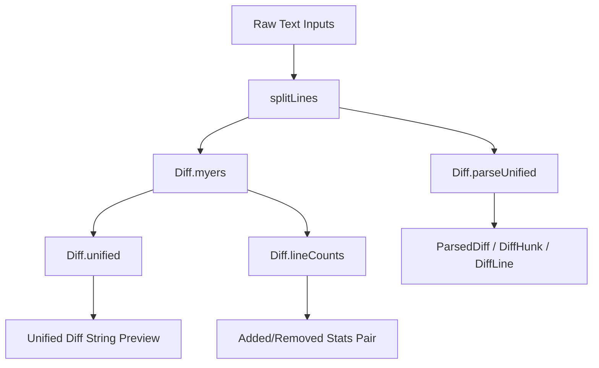

# Diff Calculation & Text Processing

> Unified diff generator, patch hunk parser, and line-level manipulation utilities.

### Module Responsibility

Unified diff generation, hunk parsing, POSIX line splitting. Core package provides text normalization for patch application, diff previewing, file change counting.

---

### Primary Files

- `app/src/main/java/com/androidharness/app/core/TextLines.kt`: POSIX text line splitter. Eliminates phantom empty lines from trailing terminators.
- `app/src/main/java/com/androidharness/app/core/Diff.kt`: Myers $O(ND)$ diff engine, unified diff formatter, structured hunk parser.

---

### Call Chain & Architecture

- `splitLines`: Strips trailing `\r\n`, `\n`, or `\r`. Splits strings without generating phantom trailing elements.
- `Diff.myers`: Computes shortest edit script between line lists via trace vectors.
- `Diff.unified`: Executes `myers` on `Dispatchers.Default`. Generates patch format with context collapse (`@@ … @@`).
- `Diff.lineCounts`: Extracts total added and removed line counts without formatting text.
- `Diff.parseUnified`: Parses diff strings into `ParsedDiff`, resolving line offsets across hunks.

---

### Key Data Structures

- `DiffLineType`: Token enum (`CONTEXT`, `ADD`, `REMOVE`, `HEADER`).
- `DiffLine`: Single diff line model. Holds `type`, optional `oldNum`, optional `newNum`, text payload.
- `DiffHunk`: Grouped diff section. Holds `header`, `oldStart`, `newStart`, list of `DiffLine`.
- `ParsedDiff`: Document structure. Contains `oldPath`, `newPath`, `hunks`, `isTruncated`. Computes `totalAdded`, `totalRemoved`.

---

### Boundary Conditions & Edge Handling

- **Trailing Line Endings**: Kotlin `String.lines()` yields extra `""` on trailing newlines. `splitLines` treats final newline as line terminator. Prevents patch offset failure.
- **Line Limit Truncation**: `Diff.MAX_LINES = 3000`. Inputs capped via `take(MAX_LINES)`. Emits `[diff truncated for preview]` when limit exceeded.
- **Empty Files**: Diff headers map empty inputs to `/dev/null`. Non-empty inputs map to `a/$path` and `b/$path`.
- **Hunk Elision**: Unchanged line streaks exceeding `CONTEXT = 2` collapse into `  @@ … @@` separators if changes follow.
- **Lenient Hunk Headers**: `parseUnified` uses fallback regex `-(\d+)` and `\+(\d+)` when strict `@@ -x,y +x,y @@` pattern fails.

---

### Extension Points

- **Context Window**: Modify `Diff.CONTEXT` constant to expand patch verification radius.
- **Algorithm Replacement**: Replace Myers implementation in `Diff.myers` with histogram or patience diff for large refactorings.
- **Token-Level Differ**: Hook custom tokenizers prior to `Diff.myers` invocation for word-level inline diffing.

---

Sources:
- [app/src/main/java/com/androidharness/app/core/TextLines.kt](app/src/main/java/com/androidharness/app/core/TextLines.kt#L1-L29)
- [app/src/main/java/com/androidharness/app/core/Diff.kt](app/src/main/java/com/androidharness/app/core/Diff.kt#L1-L298)

## Source files

- `app/src/main/java/com/androidharness/app/core/Diff.kt`
- `app/src/main/java/com/androidharness/app/core/TextLines.kt`
