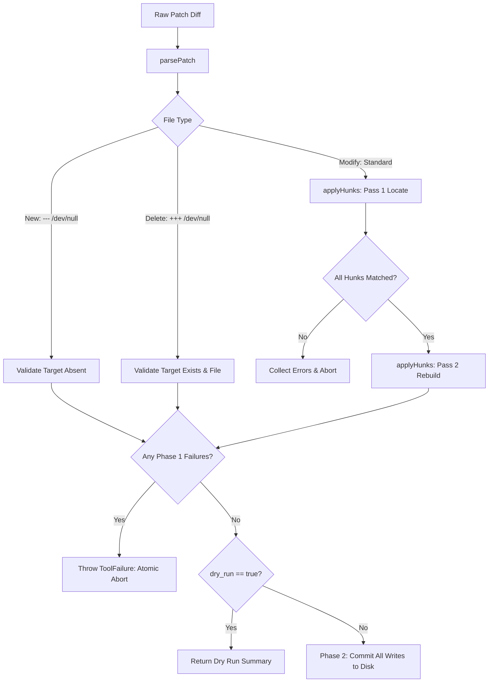

# Patch Application Engine

> File patching engine applying line changes, validating file contexts, and handling hunk failures.

### Responsibilities

`PatchTools.kt` provides filesystem modification tools. Implements line-level hunk patching, multi-string replacements, and atomic changes across files. Enforces POSIX newline semantics. Rejects partial writes on validation errors.

---

### Main Files & Dependencies

- `app/src/main/java/com/androidharness/app/tools/PatchTools.kt`: Contains `MultiEditTool` and `ApplyPatchTool`.
- `app/src/main/java/com/androidharness/app/tools/FuzzyEdit.kt`: Provides fallback matching for whitespace, indentation, and line-ending drift.
- `app/src/main/java/com/androidharness/app/core`: Provides line-splitting helper `splitLines`.

---

### Core Components

#### 1. `MultiEditTool`
Applies ordered string substitutions to target file in single atomic operation.
- Dispatches via `Dispatchers.IO`.
- Invokes `FuzzyEdit.replace(text, old, new, replaceAll)`.
- Halts execution on `FuzzyEdit.Result.Ambiguous` or `NotFound`.
- Writes back once all substitutions succeed.

#### 2. `ApplyPatchTool`
Applies standard unified diffs supporting modification, creation (`--- /dev/null`), and deletion (`+++ /dev/null`).
- Two-phase execution prevents partial disk state mutations.
- Phase 1 computes plans and verifies hunk offsets in memory.
- Phase 2 commits writes or returns validation results on `dry_run=true`.

---

### Patch Processing Architecture



#### Diagram Nodes
- `parsePatch`: Tokenizes header prefixes (`--- `, `+++ `, `@@`) into structured `FilePatch` and `Hunk` records.
- `applyHunks Pass 1`: Matches expected lines with drift offsets without modifying buffer.
- `applyHunks Pass 2`: Rebuilds lines bottom-up (`position` descending) preventing line index corruption.
- `Phase 2 Commit`: Modifies filesystem only after every file section and hunk validates.

---

### Call Chain & Execution Phases

#### Unified Diff Lifecycle (`ApplyPatchTool`)

```
ApplyPatchTool.execute()
 ├── parsePatch() -> List<FilePatch>
 │     ├── normalizePath() (strips a/, b/)
 │     └── detects \ No newline at end of file
 ├── Phase 1: In-Memory Validation
 │     ├── Create check: Target must not exist
 │     ├── Delete check: Target must exist and not be directory
 │     └── applyHunks()
 │           ├── Pass 1 (Resolve positions with shift compensation)
 │           │     └── findPosition() (search window ±40, tolerance progression)
 │           └── Pass 2 (Reverse-order line splice)
 └── Phase 2: Disk Commit (Skipped if dry_run=true)
       ├── WorkspaceNode.writeText()
       └── WorkspaceNode.delete()
```

#### In-Memory Replacement Lifecycle (`MultiEditTool`)

```
MultiEditTool.execute()
 └── loop edits:
       ├── FuzzyEdit.replace()
       ├── Match Ok -> update working text buffer
       ├── Match Ambiguous -> throw ToolFailure
       └── Match NotFound -> throw ToolFailure
 └── WorkspaceNode.writeText()
```

---

### Key Data Structures

- `FilePatch`: Represents single-file diff operations.
  - `path`: Target file relative path.
  - `isNewFile`: Boolean indicating `--- /dev/null`.
  - `isDelete`: Boolean indicating `+++ /dev/null`.
  - `hunks`: Parsed list of `Hunk` structures.
  - `newFileHasNewline`: Flag for EOF newline presence.
- `Hunk`: Line-level modification block.
  - `oldStart`: Original 1-based start line extracted from `@@ -N`.
  - `lines`: Ordered pairs of change prefix (` `, `-`, `+`) and line content.
- `Plan`: Validated file operation queued for Phase 2.
  - `op`: Operation string (`create`, `delete`, `patch`).
  - `content`: Computed target file body.
- `Resolved`: Hunk anchor found in Pass 1.
  - `position`: Zero-based line index in target text.
  - `expectedOld`: Context plus removed lines expected at position.

---

### Boundary Conditions & Edge Cases

- **Line Drift & Search Window**: `findPosition` evaluates target lines within $\pm 40$ lines of `oldStart - 1 + shift`.
- **Fuzzy Tolerance Hierarchy**: Context matching progresses through three levels:
  1. `FuzzyEdit.Level.EXACT`
  2. `FuzzyEdit.Level.LINE_ENDINGS` (CRLF vs LF)
  3. `FuzzyEdit.Level.INDENTATION` (leading/trailing whitespace drift)
- **Phantom Trailing Newline Drop**: Trailing newline modeled as extra empty context line (`expectedOld.last() == ""`) dropped via `dropLastOldEntry` when matching fails, adhering to POSIX termination semantics.
- **Context Line Preservation**: Rebuilding regions in Pass 2 reuses the target file's original context strings (`newRegion += current[oldCursor]`), preventing unintended whitespace rewrite outside modified lines.
- **Atomic Rollback**: Any missing target file, pre-existing new file, or unanchored hunk stops execution immediately. Zero file writes happen on failure.

---

### Extension Points

- **Custom Tolerance Levels**: Extend `FuzzyEdit.Level` iteration in `findPosition` for AST-aware or token-level tolerance.
- **Search Window Adjustment**: Configurable line offset window parameterizing the hardcoded 40-line boundary.
- **Conflict Resolution Strategies**: Ability to emit three-way merge conflict markers instead of strict rejection on overlapping hunks.

---

Sources: [app/src/main/java/com/androidharness/app/tools/PatchTools.kt](app/src/main/java/com/androidharness/app/tools/PatchTools.kt#L1-L443)

## Source files

- `app/src/main/java/com/androidharness/app/tools/PatchTools.kt`
