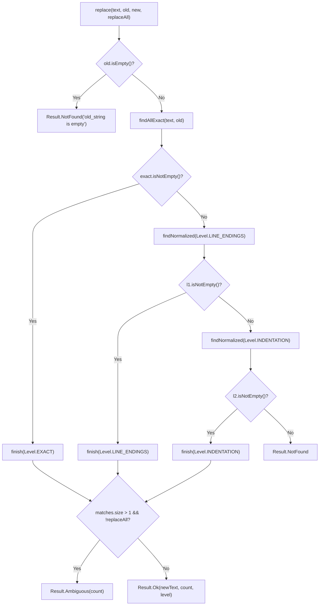

# Fuzzy Edit Matching

> Approximate substring matching engine finding and applying edits despite line shifts.

### Module Responsibilities

`FuzzyEdit` provides whitespace-tolerant substring replacement and line comparison for agent file editing operations. LLMs frequently introduce formatting drifts (indentation shifts, missing trailing spaces, line-break differences `\r\n` vs `\n`). The module resolves drift failures without introducing full Levenshtein/token distance matching, preventing silent code corruption.

Key responsibilities:
- Progressive match escalation: tests exact match first, trailing whitespace/line endings second, indentation third.
- Non-destructive span replacement: uses original text indices (`Match.start`, `Match.end`) to splice edits. Preserves untouched formatting.
- Ambiguity enforcement: aborts edits when multiple candidates exist unless explicitly permitted (`replaceAll = true`). Never escalates tolerance when a stricter level produces multiple matches.
- Patch context validation: exposes normalized line comparison (`lineEquals`) for hunk application.

---

### Primary Files

- `app/src/main/java/com/androidharness/app/tools/FuzzyEdit.kt`: Core engine. Implements `replace()`, line-window matching, normalization routines, and line equality comparisons.
- `app/src/main/java/com/androidharness/app/tools/FileTools.kt`: Consumer integration. Invokes `FuzzyEdit.replace()` during file modification operations, maps `Result` variants to tool output or failures.

---

### Matching Architecture & Call Chain

#### Key Execution Stages

1. **Input validation**: verifies `old` is not empty. Returns `Result.NotFound` immediately on blank search target.
2. **Level 0 (`Level.EXACT`)**: scans raw text via `String.indexOf` iteratively. Slices exact character matches into `Match` boundaries.
3. **Level 1 (`Level.LINE_ENDINGS`)**: activates if Level 0 yields zero matches. Normalizes lines using `trimEnd()`. Ignores carriage returns and trailing spacing.
4. **Level 2 (`Level.INDENTATION`)**: activates if Level 1 yields zero matches. Normalizes lines using `trim()`. Ignores leading indentation variations and trailing whitespace.
5. **Resolution (`finish`)**: checks candidate ambiguity. If `matches.size > 1` and `replaceAll == false`, halts execution and returns `Result.Ambiguous`. Splicing loop retains original text segments between matches, inserting `new` into matched intervals.

---

### Key Data Models & States

- **`FuzzyEdit.Level`**: Matcher tolerance tier.
  - `EXACT`: Substring match against source text.
  - `LINE_ENDINGS`: Line-by-line match ignoring line terminators (`\r`, `\n`) and trailing whitespace (`trimEnd()`).
  - `INDENTATION`: Line-by-line match ignoring leading indentation and trailing whitespace (`trim()`).
- **`FuzzyEdit.Match`**: Concrete slice coordinates in original buffer.
  - `start`: 0-based inclusive index.
  - `end`: 0-based exclusive index.
- **`FuzzyEdit.Result`**: Sealed execution outcome.
  - `Ok(val newText: String, val count: Int, val level: Level)`: Edit succeeded. Details text, replacement count, applied tolerance.
  - `NotFound(val detail: String)`: Search string absent across all levels.
  - `Ambiguous(val count: Int)`: Target string matches multiple disjoint blocks under single-replacement constraint.

---

### Boundary Conditions & Algorithm Mechanics

- **Sliding Line Window**: `findNormalized` uses lines extracted via `splitLines(text)` and `splitLines(old)`. Sliding window size equals `oldLines.size`.
- **Line Offset Tracking**: `lineStarts(text)` indexes buffer start offsets for lines across `\n`, `\r\n`, and single `\r` endings, ensuring multi-line match slices accurately map back to byte/character positions in `text`.
- **Overlapping Match Suppression**: When match sequence found at index `i`, sliding cursor increments by `oldLines.size`. Prevents overlapping spans across repeating or blank lines.
- **Size Preconditions**: If `oldLines.size > textLines.size` or `oldLines` is empty, normalized search terminates immediately, yielding `emptyList()`.
- **Preserved Ambiguity**: Fallthrough occurs *only* when count is zero. Ambiguity at a stricter tolerance level halts progression; engine does not escalate tolerance to bypass collisions.

---

### Extension Points

- **`lineEquals(line, expected, level)`**: Standalone context comparison function for diff engines (`PatchTools.kt`). Permits hunk alignment when target file line endings or indentation levels drift.
- **Normalization Strategy Extension**: `findNormalized` accepts `(String) -> String` transform per level. Additional syntax normalization (such as comment striping or quote canonicalization) can integrate directly into the `when (level)` dispatch.

---

Sources: [app/src/main/java/com/androidharness/app/tools/FuzzyEdit.kt](app/src/main/java/com/androidharness/app/tools/FuzzyEdit.kt#L1-L163), [app/src/main/java/com/androidharness/app/tools/FileTools.kt](app/src/main/java/com/androidharness/app/tools/FileTools.kt#L400-L414)

## Source files

- `app/src/main/java/com/androidharness/app/tools/FuzzyEdit.kt`
