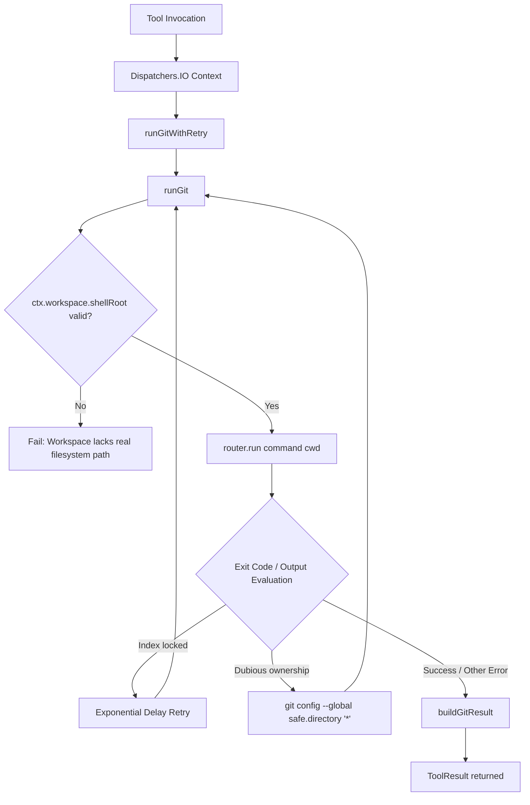

# Git Version Control Integration

> Tools executing Git status, branch inspections, commits, and diff tracking inside the workspace.

## Module Responsibilities

`GitTools.kt` provides version control integration inside the agent execution harness. It exposes read-only inspections and modifying Git operations to the LLM runtime.

Key responsibilities:
- Command construction with Android sandbox flags (`safe.directory=*`, `gc.auto=0`, `maintenance.auto=false`).
- Execution of workspace repository commands via `ShellTierRouter` under `Dispatchers.IO`.
- Automatic error recovery: index lock exponential backoff, dubious ownership repair, missing committer identity fallback, missing remote tracking upstream configuration.
- Internal exclusion of runtime artifacts (`.harness` directory) from commits.

---

## Call Chain and Architecture

### Flow Lifecycle Explanation

1. **Tool Invocation**: Agent loop dispatches tool arguments to target `Tool` subclass instance.
2. **Context Switching**: Tool shifts execution to `Dispatchers.IO`.
3. **Lock Retry Loop (`runGitWithRetry`)**: Executes commands through `runGit`. Retries up to 3 times with exponential backoff (`200ms * (2 ^ attempt)`) when index locks occur.
4. **Environment Verification (`runGit`)**: Validates `ctx.workspace.shellRoot`. Aborts if workspace has no real filesystem path. Emits install requirement if binary missing (exit code 127).
5. **Ownership Remediation**: Intercepts `dubious ownership` errors. Runs `git config --global --add safe.directory '*'`. Re-executes original command.
6. **Result Normalization (`buildGitResult`)**: Trims outputs. Separates stdout and stderr blocks. Detects empty repositories and missing repositories.

---

## Key Files

- `app/src/main/java/com/androidharness/app/tools/GitTools.kt`: Implements all Git tools, command-line template formatters, execution retry loops, and output decoders.

---

## Key States and Tool Catalog

### Base Configuration Constants

- `GIT_BASE_ARGS`: `-c 'safe.directory=*' -c gc.auto=0 -c maintenance.auto=false`. Prevents dubious ownership errors across disparate Android UIDs (app UID, Shizuku shell UID, media storage UID). Inhibits background GC subprocesses failing sandbox execution.
- `HARNESS_DIR`: `.harness`. Designates runtime scratch directory permanently stripped from staging.

### Tool Catalog

| Tool Name | `isReadOnly` | Command Executed | Specific Handling |
| :--- | :--- | :--- | :--- |
| `git_status` | `true` | `git status --short --branch` | Wraps with index-lock retry. |
| `git_diff` | `true` | `git diff [--staged] --stat && git diff [--staged] [-- <path>]` | Combines stat summary and file diff. |
| `git_commit` | `false` | Staging exclusions followed by `git commit -m <message>` | Auto-configures `Android Harness <harness@android.local>` on missing identity. |
| `git_log` | `true` | `git log -n <limit> --date=short --pretty=format:... [--stat] [-- <path>]` | Clamps limit (1–100). Customizes message on empty path matches. |
| `git_show` | `true` | `git show --stat [-s \| --patch] <hash>` | Defaults hash to `HEAD`. Toggles diff display via `no_patch`. |
| `git_branch` | `true` | `git branch [-a] -v` | Displays local branches, optionally remote-tracking branches. |
| `git_branch_manage`| `false` | `git branch <name>` or `git branch -d\|-D <name>` | Validates action type. Applies `-D` if `force=true`. |
| `git_checkout` | `false` | `git checkout [-b] <branch> [-- <paths>]` | Requires branch, path, or both. Restores files or switches branch. |
| `git_push` | `false` | `git push [-u] <remote> <branch\|HEAD>` | Detects missing upstream. Retries push automatically with `-u`. |
| `git_pull` | `false` | `git pull [--ff-only \| --rebase] <remote>` | Validates pull mode (`ff-only`, `merge`, `rebase`). |

---

## Boundary Conditions & Edge Handling

1. **Android UID Mismatch**: Repositories on shared storage or accessed via Shizuku shell cause ownership alerts. All commands apply `-c 'safe.directory=*'`. If persistent failure occurs, `runGit` inserts `safe.directory '*'` into global config and replays execution.
2. **Missing Author Identity**: `GitCommitTool` detects missing author errors. Writes `user.name 'Android Harness'` and `user.email 'harness@android.local'` to repository config. Falls back to `~/.gitconfig` if local `.git/config` read-only. Commits change again.
3. **Detached Sandbox Execution**: Standard Git triggers background maintenance threads post-commit. Android process sandboxes cannot spawn detached processes. Injected flags `gc.auto=0` and `maintenance.auto=false` suppress invocation.
4. **Index Locks**: Concurrency or interrupted commands leave `.git/index.lock`. `runGitWithRetry` detects locked index message. Applies exponential backoff delays up to 3 retry passes.
5. **Remote Push Without Upstream**: First-time branch push fails when upstream missing. `GitPushTool` intercepts upstream errors. Re-issues command with `-u origin <branch>` to bind tracking.
6. **Ephemeral Artifact Leaks**: Staging via `gitCommitCmd` runs cached unstage `rm -r --cached --ignore-unmatch :top.harness`. Staging uses pathspecs excluding `:(top,exclude).harness` and `:(top,exclude).harness/**`. Prevents commit pollution.

---

## Extension Points

- **Command Generation Helpers**: Internal functions (`gitCmd`, `gitCommitCmd`, `gitCheckoutCmd`, `gitPushCmd`, `gitPullCmd`) encapsulate CLI string creation. Additional Git actions must wrap operations using `gitCmd` to preserve base isolation flags.
- **Shell Tier Routing**: `runGit` relies on `ShellTierRouter`. Custom execution environments (chroot, proot, or remote execution engines) inject alternative tier routers without modifying Git tool contracts.

---

Sources: [app/src/main/java/com/androidharness/app/tools/GitTools.kt](app/src/main/java/com/androidharness/app/tools/GitTools.kt#L1-L536)

## Source files

- `app/src/main/java/com/androidharness/app/tools/GitTools.kt`
