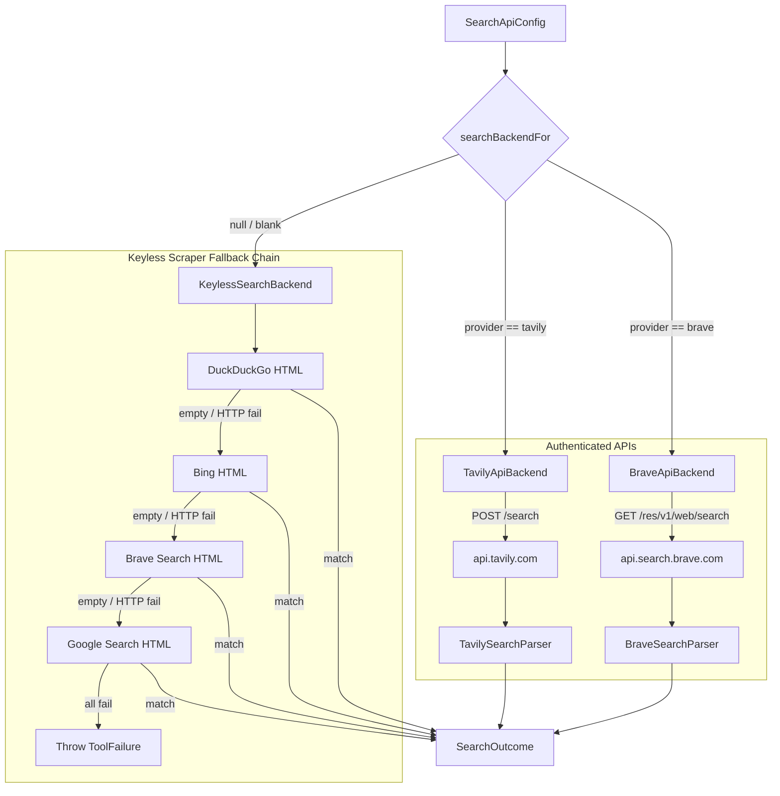

# Code Indexing & Search Backends

> Workspace search engine orchestrating lexical search, symbol lookups, and file path matching.

### Module Responsibilities

Module executes external queries across authenticated search APIs and fallback HTML scrapers. Resolves user API credentials. Dispatches queries to Brave Search API or Tavily Search API when configured. Falls back to multi-engine keyless scraping chain across DuckDuckGo, Bing, Brave web, and Google when API keys absent.

---

### Core Files & Components

- `SearchBackends.kt`:
  - `SearchBackend`: Base interface defining `fetch(client, query, count, engine)`.
  - `searchBackendFor()`: Factory resolving active `SearchBackend` from `SearchApiConfig`.
  - `SearchApiConfig`: Provider credential model. Overrides `toString()` to prevent key leakage in logs.
  - `KeylessSearchBackend`: HTML search orchestrator executing sequential fallback chain.
  - `BraveApiBackend`: Authenticated client targeting `api.search.brave.com`.
  - `TavilyApiBackend`: Authenticated client targeting `api.tavily.com`.
  - `BraveSearchParser` / `TavilySearchParser`: JSON response deserializers extracting title, URL, snippet.

---

### Invocation Architecture



#### Node Explanations
- `searchBackendFor`: Factory function inspecting `SearchApiConfig.provider`. Returns API backend instance if key non-blank; returns `null` otherwise.
- `BraveApiBackend`: Sends query parameters via GET request using `X-Subscription-Token` authorization header.
- `TavilyApiBackend`: Constructs JSON POST body specifying `query`, `api_key`, `max_results`, and `search_depth`.
- `KeylessSearchBackend`: Sequential fallback runner. Executes HTTP requests on `Dispatchers.IO` using custom mobile `User-Agent`. Evaluates engine regex extractors. Halts iteration on first non-empty result set.

---

### Key Data Models

```
SearchApiConfig
├── provider: String ("brave" | "tavily")
└── apiKey: String

WebSearchResult
├── title: String
├── url: String
└── snippet: String

SearchOutcome
├── results: List<WebSearchResult>
└── via: String? (Backend label or specific keyless engine name)
```

- `SearchApiConfig.toString()`: Custom implementation prints `<unset>` or `<redacted>`. Blocks accidental token disclosure to Android logcat.
- `SearchOutcome.via`: Records exact data provider supplying final results for audit attribution.

---

### Execution Flow & Call Chain

1. Caller supplies `SearchApiConfig?` to `searchBackendFor()`.
2. Factory checks `config.provider.trim().lowercase()`.
   - Returns `BraveApiBackend(key)` if `brave` and key not blank.
   - Returns `TavilyApiBackend(key)` if `tavily` and key not blank.
   - Returns `null` on missing key or unknown provider; caller invokes `KeylessSearchBackend`.
3. Backend executes `fetch(client, query, count, engine)` inside `withContext(Dispatchers.IO)`:
   - **KeylessSearchBackend**:
     - Allocates OkHttpClient copy with 25-second read timeout.
     - Resolves search engine list. If `engine` matches specific target (`duckduckgo`, `bing`, `brave`, `google`), runs single engine. Otherwise uses full chain `listOf("duckduckgo", "bing", "brave", "google")`.
     - Executes HTTP GET with desktop/mobile user agent: `Mozilla/5.0 (Linux; Android 14) AndroidHarness/1.0`.
     - Extracts items through engine-specific regex (`parseDuckDuckGo`, `parseBing`, `parseBrave`, `parseGoogle`).
     - Normalizes HTML text with `cleanHtml()`: strips XML/HTML tags and entity references (`&amp;`, `&quot;`, `&#x27;`).
     - Decodes intermediate redirects (`uddg` parameter for DuckDuckGo, `/url?q=` for Google).
     - Returns immediately upon first non-empty list.
   - **BraveApiBackend**:
     - Issues GET to `https://api.search.brave.com/res/v1/web/search?q={query}&count={count}`.
     - Sets header `X-Subscription-Token: apiKey`.
     - Deserializes JSON payload via `BraveSearchParser`: extracts `web.results[]`.
   - **TavilyApiBackend**:
     - Issues POST to `https://api.tavily.com/search`.
     - Sends JSON: `{"api_key": apiKey, "query": query, "max_results": count, "search_depth": "basic"}`.
     - Deserializes JSON payload via `TavilySearchParser`: extracts `results[]`.

---

### Boundary Conditions & Error Handling

- **Credential Leak Prevention**: `SearchApiConfig` overrides standard data class `toString()`. Inspecting configuration via log output cannot expose plain API keys.
- **Scraper Exhaustion**: If all scrapers in `allEngines` fail or yield empty results, `KeylessSearchBackend` throws `ToolFailure` specifying tested engines and last observed error string.
- **HTTP Transport Failures**: Non-2xx HTTP responses throw `ToolFailure("HTTP ${resp.code}")`. Keyless runner catches exception, records failure in `lastError`, advances to next engine.
- **Malformed JSON Recovery**: `BraveSearchParser` and `TavilySearchParser` wrap JSON parsing inside `runCatching { ... }.getOrDefault(emptyList())`. Malformed schemas fail safe to empty lists.
- **URL Filtering**: Parsers reject items not matching `http` or `https` schemes. Brave keyless parser explicitly discards internal `brave.com` navigation links and blank titles.

---

### Extension Points

- **New Search API Providers**:
  - Implement `SearchBackend` interface.
  - Implement dedicated JSON response parser object.
  - Add identifier branch in `searchBackendFor(config: SearchApiConfig?)`.
- **New Keyless Scraping Targets**:
  - Append engine identifier to `KeylessSearchBackend.allEngines`.
  - Add query URL branch in `KeylessSearchBackend.fetchEngine()`.
  - Add parsing function with HTML cleanup in `KeylessSearchBackend.parse()`.

---

Sources: [app/src/main/java/com/androidharness/app/tools/SearchBackends.kt](app/src/main/java/com/androidharness/app/tools/SearchBackends.kt#L1-L281)

## Source files

- `app/src/main/java/com/androidharness/app/tools/SearchBackends.kt`
