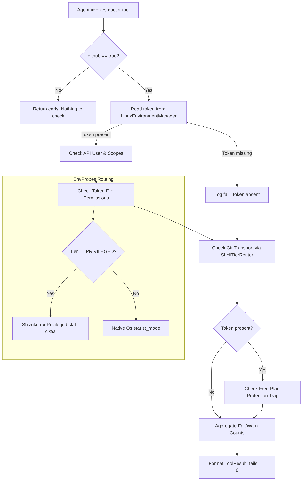

# System Doctor & Diagnostic Self-Check

> Self-test suite validating dependencies, execution binaries, permissions, and tool health.

### Module Responsibilities

- `DoctorTool`: Executes live end-to-end GitHub diagnostics (`doctor --github`). Unlike passive inventory tools, verifies functional execution readiness: API authentication, PAT scope validation, disk token permission bit enforcement, Git transport helper viability, free-plan branch protection paywall detection.
- `EnvProbes`: Provides tier-routed filesystem and binary inspections. Overcomes Android app-UID sandbox blindness against `/data/local/tmp` by dispatching checks to `ShizukuManager` privileged shell when running in privileged tier, or using native `Os.stat` for app-local prefixes.

---

### Diagnostic Pipeline & Call Chain

#### Critical Pipeline Nodes

1. **API User & Scopes Probe (`checkApiUser`)**: GET `https://api.github.com/user` using OkHttpClient (15s timeout). Asserts HTTP 200. Inspects `X-OAuth-Scopes` header. Flags missing scopes from `SCOPE_CONSEQUENCES` (`delete_repo`, `gist`, `read:org`, `workflow`). Fine-grained PATs missing scopes header trigger warning instead of failure.
2. **Token File Permission Check (`checkTokenFile`)**: Resolves active probe root via `EnvProbes.probeRoot()`. Queries POSIX permissions via `EnvProbes.fileMode()`. Enforces octal `0600`. Emits failure on open permissions; emits warning if unreadable from current execution tier.
3. **Git Transport Verification (`checkGitTransport`)**: Executes shell probe via `ShellTierRouter`. Queries `git var GIT_SHELL_PATH` to ensure Git helper/hook spawn shell exists and is executable (`shell-path=OK`). Queries `git config --global url.*.insteadOf` to verify token URL rewrite configuration.
4. **Free-Plan Trap Detection (`checkFreePlanTrap`)**: Queries `/user/repos?visibility=private&affiliation=owner` and `/user/orgs`. Fetches `/repos/{repo}/rulesets`. Detects HTTP 403 paywall status on private repos. Alerts agent that branch protection is absent and force-pushes will silently bypass safety rules on GitHub Free plans.

---

### Key States & Diagnostic Outcomes

Diagnostic checks format line output prefixed with standardized status tags:

| Tag | Condition | Tool Result Impact |
| :--- | :--- | :--- |
| `[ok]` | Check passed validation threshold. | Non-failing. |
| `[warn]` | Sub-optimal state (fine-grained PAT scope opacity, missing URL rewrite, paywalled private rulesets). | Non-failing; reported in summary. |
| `[fail]` | Terminal execution blocker (missing PAT, HTTP 401, token file mode not `0600`, non-executable `GIT_SHELL_PATH`). | Causes `ToolResult.isSuccess = false`. |

#### Result Summarization Logic

- `fails > 0`: Summary string `"$fails check(s) failed, $warns warning(s)"`; `ToolResult.isSuccess = false`.
- `fails == 0 && warns > 0`: Summary string `"all reachable checks ran: $warns warning(s)"`; `ToolResult.isSuccess = true`.
- `fails == 0 && warns == 0`: Summary string `"all checks passed"`; `ToolResult.isSuccess = true`.

---

### Primary Files

- `app/src/main/java/com/androidharness/app/tools/DoctorTool.kt`: Implements `Tool`. Contains parameter schema definitions, GitHub REST probes, Git transport scripts, token file validation, and free-plan trap detection.
- `app/src/main/java/com/androidharness/app/tools/EnvProbes.kt`: Internal utility object. Contains `probeRoot()`, `fileMode()`, and `commandPresence()` functions routing filesystem stat and binary discovery checks across app vs. Shizuku privileged shell tiers.

---

### Boundary Conditions & Edge Cases

- **Android UID Sandbox Blindness**: Standard `File.exists()` on `/data/local/tmp` returns `false` under app UID. `EnvProbes.fileMode()` delegates to `shizuku.runPrivileged(["stat", "-c", "%a", ...])` when tier is `ExecutionTier.PRIVILEGED`.
- **Gutted Prefix During Redeployment**: If environment redeployment empties the tmp prefix during command checks, `EnvProbes.commandPresence()` detects empty output or unparseable lines, returning `null` rather than false binary absence flags.
- **GitHub API Query Validation**: GitHub API returns HTTP 422 if combining `type` and `affiliation` parameters. Probe uses `visibility=private&affiliation=owner` to avoid validation failure.
- **Uninstalled Toolchain**: If `linuxEnv.isReady` is false, Git transport checks immediately abort with `[warn]`, skipping shell process invocation.
- **Fine-Grained PAT Scopes**: GitHub omits `X-OAuth-Scopes` headers on fine-grained tokens. Logic emits warning advising user verification rather than flagging failure.

---

### Extension Points

- **Additional Diagnostic Suites**: `DoctorTool.parametersSchema` accepts boolean flags. New diagnostic flags (e.g., `androidSdk`, `toolchain`, `storage`) can be added alongside `github`.
- **Scope Mappings**: `DoctorTool.SCOPE_CONSEQUENCES` companion map accepts new OAuth scopes and corresponding capability degradation messages.
- **Command Presence Verification**: `EnvProbes.commandPresence(router, cwd, names)` reusable across new diagnostic modules for batch binary availability testing via `command -v`.

---

Sources:
- [app/src/main/java/com/androidharness/app/tools/DoctorTool.kt](app/src/main/java/com/androidharness/app/tools/DoctorTool.kt#L1-L276)
- [app/src/main/java/com/androidharness/app/tools/EnvProbes.kt](app/src/main/java/com/androidharness/app/tools/EnvProbes.kt#L1-L92)

## Source files

- `app/src/main/java/com/androidharness/app/tools/DoctorTool.kt`
