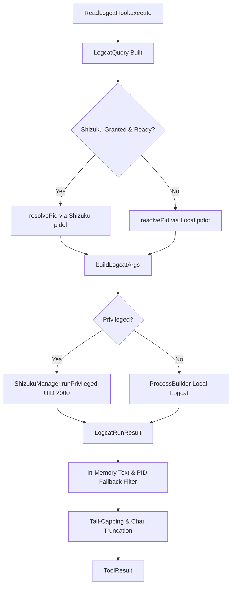

# Android Logcat Tool

> Android system log streaming and logcat buffer inspection tool for runtime debugging.

### Module Responsibilities

`ReadLogcatTool` provides runtime inspection of Android system and application logs. It exposes a read-only agent interface (`read_logcat`) querying Android `logcat` buffers.

Core operations:
- Query execution: captures dump output (`logcat -d`).
- Ring buffer selection: routes across `main`, `system`, `crash`, `events`, `radio`, or `all`.
- Filtering: level thresholding (`V`, `D`, `I`, `W`, `E`, `F`), tag filtering (`<tag>:<level> *:S`), and in-memory substring matching.
- Privilege tiering: executes through Shizuku (shell UID 2000) for system-wide capture or local subprocess fallback for app-confined logs.
- PID resolution: maps package identifiers to runtime PIDs via `/system/bin/pidof`.

---

### Main Files

- `app/src/main/java/com/androidharness/app/tools/LogcatTool.kt`: Contains `ReadLogcatTool`, `LogcatRunner` interface, `DefaultLogcatRunner`, and models (`LogcatQuery`, `LogcatRunResult`).
- `app/src/main/java/com/androidharness/app/tools/Tool.kt`: Defines `Tool` contract, `ToolContext`, `ToolResult`, and registers `ReadLogcatTool` in `ToolRegistry.default()`.

---

### Call Chain

1. LLM engine dispatches tool invocation `read_logcat` with JSON arguments.
2. `ToolRegistry.get("read_logcat")` yields `ReadLogcatTool`.
3. `ReadLogcatTool.execute(args, ctx)` runs in `Dispatchers.IO`:
   - Clamps `lines` (`1..1000`).
   - Parses `level` to normalized single-char token (`V`, `D`, `I`, `W`, `E`, `F`).
   - Builds `LogcatQuery`.
4. `LogcatRunner.runLogcat(query)` executes:
   - Validates Shizuku privilege state (`ShizukuState.GRANTED` and `UserServiceState.BOUND_READY`).
   - Resolves target package PID if `package_name` defined.
   - Builds CLI arguments (`/system/bin/logcat -d -t <count> ...`).
   - Routes command execution to `runPrivilegedLogcat()` or `runLocalLogcat()`.
5. Post-processing in `ReadLogcatTool.execute()`:
   - Applies in-memory case-insensitive text substring filter.
   - Fallback text filter for package name if PID lookup yielded null.
   - Takes trailing `linesCount` lines.
   - Truncates output to `MAX_OUTPUT_CHARS` (65536).
   - Returns `ToolResult`.

---

### Architecture & Execution Flow

#### Key Nodes:
- `ReadLogcatTool.execute`: Entry point. Parses JSON payload, handles clamp logic, manages thread dispatch.
- `Shizuku Granted & Ready?`: State gate verifying shell UID 2000 availability.
- `resolvePid`: Invokes `/system/bin/pidof <pkg>`. PID attaches via `--pid=<pid>` flag.
- `buildLogcatArgs`: Generates flag collection (`-d`, `-t`, `-b`, `--pid`, filterspec).
- `runPrivilegedLogcat`: Executes over IPC via `ShizukuManager`. Accesses device-wide log streams.
- `runLocalLogcat`: Spawns sandboxed app subprocess. Reads standard input stream; appends non-privileged diagnostic warning note.
- `In-Memory Filter`: Handles keyword matches and text-based package matching when process ID absent.

---

### Key States & Data Contracts

#### `LogcatQuery`
Immutable parameter set:
- `lines: Int`: Requested count (1 to 1000).
- `level: String`: Verbosity threshold (`V`, `D`, `I`, `W`, `E`, `F`).
- `tag: String?`: Android logging tag.
- `packageName: String?`: Target application package.
- `buffer: String?`: Ring buffer target (`main`, `system`, `crash`, `events`, `radio`, `all`).
- `filter: String?`: Keyword filter string.

#### `LogcatRunResult`
Execution envelope returned by `LogcatRunner`:
- `ok: Boolean`: Execution exit status.
- `output: String`: Raw captured stdout/stderr.
- `pid: String?`: Resolved PID if package lookup succeeded.
- `tierNote: String?`: Informational banner added when running degraded unprivileged mode.

#### Privilege Dependencies
- `ShizukuState.GRANTED`: Shizuku permission approved by user.
- `UserServiceState.BOUND_READY`: Shizuku IPC service binder active.

---

### Boundary Conditions & Limits

- Hard Line Cap: Default 100 lines; clamped between 1 and 1000 (`MAX_LINES`).
- Buffer Oversampling: Fetches `lines * 2` lines (capped at 1000) when substring filters or package-name text fallbacks active to prevent filter starvation.
- Payload Output Limit: Maximum 65,536 characters (`MAX_OUTPUT_CHARS`).
- Subprocess Timeouts:
  - Local PID lookup: 2 seconds.
  - Privileged PID lookup: 3 seconds.
  - Local logcat process: 10 seconds.
  - Privileged logcat execution: 15 seconds.
- Sandboxing Permissions: Non-Shizuku execution cannot view system services, external app exceptions, or device-wide logs due to Android security restrictions; outputs fallback diagnostic banner.

---

### Extension Points

- `LogcatRunner` interface: Swap `DefaultLogcatRunner` with simulated runners for unit testing or custom remote ADB network daemons.
- Buffer schemas: Extend schema enum to support custom vendor log buffers (e.g., kernel/dmesg or vendor-specific telemetry).
- Formatters: Integrate `-v <format>` flags (e.g., `time`, `epoch`, `json`) by augmenting `buildLogcatArgs()`.

---

Sources: [app/src/main/java/com/androidharness/app/tools/LogcatTool.kt](app/src/main/java/com/androidharness/app/tools/LogcatTool.kt#L1-L281), [app/src/main/java/com/androidharness/app/tools/Tool.kt](app/src/main/java/com/androidharness/app/tools/Tool.kt#L1-L100)

## Source files

- `app/src/main/java/com/androidharness/app/tools/LogcatTool.kt`
