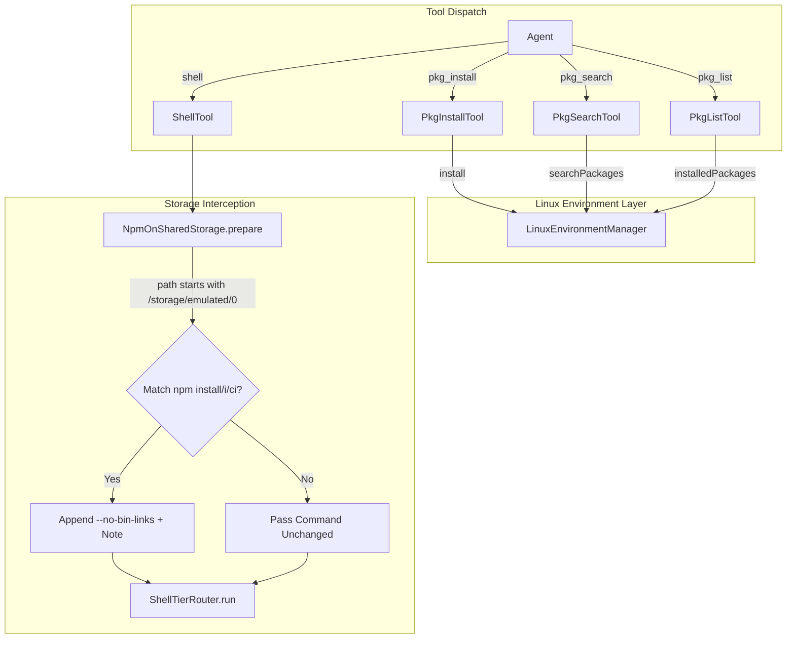

# Package & Storage Tools

> Package inspection routines and NPM package resolution under Android shared storage.

# Package & Storage Tools

Package inspection routines manage userspace Linux packages. Storage mitigation layer adapts Node Package Manager execution to Android shared storage filesystem limitations.

## Responsibilities

- **Package querying and installation**: Provide agent tools (`pkg_install`, `pkg_search`, `pkg_list`) wrapping `LinuxEnvironmentManager`.
- **Filesystem constraint mitigation**: Intercept shell execution targeting Android emulated shared storage (`/storage/emulated/0`). Inject flags avoiding symlink operations.

## Primary Files

- `app/src/main/java/com/androidharness/app/tools/PkgTools.kt`: Exposes `PkgInstallTool`, `PkgSearchTool`, and `PkgListTool`. Interfaces with `LinuxEnvironmentManager`.
- `app/src/main/java/com/androidharness/app/tools/NpmOnSharedStorage.kt`: Regex-based pre-execution rewriter. Appends `--no-bin-links` to NPM commands on emulated storage.
- `app/src/main/java/com/androidharness/app/tools/ShellTool.kt`: Dispatches shell commands. Integrates `NpmOnSharedStorage.prepare` prior to tier routing.

## Call Chains & Architecture

### Node Descriptions

- `PkgInstallTool`: Validates `linuxEnv.isReady`. Parses `packages` parameter. Invokes `installPackages`. Queries `installedPackages` to verify diff.
- `PkgSearchTool`: Invokes `searchPackages`. Limits output to 25 items. Tags matches already installed.
- `PkgListTool`: Queries `installedPackages`. Returns sorted list.
- `NpmOnSharedStorage`: Detects path prefix `/storage/emulated/0`. Regex matches `npm install`, `npm i`, or `npm ci`. Rewrites command line. Prevents Android FUSE/FAT32 `EACCES` failures on symlinks.

## Key State & Regex Rules

- **Shared Storage Target**:
  - Exact: `/storage/emulated/0`
  - Prefix: `/storage/emulated/0/`
- **NPM Install Regex**: `\bnpm\s+(?:install|i|ci)\b`
- **Search Pagination**: Max 25 packages per query (`take(25)`).

## Boundary Conditions

- **Linux environment unready**: `PkgInstallTool` aborts immediately when `linuxEnv.isReady == false`. Returns explicit installation requirement message.
- **Argument shape fallback**: `PkgInstallTool` checks JSON array key `packages`. Falls back to scalar string key `package`. Returns failure on empty resolution.
- **Pre-existing flags**: `NpmOnSharedStorage` skips rewrite when `--no-bin-links` already present in command string.
- **Symlink detection in shell**: `ShellTool` scans for `ln -s` commands failing with `Permission denied` or `Operation not permitted`. Deletes dangling zero-byte destination files left by partial creation on non-symlink filesystems.

## Extension Points

- **Additional package managers on shared storage**: `NpmOnSharedStorage` regex strategy extendable to `yarn`, `pnpm`, or `bun` flags (`--no-bin-links`, node-linker configuration).
- **Custom package repositories**: `LinuxEnvironmentManager` injection via `PkgInstallTool` and `PkgSearchTool` constructor lambdas supports custom upstream repos and packaging backends.

## Sources

Sources: [app/src/main/java/com/androidharness/app/tools/PkgTools.kt](app/src/main/java/com/androidharness/app/tools/PkgTools.kt#L1-L139), [app/src/main/java/com/androidharness/app/tools/NpmOnSharedStorage.kt](app/src/main/java/com/androidharness/app/tools/NpmOnSharedStorage.kt#L1-L39), [app/src/main/java/com/androidharness/app/tools/ShellTool.kt](app/src/main/java/com/androidharness/app/tools/ShellTool.kt#L65-L88)

## Source files

- `app/src/main/java/com/androidharness/app/tools/PkgTools.kt`
- `app/src/main/java/com/androidharness/app/tools/NpmOnSharedStorage.kt`
