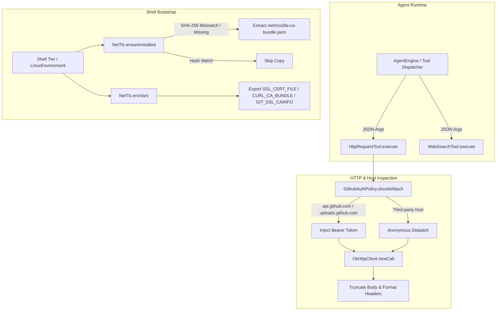

# Network Diagnostics & TLS Probing

> Network ping, HTTP checks, and TLS certificate validation tools.

### Module Responsibilities

- **`HttpRequestTool`**: Executes outbound HTTP operations (GET, POST, PUT, PATCH, DELETE, HEAD) via OkHttpClient. Enforces payload truncation and handles status reporting.
- **`GithubAuthPolicy`**: Evaluates target hostnames. Injects stored GitHub OAuth/PAT tokens into GitHub API and raw content endpoints automatically. Blocks token exposure to third-party endpoints.
- **`WebSearchTool`**: Dispatches external web queries. Routes to authenticated API backends (Brave, Tavily) first. Falls back automatically to keyless scraping backends.
- **`NetTls`**: Resolves missing root CA stores in Android userspace environments. Extracts Mozilla CA certificate bundle from APK assets to the toolchain prefix filesystem. Generates TLS environment variable bindings for CLI processes (`curl`, `git`, `python`, `node`).

---

### Invocation Call Chain

#### Key Nodes
- **`GithubAuthPolicy.shouldAttach`**: Guards authentication bearer headers before transmission.
- **`OkHttpClient.newCall`**: Executes network I/O on `Dispatchers.IO` with explicit timeouts (15s connect, 30s read).
- **`NetTls.ensureInstalled`**: Performs streaming SHA-256 calculation to avoid redundant writes across application restarts.
- **`NetTls.envVars`**: Maps extracted PEM path to standard environment variables for external CLIs.

---

### Key State

- **`GithubAuthPolicy` host matching**:
  - `explicit = false`: Never inject token.
  - `explicit = true`: Allow `github.com`, `*.github.com`, `githubusercontent.com`, `*.githubusercontent.com`.
  - `explicit = null`: Constrain exclusively to `api.github.com` and `uploads.github.com`.
- **`HttpRequestTool` response limits**:
  - Max response headers: 12.
  - Max body size: 20,000 characters (appends `[truncated]` on overflow).
- **`NetTls` certificate artifact**:
  - Source path: `net/mozilla-ca-bundle.pem` (APK asset).
  - Target path: `<prefixDir>/etc/tls/cacert.pem`.
  - Checksum algorithm: MessageDigest SHA-256 over 64 KB streaming buffer chunks.

---

### Primary Files

- `app/src/main/java/com/androidharness/app/tools/NetTools.kt`: Hosts `HttpRequestTool`, `GithubAuthPolicy`, and `WebSearchTool`.
- `app/src/main/java/com/androidharness/app/tools/NetTls.kt`: Hosts TLS CA certificate extraction and environment map generation for external runtimes.

---

### Boundary Conditions & Error Handling

- **GitHub Unauthorized (401/403)**: `HttpRequestTool` inspects status code when auth token attached. Injects suggestion note to run `doctor --github`.
- **Search Provider Failure**: `WebSearchTool` catches provider exceptions or empty result sets. Appends diagnostic note and executes `KeylessSearchBackend.fetch`.
- **Unwritable Prefix Directory**: `NetTls.ensureInstalled` wraps filesystem I/O in open catch block. Swallows extraction failures silently; host system falls back to system trust store.
- **Empty or Missing Asset**: Checksum mismatch handler in `NetTls` ensures non-zero file length validation before skipping extraction.

---

### Extension Points

- **Custom Search Providers**: Supply implementations to `searchBackendFor(searchApi())` inside `WebSearchTool`.
- **CLI Tool TLS Mappings**: Register additional runtime environment variables in `NetTls.envVars(bundlePath)`.
- **HTTP Payload Encoding**: Expand method routing inside `HttpRequestTool.execute` to handle additional MIME types via `toRequestBody`.

---

Sources:
- [app/src/main/java/com/androidharness/app/tools/NetTools.kt](app/src/main/java/com/androidharness/app/tools/NetTools.kt#L1-L215)
- [app/src/main/java/com/androidharness/app/tools/NetTls.kt](app/src/main/java/com/androidharness/app/tools/NetTls.kt#L1-L100)

## Source files

- `app/src/main/java/com/androidharness/app/tools/NetTools.kt`
- `app/src/main/java/com/androidharness/app/tools/NetTls.kt`
- `app/src/main/java/com/androidharness/app/core/LocalPortProbe.kt`
