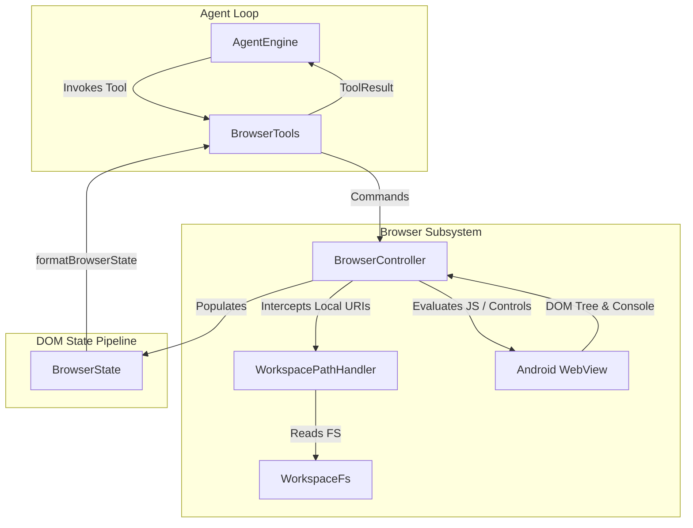

# Browser Interaction & Web Extraction

> Web scraping, resource downloading, and HTML content extraction tools.

### Module Responsibilities

- Orchestrate Android `WebView` instance for autonomous agent browsing.
- Intercept workspace file requests via virtual domain (`https://harness.workspace/ws/...`). Enable relative asset resolution, HTML rendering, form submission.
- Extract DOM structures, interactive elements, viewport metrics, text summaries.
- Dispatch synthetic input events (`click`, `type`, `scroll`, keyboard focus).
- Capture console logs, JS exceptions, visual viewport screenshots.
- Support conditional DOM polling (`wait_for`) and sandbox JS evaluation (`eval`).

---

### Main Files

- `app/src/main/java/com/androidharness/app/tools/BrowserTools.kt`: Agent tool definitions exposed to `AgentEngine`. Handles argument validation, tool execution, state formatting.
- `app/src/main/java/com/androidharness/app/browser/BrowserController.kt`: Core WebView lifecycle manager. Dispatches JavaScript injections, element indexing, screenshot captures, navigation state tracking.
- `app/src/main/java/com/androidharness/app/browser/WorkspacePathHandler.kt`: Intercepts `https://harness.workspace/` requests. Reads local workspace files directly into WebView response streams.
- `app/src/main/java/com/androidharness/app/core/WebResourceExtractor.kt`: Static web content extraction, HTML sanitization, text extraction utilities.

---

### Call Chain & Architecture

#### Diagram Nodes

- `BrowserTools`: Parses tool arguments (`url`, `id`, `selector`, `text`). Returns formatted `ToolResult` strings or `ImageRef`.
- `BrowserController`: Orchestrates `WebView`. Manages JavaScript bridge, screenshot rendering, DOM tree extraction.
- `WorkspacePathHandler`: Custom WebView client request interceptor. Maps virtual host `harness.workspace` to physical paths on Android storage.
- `BrowserState`: Internal snapshot of active page state (title, URL, interactive element catalog, logs, errors).

---

### Multi-Step Interaction Flow

For page navigation and synthetic element interaction, the execution follows this sequence:

1. The agent invokes `browser_navigate` with a remote URL, local server port, or relative workspace path.
2. `WorkspacePathHandler` resolves workspace-relative paths into local virtual URIs under `https://harness.workspace/ws/...`.
3. `BrowserController` commands the underlying `WebView` to load the target URI.
4. On load completion, `BrowserController` injects an element indexing script. The script scans interactive tags (`<a>`, `<button>`, `<input>`, `<textarea>`, `[role]`), assigns numeric IDs, checks viewport visibility, and collects visible text excerpts.
5. `formatBrowserState` converts the catalog into structured text containing URL, title, scroll offset, and enumerated `[id]` handles.
6. The agent reads element IDs from the formatted output and invokes `browser_click` or `browser_type`.
7. `BrowserController` locates target nodes via indexed numeric IDs or fallback CSS selectors, scrolls targets into view, and dispatches native-equivalent DOM events.

---

### Key Data Models

#### `BrowserState`
- `url`: Current page URL.
- `title`: Current document title.
- `scrollY`: Viewport vertical scroll offset in pixels.
- `error`: Warning or runtime load error string.
- `interactiveElements`: List of indexed DOM elements.
- `textSummary`: First 1,500 characters of rendered text content.

#### `BrowserElement`
- `id`: Integer handle assigned sequentially during DOM sweep.
- `tag`: HTML element tag (`a`, `button`, `input`).
- `type`: Input type attribute (`text`, `submit`, `checkbox`).
- `name` / `placeholder` / `ariaLabel` / `role`: Semantic identifiers.
- `text`: Visible inner text.
- `href`: Link target for anchor tags.
- `disabled`: Boolean disabled state.
- `inViewport`: Boolean flag indicating visibility within current viewport boundaries.

#### `BrowserConsoleLog`
- `level`: Console severity (`ERROR`, `WARN`, `LOG`, `DEBUG`).
- `message`: Text payload.
- `source`: Script source URL or filename.
- `line`: Line number of log emission.
- `url`: Page URL active during emission.

---

### Tool Catalog

| Tool Name | Read-Only | Purpose | Primary Arguments |
|---|---|---|---|
| `browser_navigate` | No | Load remote URL or workspace file | `url` (required) |
| `browser_click` | No | Click DOM element | `id` (integer) or `selector` (string) |
| `browser_type` | No | Enter text into input element | `text` (required), `id`/`selector`, `clear_first` |
| `browser_scroll` | No | Shift viewport offset | `direction` (`up`/`down`/`left`/`right`), `amount` |
| `browser_get_dom` | Yes | Extract element index without navigating | *None* |
| `browser_eval` | No | Sandboxed async JavaScript execution | `code` (required) |
| `browser_screenshot` | Yes | Capture viewport image to disk | *None* |
| `browser_get_logs` | Yes | Retrieve buffered console output | `level`, `source`, `clear` |
| `browser_wait_for` | Yes | Poll until DOM condition met | `condition` (`selector`/`text`/`url_contains`), `value`, `timeout_ms` |
| `browser_back` | No | Navigate back in history | *None* |
| `browser_forward` | No | Navigate forward in history | *None* |
| `browser_refresh` | No | Reload current page | *None* |
| `browser_get_url` | Yes | Fast read of current URL and title | *None* |

---

### Boundary Conditions & Guardrails

- `browser_click` and `browser_type` reject invocations omitting both `id` and `selector`.
- `browser_wait_for` enforces minimum 0ms and maximum 30,000ms timeout window. Default timeout: 5,000ms.
- Page text excerpt truncated at 1,500 characters in `formatBrowserState`. Prevents context token exhaustion.
- `browser_eval` executes code wrapped in async closure. Unhandled exceptions convert directly to tool failure results (`ToolResult(false, ...)`).
- `browser_screenshot` validates active WebView rendering pipeline. Returns failure if surface canvas uninitialized.

---

### Extension Points

- `WorkspacePathHandler`: Register additional virtual schemes or mime-type overrides for custom local file extensions.
- `BrowserController`: Add input gesture primitives (drag-and-drop, file chooser injection, multi-touch pinch).
- `WebResourceExtractor`: Implement specialized parsers for structured metadata, OpenGraph tags, or JSON-LD extraction.

---

Sources: [app/src/main/java/com/androidharness/app/tools/BrowserTools.kt](app/src/main/java/com/androidharness/app/tools/BrowserTools.kt#L1-L450)

## Source files

- `app/src/main/java/com/androidharness/app/tools/BrowserTools.kt`
- `app/src/main/java/com/androidharness/app/tools/MoreTools.kt`
- `app/src/main/java/com/androidharness/app/core/WebResourceExtractor.kt`
