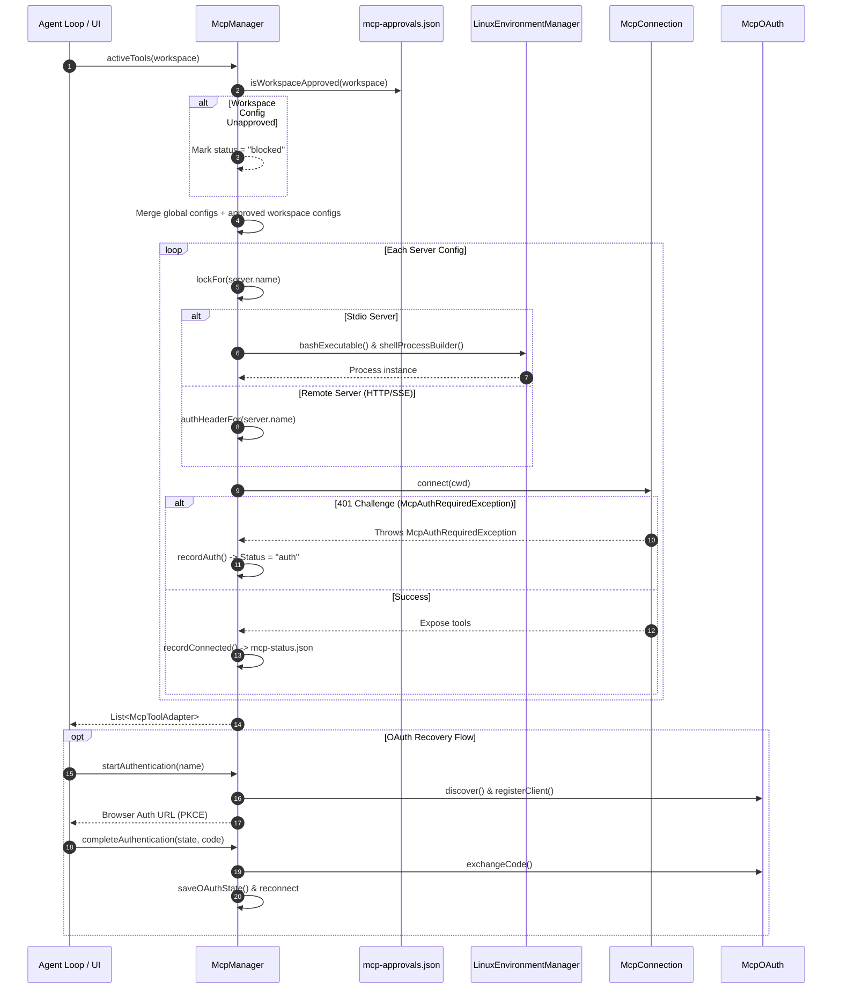

# MCP Client Manager

> Lifecycle manager managing discovery, startup, and connection pooling for MCP servers.

### Module Responsibilities

`McpManager` orchestrates the complete lifecycle of Model Context Protocol (MCP) servers and tools:
- **Server Discovery & Configuration**: Persists global server configurations to `filesDir/mcp-servers.json` with Keystore-backed HMAC tamper detection; parses per-workspace `.harness/mcp.json` definitions.
- **Security & Authorization Gate (D1)**: Blocks workspace-defined servers until explicit user approval via hash matching; enforces Android Keystore validation over global server records.
- **Connection Lifecycle & Pooling**: Pools active `McpConnection` instances; prevents concurrent duplicate process initialization via per-server mutexes; handles dead connection cleanup and cold-start retries (up to two attempts).
- **Auto-Reconnection**: Reconnects servers with prior success (`mcp-status.json`). Partitions remote servers (immediate) versus stdio servers (suspended until `LinuxEnvironmentManager` emits `EnvState.Ready`).
- **OAuth 2.1 Dynamic Flow**: Captures 401 HTTP challenges, performs RFC 8414 discovery, registers dynamic clients (RFC 7591), initiates PKCE flows, exchanges redirect codes, and saves tokens via `KeyStoreManager`.
- **Tool Adapter Bridge**: Dispatches active server capabilities to the agent runtime wrapped as harness-compatible `McpToolAdapter` instances.

---

### Call Chain & Operational Flow

#### Key Lifecycle Sequence
1. **Tool Retrieval**: `Agent Execution Engine` invokes `activeTools(workspace)`.
2. **Approval Verification**: `McpManager` queries `isWorkspaceApproved()`. Unapproved workspace configurations get marked `"blocked"` in `_statuses` and excluded.
3. **Connection Acquisition**: Calls `connectionFor(config, cwd)`. Aquires `lockFor(config.name)` to block race conditions. Returns alive connection or executes `tryConnect()`.
4. **Transport Initialization**:
   - **Stdio**: `spawnStdio()` invokes `LinuxEnvironmentManager.shellProcessBuilder()` with bash-wrapped arguments; appends stderr to server log file.
   - **Remote**: Direct OkHttp client with Bearer authorization provider.
5. **Exception Handling**: Connect failure records `"failed"` status; HTTP 401 records metadata URL, sets status to `"auth"`, and prompts UI authentication.

---

### Key States & Persistence

#### Server Operational States (`McpServerStatus`)
| State | Cause | Effect |
| :--- | :--- | :--- |
| `"connecting"` | `tryConnect` initiated | Informs UI; background connection pending. |
| `"connected"` | Connection handshake succeeded | Updates `toolCount`; marks auto-reconnect eligibility. |
| `"failed"` | IO failure / process crash after 2 attempts | Disconnects transport; logs error message. |
| `"auth"` | HTTP 401 challenge caught | Sets `needsAuth = true`; stores `resourceMetadataUrl`. |
| `"blocked"` | Workspace config hash unapproved | Excludes tools from agent runtime until user consent. |

#### Storage Artifacts
- `filesDir/mcp-servers.json`: Global server configs. Serialized via KotlinX JSON.
- `filesDir/mcp-servers.json.hmac`: Base64 HMAC-SHA256 hash using AndroidKeyStore key `mcp_config_hmac`.
- `filesDir/mcp-status.json`: Persisted map of servers that previously connected (`toolCount`, timestamp). Workspace configs explicitly excluded from this store.
- `filesDir/mcp-approvals.json`: Map of `shellRoot:sha256(configText)` to approval timestamp.

---

### Primary Files

- `app/src/main/java/com/androidharness/app/tools/mcp/McpManager.kt`: Top-level orchestrator, process launcher, connection pool, HMAC integrity verifier, OAuth supervisor.
- `app/src/main/java/com/androidharness/app/tools/mcp/McpConnection.kt`: JSON-RPC session manager, transport state machine, tool listing provider.
- `app/src/main/java/com/androidharness/app/tools/mcp/McpOAuth.kt`: RFC 8414 metadata discovery, RFC 7591 dynamic client registration, PKCE exchange helpers.
- `app/src/main/java/com/androidharness/app/tools/mcp/McpReconnectPolicy.kt`: Filters candidates for startup reconnection based on previous successful connections.
- `app/src/main/java/com/androidharness/app/tools/mcp/McpToolAdapter.kt`: Wraps MCP remote tool declarations as harness-executable `Tool` instances.
- `app/src/main/java/com/androidharness/app/tools/mcp/McpTransport.kt`: Stdio and HTTP/SSE low-level transport implementations.
- `app/src/main/java/com/androidharness/app/tools/mcp/McpModels.kt`: Schema contracts for MCP configuration, JSON-RPC envelopes, and statuses.

---

### Boundary Conditions & Security Policies

- **Config Tampering Refusal**:
  - `loadServers()` verifies `mcp-servers.json` against `mcp-servers.json.hmac`.
  - Mismatch deletes both files, refuses contents, sets `configTampered = true`.
  - AndroidKeyStore absence degrades verification to accept (fails open without bricking).
- **Workspace Isolation (Security-Battery D1)**:
  - Repositories containing `.harness/mcp.json` cannot execute commands automatically.
  - Keyed by directory path and SHA-256 hash of configuration text. Any edits invalidate prior approval.
  - Workspace servers cannot qualify for auto-reconnect on application startup.
- **Process Environment Prerequisites**:
  - `spawnStdio()` requires `LinuxEnvironmentManager.bashExecutable()`. Throws `ToolFailure` if Linux environment is uninstalled.
  - Startup auto-reconnect separates remote from stdio; stdio waits for `EnvState.Ready`.
- **Concurrency & Re-entrancy**:
  - Per-server mutex locks (`connectLocks`) eliminate duplicate process spawning across startup passes and active agent runs.
  - Pending OAuth states serialize through single in-flight `pendingAuth` reference with state parameter matching.

---

### Extension Points

- **Transport Protocols**: `McpTransport` abstraction accommodates future transport types (e.g., WebSocket or Android IPC binders) alongside Stdio and SSE.
- **Authentication Providers**: `McpOAuth.discover()` hooks allow non-standard OAuth metadata endpoints or alternate bearer authorization injectors.
- **Client Configuration Parsers**: `McpConfigParser` permits alternate workspace configuration formats without altering connection pooling logic.

---

Sources: [app/src/main/java/com/androidharness/app/tools/mcp/McpManager.kt](app/src/main/java/com/androidharness/app/tools/mcp/McpManager.kt#L1-L500)

## Source files

- `app/src/main/java/com/androidharness/app/tools/mcp/McpManager.kt`
