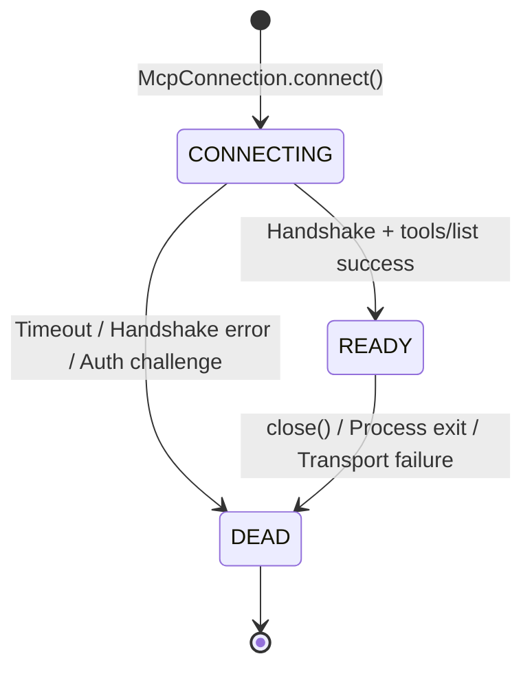
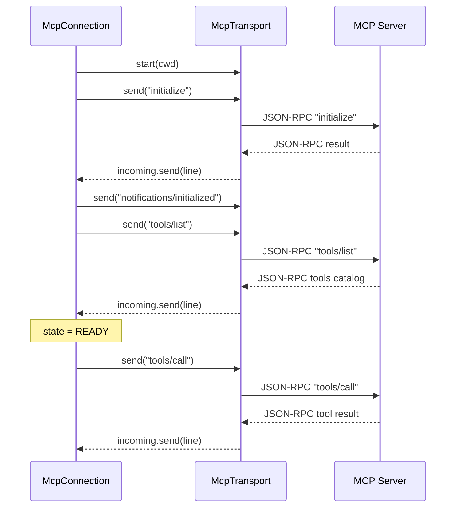

# MCP Connection Controller

> State machine managing transport handshake, protocol capability exchange, and requests.

# MCP Connection Controller

Manages Model Context Protocol (MCP) client-side lifecycle. Establishes transport instances, executes protocol handshakes, routes JSON-RPC requests, parses responses, tracks connection health.

## Module Responsibilities

- **Transport Instantiation**: Routes server config types (`http`, `sse`, stdio default) to concrete `McpTransport` implementations.
- **Protocol Handshaking**: Negotiates protocol versions (`2025-06-18` for remote, `2024-11-05` for stdio), exchanges empty client capabilities, announces initialization.
- **Tool Discovery**: Executes `tools/list` on handshake completion. Parses schemas into `McpToolInfo`.
- **JSON-RPC Multiplexing**: Assigns atomic request IDs, holds `CompletableDeferred` handles in `ConcurrentHashMap`, correlates responses via incoming message loop.
- **Tool Invocation**: Encapsulates `tools/call`, converts structured tool output blocks to plain text, extracts `isError` flags.

## Key States & Lifecycle

- `CONNECTING`: Transport initialized. Handshake pending (`initialize` RPC, `notifications/initialized`, `tools/list` RPC).
- `READY`: Handshake succeeded. Capabilities and tool catalog cached. Ready for `callTool`.
- `DEAD`: Channel closed, transport terminated, or handshake aborted. Coroutine scope canceled.

## Handshake & Request Call Chain

Ordered connection sequence:
1. `McpConnection.connect(cwd)` selects transport:
   - `config.type == "http"` -> `StreamableHttpTransport`
   - `config.type == "sse"` -> `SseLegacyTransport`
   - default -> `StdioTransport`
2. Coroutine scope launches background loop reading `McpTransport.incoming` channel via `handleLine()`.
3. Calls `McpTransport.start(cwd)`:
   - `StdioTransport` executes process factory, opens standard I/O pipes.
   - `SseLegacyTransport` opens persistent SSE GET stream, waits for initial `endpoint` event.
   - `StreamableHttpTransport` no-op.
4. Client sends JSON-RPC `initialize` method through `rpc()` with 15-second timeout (`handshakeTimeoutMs`). Remote transports assert `REMOTE_VERSION` (`2025-06-18`), stdio asserts `2024-11-05`.
5. Client emits `notifications/initialized` notification (no response expected).
6. Client sends `tools/list` via `rpc()`.
7. `parseTools` deserializes tool schemas; state transitions to `ConnectionState.READY`.

Tool invocation sequence:
- `McpConnection.callTool(toolName, args, timeoutMs)` -> `rpc("tools/call", ...)` -> `writeMutex.withLock { transport.send(...) }` -> await `CompletableDeferred` -> `contentToText()` extracts concatenated string output.

## Primary Files

- `app/src/main/java/com/androidharness/app/tools/mcp/McpConnection.kt`: Implements `McpConnection` state machine, JSON-RPC correlation, tool result conversion.
- `app/src/main/java/com/androidharness/app/tools/mcp/McpTransport.kt`: Declares `McpTransport` interface; implements `StdioTransport`, `StreamableHttpTransport`, `SseLegacyTransport`, protocol constants.

## Boundary Conditions

- **Server-Initiated RPCs**: Server requests/notifications contain `"method"`. Ignored by `handleLine()`; only ID-matched responses resolve pending requests.
- **Handshake Expiration**: Failure to complete `initialize` and `tools/list` within 15 seconds triggers `TimeoutCancellationException`, shuts connection down to `DEAD`, rethrows `ToolFailure`.
- **HTTP 401 Unauthorized**: Remote endpoints returning HTTP 401 raise `McpAuthRequiredException`. Extracts `resource_metadata` challenge URI; marks connection `DEAD`.
- **Subprocess Death**: `StdioTransport` EOF on process stdout closes incoming channel; subsequent writes fail via closed stream. `isAlive` checks `Process.isAlive()`.
- **Concurrent Writes**: `writeMutex` serializes writes to `McpTransport.send()`, preventing line interleaving across concurrent tool calls.

## Extension Points

- `processFactory` parameter in `McpConnection`: Injects mock subprocess runners for hermetic unit testing without spawning OS-level processes.
- `authHeader` provider: Supplies dynamic OAuth bearer tokens for remote transports; integrates with token refresh managers.
- `McpTransport` interface: Supports additional transports (e.g. raw WebSockets) by exposing `incoming: Channel<String>`, `send(message)`, `start(cwd)`, and `close()`.

Sources: [app/src/main/java/com/androidharness/app/tools/mcp/McpConnection.kt](app/src/main/java/com/androidharness/app/tools/mcp/McpConnection.kt#L1-L250), [app/src/main/java/com/androidharness/app/tools/mcp/McpTransport.kt](app/src/main/java/com/androidharness/app/tools/mcp/McpTransport.kt#L1-L280)

## Source files

- `app/src/main/java/com/androidharness/app/tools/mcp/McpConnection.kt`
