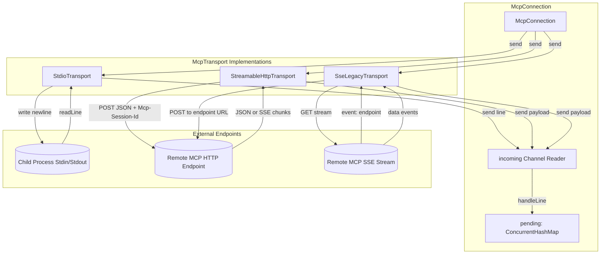

# MCP Low-Level Transport

> Transport implementation wrapping JSON-RPC over stdio, SSE, or WebSocket streams.

### Responsibilities

`McpTransport` abstracts bidirectional JSON-RPC framing across heterogeneous execution models. Decouples upper-level connection handling from transport protocols:

- **Process I/O (`StdioTransport`)**: Spawns local child processes. Writes newline-delimited messages to `stdin`. Reads lines from `stdout` asynchronously into channel.
- **Streamable HTTP (`StreamableHttpTransport`)**: Implements MCP 2025-06-18 spec. Dispatches one POST per request. Ingests direct JSON or text/event-stream chunks. Maintains session state via `Mcp-Session-Id`.
- **Legacy HTTP+SSE (`SseLegacyTransport`)**: Implements MCP 2024-11-05 spec. Opens persistent GET SSE stream for incoming traffic. Resolves dynamic POST endpoint from `endpoint` event. Transmits outbound RPC to resolved target.
- **Auth Challenge Propagation**: Intercepts HTTP 401 statuses. Parses `WWW-Authenticate` challenge headers. Raises `McpAuthRequiredException` with OAuth metadata URI.

---

### Transport Architecture



#### Key Architecture Nodes
- **`McpConnection`**: Coordinates JSON-RPC requests. Locks outbound transmissions via `writeMutex`. Correlates incoming message IDs to `pending` `CompletableDeferred` responses.
- **`incoming Channel<String>`**: Unbounded coroutine channel buffering raw server lines/events across all transport variants.
- **`StdioTransport`**: Direct pipe binding using `BufferedWriter` and coroutine-isolated `bufferedReader` loop.
- **`StreamableHttpTransport`**: Synchronous POST model capturing immediate bodies or multiplexed SSE events without long-lived GET streaming.
- **`SseLegacyTransport`**: Decoupled duplex bridge. Uses initial GET SSE stream discovery before permitting outbound POST traffic.

---

### Transport Call Chains

#### 1. Message Dispatch (`send`)
```
McpConnection.rpc()
  └─ buildJsonObject {"jsonrpc": "2.0", "id": X, "method": M, "params": P}
      └─ writeMutex.withLock
          └─ McpTransport.send()
              ├─ StdioTransport: BufferedWriter.write() → newLine() → flush() on Dispatchers.IO
              ├─ StreamableHttpTransport: OkHttpClient.newCall(POST) → parse body/SSE → push incoming
              └─ SseLegacyTransport: OkHttpClient.newCall(POST to postUrl) → fire and forget (SSE captures reply)
```

#### 2. Inbound Line Ingestion (`incoming`)
```
Transport Background Loop
  ├─ Stdio: reader.readLine()
  ├─ StreamableHttp: client.execute() → sseEvents(body) OR string body
  └─ SseLegacy: source.readUtf8Line() → match event/data
      └─ Channel<String>.send(line)
          └─ McpConnection Coroutine
              └─ McpConnection.handleLine()
                  └─ Extract ID → pending.remove(id).complete(obj)
```

---

### Key States and Lifecycles

| Component | State / Field | Purpose |
| :--- | :--- | :--- |
| `McpConnection` | `ConnectionState` | Tracks connection phase: `CONNECTING`, `READY`, `DEAD`. |
| `StdioTransport` | `processAlive()` | Validates child process viability via `process.isAlive`. |
| `StreamableHttpTransport` | `@Volatile sessionId` | Stores `Mcp-Session-Id` HTTP header returned from server. Appends to downstream requests. |
| `SseLegacyTransport` | `endpointReady` | `CompletableDeferred<Unit>` barrier. Blocks `start()` completion until server emits `event: endpoint`. |
| `SseLegacyTransport` | `@Volatile postUrl` | Target URI resolved from `endpoint` event payload. Receives client POST bodies. |

---

### Primary Files

- **`app/src/main/java/com/androidharness/app/tools/mcp/McpTransport.kt`**: Defines `McpTransport` interface, `McpProtocol` constants, `StdioTransport`, `StreamableHttpTransport`, `SseLegacyTransport`, and `sseEvents` parsing logic.
- **`app/src/main/java/com/androidharness/app/tools/mcp/McpConnection.kt`**: Client abstraction constructing transports according to `McpServerConfig.type` (`http`, `sse`, or process command). Handles JSON-RPC dispatch, timeouts, and framing.

---

### Boundary Conditions & Error Handling

- **Subprocess Exit Detection**: Stdio stream reader encounters EOF (`readLine() == null`). Closes reader, breaks loop, closes `incoming` channel.
- **401 Unauthorized Extraction**: Remote HTTP transports check for status 401. Regex extracts `resource_metadata` URI from `WWW-Authenticate` header. Instantiates `McpAuthRequiredException`. Upper layer launches OAuth flow.
- **Legacy Endpoint Race Prevention**: `SseLegacyTransport.start()` holds caller using `withTimeout(15_000)` on `endpointReady.await()`. Rejects premature RPC dispatch before target URL available.
- **Slow Tool Invocation**: OkHttp client builder overrides defaults via `mcpHttpClient()`. Configures 15-second connect timeout and 5-minute read timeout.
- **Missing Process Binary**: `StdioTransport.start()` traps execution failures from `processFactory`. Throws `ToolFailure` indicating missing Linux environment or bad path.

---

### Extension Points

- **`processFactory: (File) -> Process`**: Injectable lambda in `StdioTransport` / `McpConnection`. Enables custom shell confinement, Android pseudo-terminal wrappers, or test mock processes.
- **`authHeader: suspend () -> String?`**: Dynamic functional hook in HTTP transports. Fetches and refreshes bearer tokens before each POST or SSE request.
- **`McpTransport` Contract**: Clean abstraction (`start`, `send`, `close`, `incoming`). Facilitates WebSocket or UNIX domain socket implementations without changing `McpConnection` RPC logic.

---

Sources:
- [app/src/main/java/com/androidharness/app/tools/mcp/McpTransport.kt](app/src/main/java/com/androidharness/app/tools/mcp/McpTransport.kt#L1-L339)
- [app/src/main/java/com/androidharness/app/tools/mcp/McpConnection.kt](app/src/main/java/com/androidharness/app/tools/mcp/McpConnection.kt#L1-L250)

## Source files

- `app/src/main/java/com/androidharness/app/tools/mcp/McpTransport.kt`
