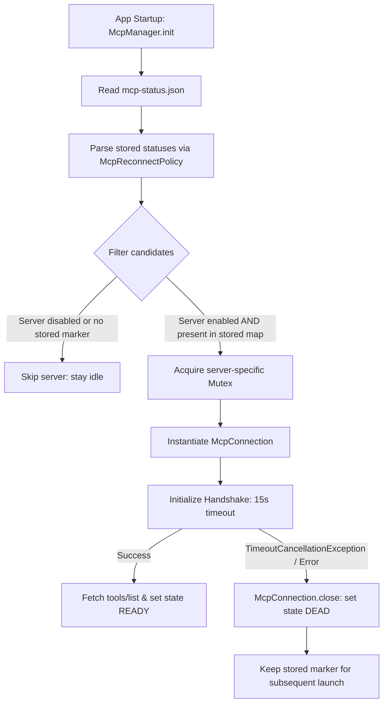

# MCP Reconnect Strategy

> Exponential backoff and heartbeat recovery policy for disconnected MCP sessions.

### Module Responsibilities

`McpReconnectPolicy` selects candidate servers for startup auto-reconnect. Disqualifies unverified or disabled endpoints. Filters out workspace-level configurations to prevent auto-spawning commands from untrusted repositories.

`McpManager` orchestrates recovery lifecycle. Loads persisted markers from `mcp-status.json`. Triggers `autoReconnect()` on initialization. Serializes re-connection through per-server mutexes.

`McpConnection` tracks live state (`ConnectionState`). Enforces handshake timeouts. Evaluates transport liveness. Marks crashed transports as `DEAD`.

---

### Call Chain

```
McpManager.init
  │
  ├──► McpReconnectPolicy.parseStored(statusFile.readText())
  │      └─ Returns Map<String, McpStoredStatus>
  │
  └──► McpManager.autoReconnect()
         │
         ├──► McpReconnectPolicy.candidates(servers, storedStatuses)
         │      └─ Filters enabled app-side servers with prior connection history
         │
         └──► For each candidate server:
                ├──► lockFor(name).withLock  (prevents parallel runs spawning duplicates)
                └──► McpConnection.connect(cwd)
                       ├──► McpTransport.start(cwd)
                       ├──► rpc("initialize") [15s timeout]
                       ├──► notify("notifications/initialized")
                       ├──► rpc("tools/list") [15s timeout]
                       └──► stateFlow.value = ConnectionState.READY
```

---

### Key States

#### `ConnectionState`
Declared in `McpConnection.kt#L33`:
* `CONNECTING`: Transport open, initialize handshake pending.
* `READY`: Initialize completed, tool list cached, ready for `tools/call`.
* `DEAD`: Handshake timed out, transport closed, or process exited.

#### Liveness Invariants
`McpConnection.isAlive` evaluation:
* State not `READY`: Always `false`.
* Remote HTTP / SSE: `true` when `READY`.
* Stdio: Requires `stdio?.processAlive() == true`.

#### Reconnect State Store
`McpStoredStatus` persisted in `filesDir/mcp-status.json`:
* `toolCount`: Total discovered tools during last successful session.
* `connectedAtMs`: Epoch timestamp of last successful handshake.

---

### Recovery and Reconnection Flow



#### Node Explanations
* **Filter candidates**: Reconnects only app-side configs (`mcp-servers.json`) with previous successful runs. Ignores past startup failures because network availability fluctuates.
* **Acquire server-specific Mutex**: Prevents race conditions between `autoReconnect()` and immediate tool executions.
* **Initialize Handshake (15s timeout)**: RPC call `initialize`. Failure aborts setup immediately.
* **Keep stored marker**: Failure does not delete server from `mcp-status.json`. Allows retry on next application start.

---

### Major Files

| File | Path | Responsibility |
|---|---|---|
| `McpReconnectPolicy.kt` | `app/src/main/java/com/androidharness/app/tools/mcp/McpReconnectPolicy.kt` | Filters reconnect candidates, serializes/deserializes `McpStoredStatus`. |
| `McpConnection.kt` | `app/src/main/java/com/androidharness/app/tools/mcp/McpConnection.kt` | Manages handshake timeout, RPC message tracking, and `isAlive` checks. |
| `McpManager.kt` | `app/src/main/java/com/androidharness/app/tools/mcp/McpManager.kt` | Stores statuses, coordinates auto-connect concurrency locks, checks config HMAC. |

---

### Boundary Conditions

* **Security Battery D1**: Workspace `.harness/mcp.json` servers never saved to `mcp-status.json`. Cloned repositories cannot execute commands on boot.
* **Past Failure Handling**: Transient network failures do not invalidate stored marker. Candidate status preserved across app launches.
* **Handshake Expiry**: 15,000 ms timeout enforced via `withTimeout`. Exceeding threshold triggers `close()`, cancelling CoroutineScope and marking state `DEAD`.
* **Subprocess Death**: Stdio transports check `processAlive()`. Dead process immediately invalidates `isAlive` without active polling.

---

### Extension Points

* **Continuous Heartbeat**: `McpConnection` currently relies on transport stream lifecycle. Add JSON-RPC ping frames inside `scope.launch` loop for idle detection.
* **Exponential Backoff**: `autoReconnect` executes once on launch. Wrap failed connect attempts in delayed exponential retry loops.
* **Failure Throttling**: Inject persistent failure counter into `McpStoredStatus` to throttle repeatedly failing endpoints.

---

Sources:
* [app/src/main/java/com/androidharness/app/tools/mcp/McpReconnectPolicy.kt](app/src/main/java/com/androidharness/app/tools/mcp/McpReconnectPolicy.kt#L1-L44)
* [app/src/main/java/com/androidharness/app/tools/mcp/McpConnection.kt](app/src/main/java/com/androidharness/app/tools/mcp/McpConnection.kt#L33-L140)
* [app/src/main/java/com/androidharness/app/tools/mcp/McpManager.kt](app/src/main/java/com/androidharness/app/tools/mcp/McpManager.kt#L60-L78)

## Source files

- `app/src/main/java/com/androidharness/app/tools/mcp/McpReconnectPolicy.kt`
