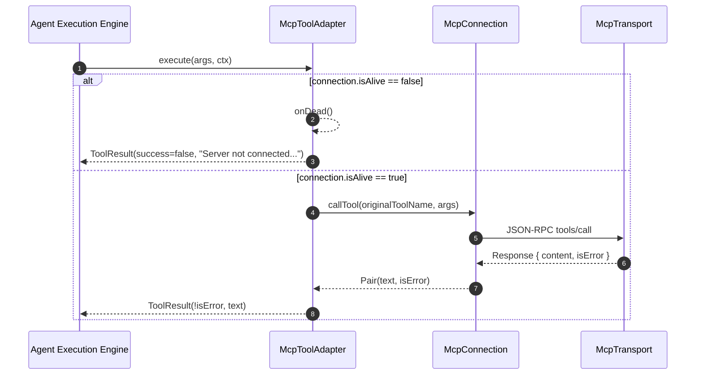

# MCP Tool Adapter

> Dynamic adapter bridging MCP protocol tool definitions into internal harness Tool instances.

# MCP Tool Adapter

Dynamic bridge mapping Model Context Protocol (MCP) tool schemas to internal `Tool` instances.

### Module Responsibilities

- Wrap `McpToolInfo` definitions discovered via `tools/list` into harness-executable `Tool` instances.
- Sanitize server/tool names to canonical identifiers (`mcp__<server>__<tool>`).
- Normalize MCP tool input schemas to guarantee top-level JSON Object structures required by LLM providers.
- Route tool execution payloads to `McpConnection.callTool`.
- Force manual confirmation policies: set `isReadOnly = false` to guarantee harness permission gating.
- Intercept transport disconnects during tool calls; invoke dead-connection callbacks.

---

### Key Files

- `app/src/main/java/com/androidharness/app/tools/mcp/McpToolAdapter.kt`: Defines `McpToolAdapter` and `normalizeMcpSchema`.
- `app/src/main/java/com/androidharness/app/tools/mcp/McpModels.kt`: Defines `McpToolInfo` payload and `McpNames.toolName` sanitizer.
- `app/src/main/java/com/androidharness/app/tools/mcp/McpConnection.kt`: Controls wire JSON-RPC dispatch, connection state, and `callTool` execution.

---

### Invocation Architecture and Call Chain

#### Key Nodes

- **`execute` entry**: Agent invokes adapter using namespaced harness name. Adapter maps back to original wire tool name (`info.name`).
- **`connection.isAlive` gate**: Validates connection state prior to dispatch. Short-circuits dead processes.
- **`onDead` notification**: Informs parent `McpManager` to mark session offline and prompt user recovery.
- **Wire Dispatch**: Passes raw `JsonObject` arguments into JSON-RPC `tools/call`.

---

### Key States and Mechanics

- **Naming Convention (`McpNames.toolName`)**:
  - Pattern: `mcp__<server>__<tool>`.
  - Characters sanitized to `[a-z0-9_]`.
  - Component length limits: Server name capped at 32 characters; tool name capped at 64 characters. Fallback string: `"x"`.
  - Original tool name preserved internally for outbound wire requests.
- **Permission Enforcement**:
  - `isReadOnly` hardcoded to `false`. Every MCP tool call requires agent permission evaluation.
- **Connection Liveness**:
  - Checked via `McpConnection.isAlive`. Evaluates `state == ConnectionState.READY` and validates OS process or remote socket state.

---

### Schema Normalization

LLM schema evaluators reject primitive or unshaped root definitions. `normalizeMcpSchema` applies structural guarantees:

1. Empty schema: Inject `{"type": "object", "properties": {}}`.
2. Existing `"type"` key: Retain raw payload.
3. Missing `"type"` key: Wrap existing properties inside `{ "type": "object", ... }`.

---

### Boundary Conditions and Error Handling

- **Dead Process on Call**: Triggers `onDead()`. Returns formatted `ToolResult` failure with user instructions for Settings inspection.
- **`ToolFailure` Exception**: Intercepted; checks `connection.isAlive`. Emits `onDead()` if transport dropped during invocation. Returns `ToolResult(false, message)`.
- **Generic Protocol Exceptions**: Intercepted; suppresses crash, captures message, marks execution failure in `ToolResult`.

---

### Extension Points

- **`onDead` Callback**: Receiver lambda supplied by caller (typically `McpManager`) allowing connection pools to trigger automated reconnect sweeps.
- **`parametersSchema` Mutators**: `normalizeMcpSchema` functions as internal pipeline interceptor for future model-specific JSON Schema version quirks.

---

Sources: [app/src/main/java/com/androidharness/app/tools/mcp/McpToolAdapter.kt](app/src/main/java/com/androidharness/app/tools/mcp/McpToolAdapter.kt#L1-L68), [app/src/main/java/com/androidharness/app/tools/mcp/McpModels.kt](app/src/main/java/com/androidharness/app/tools/mcp/McpModels.kt#L38-L73), [app/src/main/java/com/androidharness/app/tools/mcp/McpConnection.kt](app/src/main/java/com/androidharness/app/tools/mcp/McpConnection.kt#L33-L76)

## Source files

- `app/src/main/java/com/androidharness/app/tools/mcp/McpToolAdapter.kt`
