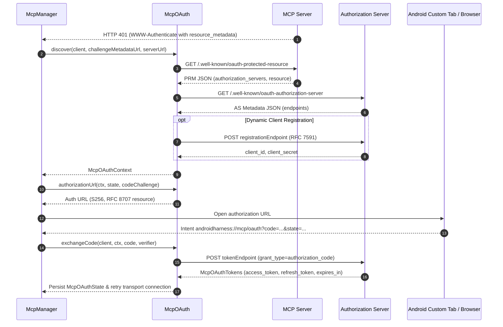

# MCP OAuth Authentication

> OAuth flow handling and token storage for MCP servers requiring authenticated access.

### Module Responsibilities

`McpOAuth` implements the Model Context Protocol authorization specification (spec version 2025-06-18). It manages:
- **Endpoint Discovery**: Probes Protected Resource Metadata (PRM, RFC 9728) and Authorization Server Metadata (RFC 8414).
- **Client Registration**: Executes Dynamic Client Registration (DCR, RFC 7591) when registration endpoints exist.
- **PKCE & URL Construction**: Generates cryptographic verifiers, S256 code challenges, and authorization URLs containing RFC 8707 resource indicators.
- **Token Exchange & Renewal**: Exchanges authorization codes for bearer tokens and refreshes expired tokens over OkHttp.
- **Lifecycle Coordination**: `McpManager` intercepts HTTP 401 challenges, initiates browser authorization flows, and captures redirect intents.

---

### Primary Files

- `app/src/main/java/com/androidharness/app/tools/mcp/McpOAuth.kt`: Discovery logic, PKCE generation, DCR registration, token exchange, and credential serialization models.
- `app/src/main/java/com/androidharness/app/tools/mcp/McpManager.kt`: Server connection coordinator. Caches 401 auth challenges, maintains pending authentication state, and persists server definitions.

---

### Key States & Data Structures

- `McpOAuthState`: Persisted authorization state.
  - `context: McpOAuthContext`: Server metadata and client identifiers.
  - `accessToken: String`: Active bearer token.
  - `refreshToken: String?`: Optional token renewal credential.
  - `expiresAtMs: Long?`: Expiration epoch timestamp.
  - `accessTokenValid(nowMs)`: Returns true when `accessToken` not blank and `nowMs < expiresAtMs - 30_000` (30-second safety buffer). Null `expiresAtMs` considered valid.
- `McpOAuthContext`:
  - `resource`: Canonical resource URI (RFC 8707).
  - `authorizationEndpoint`: Browser login target.
  - `tokenEndpoint`: Token exchange endpoint.
  - `registrationEndpoint`: Optional DCR endpoint.
  - `clientId` / `clientSecret`: Dynamic or static client identifiers.
  - `scopes`: Whitespace-separated scope string.
- `PendingAuth`: In-flight authorization handshake cached in `McpManager`.
  - `serverName: String`: Target server identifier.
  - `state: String`: Anti-CSRF challenge token.
  - `verifier: String`: PKCE code verifier secret.
  - `context: McpOAuthContext`: Resolved server endpoints.
- `REDIRECT_URI`: Custom URI constant `androidharness://mcp/oauth`.

---

### Authentication & Token Exchange Flow

#### Flow Steps
1. **Challenge Interception**: Transport receives 401 challenge. Extracts `resource_metadata` parameter into `McpManager.authChallenges`.
2. **Metadata Discovery**: `McpOAuth.discover()` checks header URL. Falls back to `<base>/.well-known/oauth-protected-resource<path>`. Resolves authorization server base URL, queries `/.well-known/oauth-authorization-server`.
3. **Dynamic Registration**: If `registrationEndpoint` returned, `McpOAuth.registerClient()` posts client profile (`client_name="AndroidHarness"`, `token_endpoint_auth_method="none"`). Receives `client_id`.
4. **Challenge Generation**: `createVerifier()` generates 48-byte URL-safe base64 string. `codeChallenge()` produces SHA-256 digest (`S256`).
5. **Interactive Auth**: Application directs user to URL generated by `authorizationUrl()`. Browser returns code via `androidharness://mcp/oauth`.
6. **Token Resolution**: `exchangeCode()` sends POST request to `tokenEndpoint` with `code_verifier`, code, and canonical `resource`.
7. **Token Renewal**: On expiration, `refreshTokens()` uses `refresh_token` grant. Updates `McpOAuthState`.

---

### Boundary Conditions & Error Handling

- **Missing Protected Resource URL**: 401 challenge omits `resource_metadata`. Probes default well-known endpoints on host URL. Discovery returns `null` when neither responds.
- **Provider DCR Refusal**: AS returns non-200 on DCR request. Throws `McpOAuthException` containing HTTP code and first 200 characters of response body.
- **Token Expiry Calculations**: Response `expires_in` converted to epoch milliseconds (`System.currentTimeMillis() + expiresIn * 1000`). If missing or `<= 0`, `expiresAtMs` set to `null`.
- **Token Freshness Verification**: Pre-emptive 30-second invalidation window prevents in-flight token expiry during active MCP RPC dispatch.
- **Network Timeouts**: Token HTTP requests configure 30-second explicit `callTimeout`.
- **Malformed Token JSON**: Response missing `access_token` or JSON parse failure throws `McpOAuthException`.

---

### Extension Points

- **Redirect Scheme**: Replace `McpOAuth.REDIRECT_URI` to support App Links (HTTPS) or local HTTP loopback servers.
- **Client Authentication**: Expand `registerClient()` body and `tokenRequest()` parameters to support asymmetric client assertion keys (`private_key_jwt`) instead of `"token_endpoint_auth_method": "none"`.
- **Secure Storage Target**: Integrate `KeyStoreManager` to encrypt `McpOAuthState` JSON blobs before writing to disk storage.

---

Sources: [app/src/main/java/com/androidharness/app/tools/mcp/McpOAuth.kt](app/src/main/java/com/androidharness/app/tools/mcp/McpOAuth.kt#L1-L306), [app/src/main/java/com/androidharness/app/tools/mcp/McpManager.kt](app/src/main/java/com/androidharness/app/tools/mcp/McpManager.kt#L1-L150)

## Source files

- `app/src/main/java/com/androidharness/app/tools/mcp/McpOAuth.kt`
