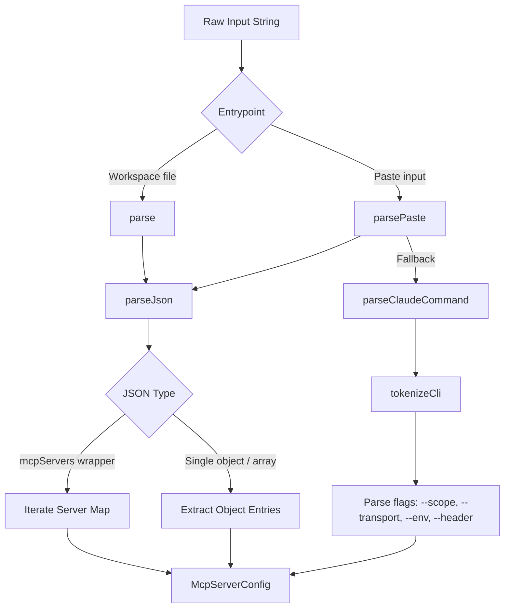

# MCP Data Models

> Serialization models and JSON-RPC structures adhering to the Model Context Protocol spec.

### Module Responsibility

Defines serialization models, naming conventions, configuration parsers, and JSON-RPC structures for Model Context Protocol (MCP) servers. Bridges external configuration formats and runtime tool specifications into harness-compatible representations.

---

### Core Data Models

- `McpServerConfig`: Server declaration dataclass. Supports `stdio`, `http` (Streamable HTTP), and `sse` (legacy HTTP+SSE). Stores command, args, environment maps, target URL, and static headers.
- `McpToolInfo`: Model-facing tool contract. Holds advertised `name`, `description`, and JSON Schema `inputSchema`.
- `McpServerStatus`: UI settings reporter. Tracks connection lifecycle state (`connecting`, `connected`, `failed`, `auth`), available tool count, failure error strings, and authentication challenge flags (`needsAuth`).
- `ConnectionState`: Transport connection state enum (`CONNECTING`, `READY`, `DEAD`).

---

### Configuration Parsing Architecture

`McpConfigParser` processes raw JSON files or pasted CLI snippets into `List<McpServerConfig>`.



#### Node Details
- `parse`: Strict JSON parser. Reads `.harness/mcp.json`.
- `parsePaste`: Tolerant parser for setup UI. Tries JSON wrapper format, falls back to `claude mcp add` shell syntax.
- `tokenizeCli`: Lexical analyzer. Preserves single and double-quoted strings with backslash escapes.
- `McpServerConfig`: Normalized configuration record passed to connection manager.

---

### Tool Naming Convention

`McpNames` prevents namespace collisions between local tools and multiple MCP servers.

- Target format: `mcp__<sanitized_server>__<sanitized_tool>`
- Server name length: Truncated to 32 characters.
- Tool name length: Truncated to 64 characters.
- Sanitization: Transforms characters outside `[a-z0-9_]` to `_`. Falls back to `x` when empty.
- Workspace configuration path: `.harness/mcp.json`.

---

### JSON-RPC Protocol Wire Shapes

`McpConnection` implements client-side Model Context Protocol JSON-RPC 2.0 handshake and dispatch structures:

1. Handshake request (`initialize`):
   ```json
   {
     "protocolVersion": "2024-11-05",
     "capabilities": {},
     "clientInfo": {
       "name": "AndroidHarness",
       "version": "0.4-alpha"
     }
   }
   ```
   *Note: Remote transports negotiate `McpProtocol.REMOTE_VERSION`.*

2. Handshake confirmation (`notifications/initialized`):
   Empty parameter JSON-RPC notification confirming initialization.

3. Discovery request (`tools/list`):
   Parameterless RPC retrieving advertised tools into `McpToolInfo` records.

4. Execution request (`tools/call`):
   Invokes tool by name with arguments payload.

---

### Key Files

- `app/src/main/java/com/androidharness/app/tools/mcp/McpModels.kt`: Configuration schemas, tool metadata, settings status containers, naming utilities, and CLI/JSON parsers.
- `app/src/main/java/com/androidharness/app/tools/mcp/McpConnection.kt`: Protocol payload construction, connection state transitions, and JSON-RPC dispatch lifecycle.

---

### Boundary Conditions & Extension Points

- Transport detection: `type` defaults to `stdio` when `command` is non-null. Defaults to `http` when `url` is provided without an explicit transport.
- Missing configuration fields: Empty string arguments and headers fall back to `emptyList()` and `emptyMap()`.
- Parsing resilience: Unknown keys ignored via `Json { ignoreUnknownKeys = true }`. Invalid JSON objects return empty collections instead of throwing.
- CLI argument separator: Detects `--` token to treat subsequent tokens strictly as positional parameters.
- Protocol version extension: Remote and local protocol version strings bifurcate in `McpConnection.connect()` based on `config.isRemote`.

---

Sources: [app/src/main/java/com/androidharness/app/tools/mcp/McpModels.kt](app/src/main/java/com/androidharness/app/tools/mcp/McpModels.kt#L1-L248), [app/src/main/java/com/androidharness/app/tools/mcp/McpConnection.kt](app/src/main/java/com/androidharness/app/tools/mcp/McpConnection.kt#L1-L120)

## Source files

- `app/src/main/java/com/androidharness/app/tools/mcp/McpModels.kt`
