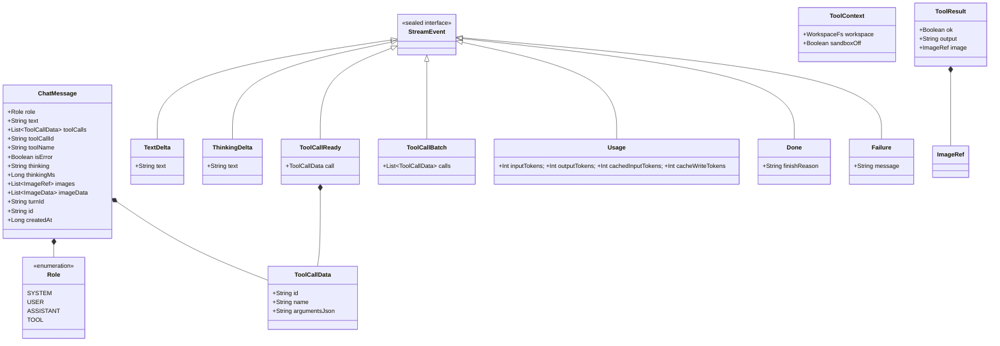

# Shared Data Models

> Common domain representations, execution results, and shared value objects.

### Module Responsibilities

Shared Data Models establish provider-neutral representations across agent loops, tool dispatchers, storage layers, and user interfaces. 

- Decouple LLM vendor schemas from internal message state.
- Standardize tool execution inputs, results, and capability schemas.
- Streamline token accounting and transient stream event pipelines.
- Isolate disk-persisted metadata from volatile memory payloads.

---

### Key Files

- `app/src/main/java/com/androidharness/app/core/Models.kt`: Canonical conversation domain (`ChatMessage`, `Role`, `ToolCallData`, image descriptors).
- `app/src/main/java/com/androidharness/app/tools/Tool.kt`: Tool execution contracts (`Tool`, `ToolResult`, `ToolContext`, `ToolRegistry`, `Schema`).
- `app/src/main/java/com/androidharness/app/llm/Llm.kt`: Model abstraction contracts (`StreamEvent`, `RequestOptions`, `ProviderConfig`, `ToolSchema`, `LlmProvider`).

---

### Data Model Hierarchy & Flow

#### Key Node Definitions

- `ChatMessage`: Core unit of agent turn tracking. Holds text, reasoning traces, emitted tool calls, or inbound tool results.
- `ToolCallData`: Structured model invocation request. Maps provider function-calling JSON to registered tool names.
- `ToolResult`: Structured tool exit state. Flags execution success/failure and bundles optional chat-rendered images.
- `ToolContext`: Context carrier for tool executions. Passes file system abstraction and security containment flags.
- `StreamEvent`: Reactive event envelope emitted over OkHttp SSE flows during provider generation.

---

### Core Data Models & Calling Chains

#### 1. Conversation State (`core/Models.kt`)
- `Role`: Message actors (`SYSTEM`, `USER`, `ASSISTANT`, `TOOL`).
- `ToolCallData`: Assistant tool call requests. Contains call `id`, target `name`, serialized `argumentsJson`.
- `ImageRef`: Persistent image handle referencing disk storage by `name` and `mime`.
- `ImageData`: Transient raw base64 image representation for direct provider payload injection; excluded from database storage.
- `ChatMessage`: Unified transcript entry. Keyed by `turnId` for atomic rollback checkpoints. Role `TOOL` messages correlate back to assistant calls via `toolCallId`.

#### 2. Tool Execution Contracts (`tools/Tool.kt`)
- `ToolContext`: Supplies `WorkspaceFs` virtual root. Carries `sandboxOff` boolean indicating full-access host permissions.
- `ToolResult`: Output carrier containing `ok` flag, string `output`, and optional `ImageRef`.
- `ToolFailure`: Checked exception indicating critical tool termination failures.
- `Tool`: Base interface demanding `parametersSchema` JSON-Schema definition and `suspend fun execute`.
- `ToolRegistry`: In-memory lookup map. Merges base local tools with run-scoped MCP tools via `withExtra()`.

#### 3. LLM Abstraction Contracts (`llm/Llm.kt`)
- `ProviderType`: Model endpoint families (`OPENAI_COMPAT`, `OPENAI_RESPONSES`, `ANTHROPIC`, `GEMINI`). Maps wire paths via `endpointPath`.
- `ProviderConfig`: Model endpoint settings (URL, model identifier, authentication type).
- `ToolSchema`: Simplified tool definition schema (`name`, `description`, `parametersJson`) passed into LLM completions.
- `RequestOptions`: Runtime generation options. Configures `maxOutputTokens`, `thinking` level budget, and session-stable `cacheKey` for prompt caching.
- `StreamEvent`: Polymorphic token stream deltas:
  - `TextDelta` / `ThinkingDelta`: Streaming chunks for output and reasoning.
  - `ToolCallReady` / `ToolCallBatch`: Materialized tool call events.
  - `Usage`: Token accounting. Tracks uncached `inputTokens`, `outputTokens`, `cachedInputTokens`, and write-premium `cacheWriteTokens`.
  - `Done`: Termination signal containing provider `finishReason`.
  - `Failure`: Non-HTTP runtime stream abort signal.

---

### Boundary Conditions & Invariants

- **Image Persistence Boundary**: `ImageRef` serializes to SQLite database. `ImageData` base64 payloads discard after API dispatch to avoid memory pressure and database bloat.
- **Cache Isolation**: `RequestOptions.cacheKey` maps to OpenAI `prompt_cache_key` or Anthropic `metadata.user_id`. Shards consecutive turn requests to identical backend cache clusters.
- **Tolerant JSON Parsing**: `jsonObjectOrAbsent()` and `jsonArrayOrAbsent()` cast explicit JSON null values (`{"usage": null}`) safely. Prevents parser crashes on non-standard gateway null responses.
- **Sandbox Boundary State**: `ToolContext.sandboxOff` defaults to `false`. Tools evaluate, never elevate, this flag. Elevated permissions gate entirely within upstream engine logic.

---

### Extension Points

- **Custom Stream Events**: Extend `StreamEvent` sealed interface. Update provider parsers in `llm/` to emit custom streaming control frames.
- **Tool Parameter Expansion**: Construct schemas via helper DSL `Schema.string()` and `Schema.integer()` inside `tools/Tool.kt`.
- **Dynamic Tool Injection**: Register ephemeral run-scoped capabilities at runtime via `ToolRegistry.withExtra()`. Used by Model Context Protocol (MCP) tool bindings.

---

Sources: [app/src/main/java/com/androidharness/app/core/Models.kt](app/src/main/java/com/androidharness/app/core/Models.kt#L1-L50), [app/src/main/java/com/androidharness/app/tools/Tool.kt](app/src/main/java/com/androidharness/app/tools/Tool.kt#L1-L150), [app/src/main/java/com/androidharness/app/llm/Llm.kt](app/src/main/java/com/androidharness/app/llm/Llm.kt#L1-L125)

## Source files

- `app/src/main/java/com/androidharness/app/core/Models.kt`
